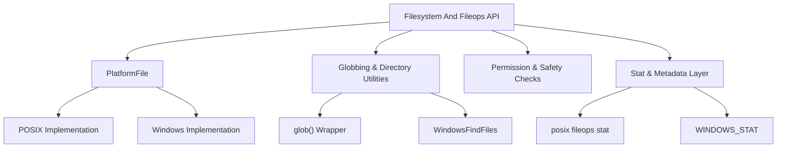
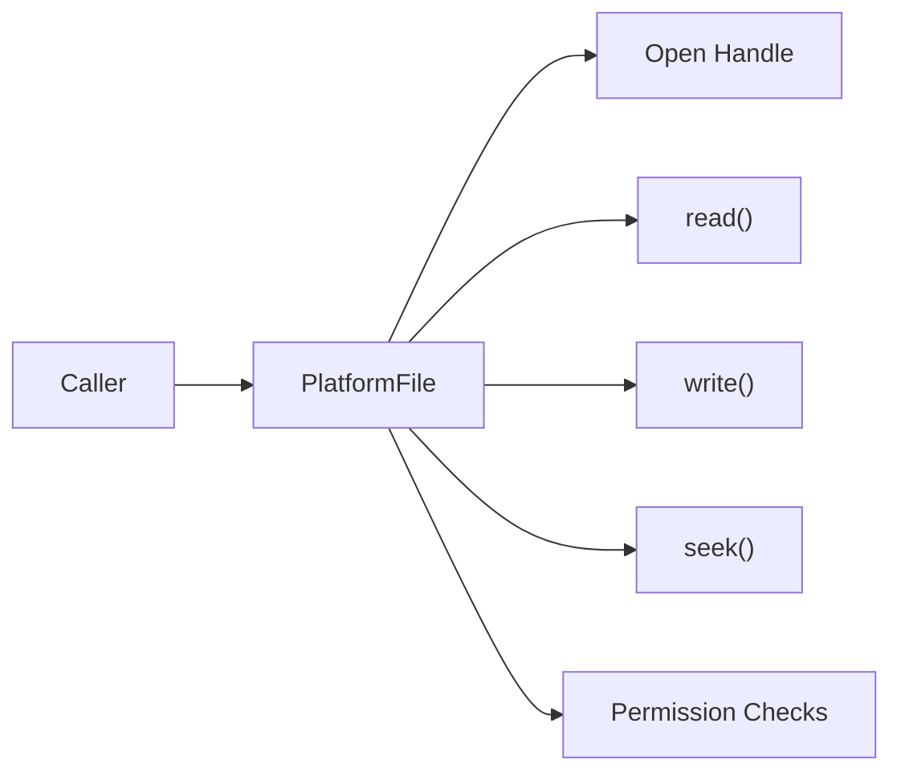
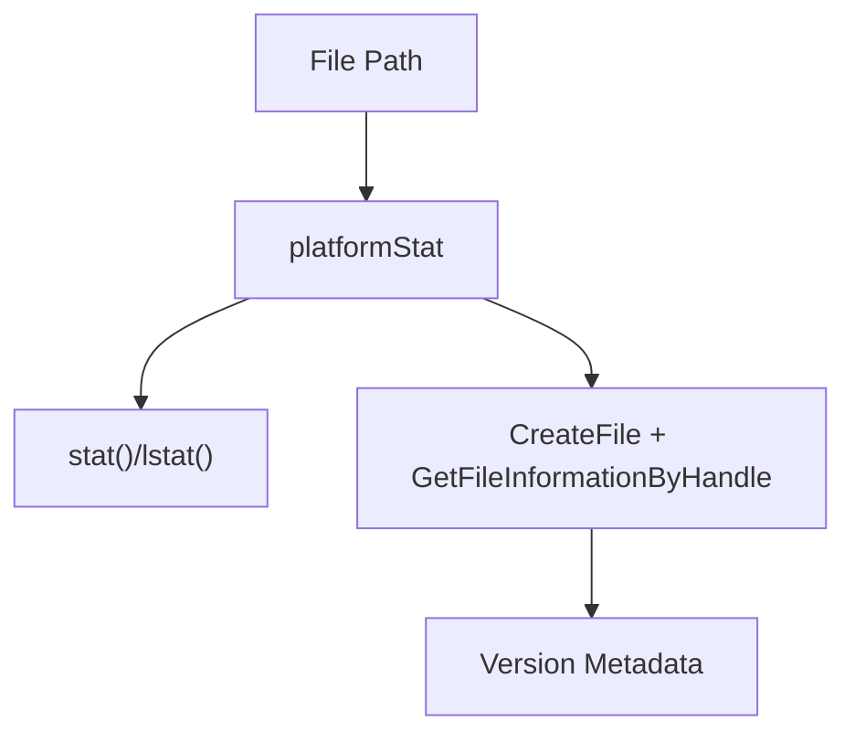
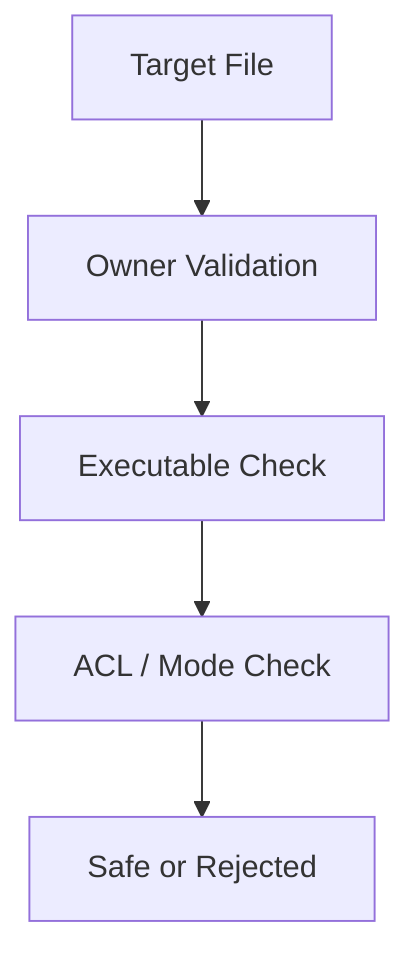
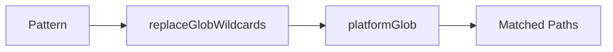
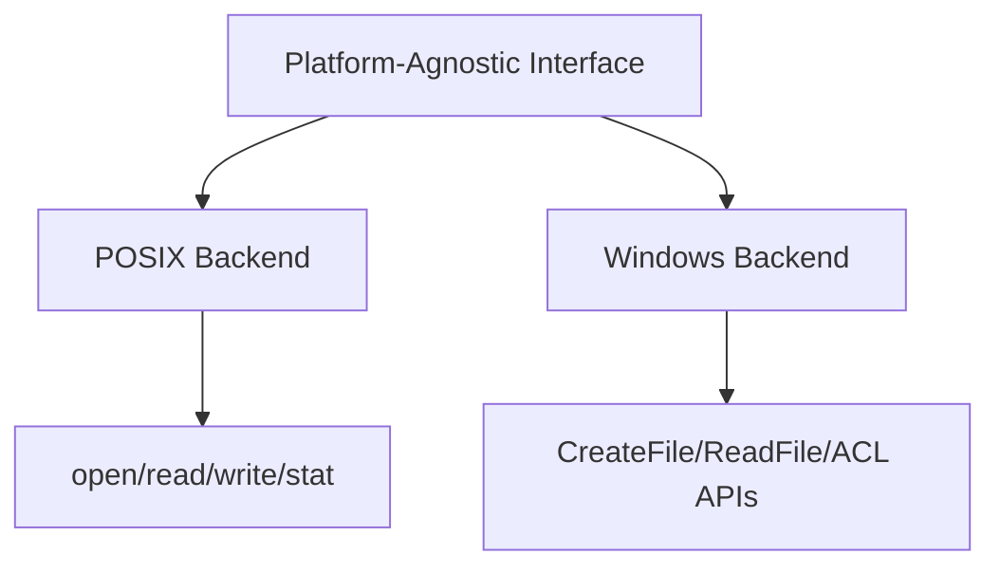

# Filesystem And Fileops

## Overview

The **Filesystem And Fileops** module provides a cross-platform abstraction layer for file system access, file metadata inspection, permission handling, globbing, and low-level file I/O operations within osquery.

It is responsible for:

- Abstracting platform differences between POSIX and Windows file APIs
- Providing a unified `PlatformFile` interface
- Implementing safe file permission checks
- Supporting globbing and directory traversal
- Enforcing file read limits and security constraints
- Exposing stat-like metadata across platforms

This module is foundational and is used by higher-level components such as:

- Logging (for file-based log writers)
- Database (for SQLite backing files and safe permissions)
- Extensions and IPC (for named pipes and UNIX sockets)
- SQL virtual tables (file-backed tables)

---

## Architecture Overview

The module is split into:

1. **Platform-independent interface** (`fileops.h`, `filesystem.cpp`)
2. **POSIX implementation** (`posix/fileops.cpp`)
3. **Windows implementation** (`windows/fileops.cpp`)

---

## Core Components

### 1. PlatformFile

`PlatformFile` is the central abstraction for file operations.

It wraps:

- File open modes (read, write, append, create)
- Non-blocking semantics
- Seek operations
- File size queries
- Permission and ownership checks

#### Responsibilities

- Translate osquery flags (e.g., `PF_READ`, `PF_WRITE`) into platform flags
- Provide safe ownership validation
- Support async I/O on Windows via `AsyncEvent`
- Offer consistent `read`, `write`, `seek`, and `size` semantics

On POSIX:
- Uses `open`, `read`, `write`, `lseek`, `fstat`

On Windows:
- Uses `CreateFileW`, `ReadFile`, `WriteFile`
- Emulates non-blocking I/O using `OVERLAPPED`

---

### 2. AsyncEvent (Windows Only)

`AsyncEvent` simulates POSIX-like non-blocking behavior using Windows overlapped I/O.

Key behavior:

- Tracks pending I/O state
- Uses `OVERLAPPED` structure
- Cancels incomplete writes to avoid inconsistent state

This is critical for maintaining consistent behavior across platforms when `PF_NONBLOCK` is used.

---

### 3. File Metadata (stat Layer)

The module exposes platform-specific stat functionality.

#### POSIX
- Uses `struct stat`
- Implemented in `posix/fileops.cpp`

#### Windows
- Uses custom `WINDOWS_STAT` structure
- Populates:
  - File ID
  - Volume serial
  - Owner SID (mapped to UID/GID-like fields)
  - File version and product version
  - Original filename from version resources

Windows adds deep metadata inspection using:

- `GetSecurityInfo`
- `GetFileVersionInfo`
- ACL analysis

---

### 4. Safe Permission Enforcement

Security-sensitive components (e.g., extension loading, database files) rely on:

- `PlatformFile::isOwnerRoot()`
- `PlatformFile::isOwnerCurrentUser()`
- `PlatformFile::hasSafePermissions()`
- `platformSetSafeDbPerms()`

#### POSIX Behavior
- Enforces owner and write restrictions
- Rejects world-writable files

#### Windows Behavior
- Rewrites DACL entries
- Ensures only:
  - Administrators
  - SYSTEM
- Have write privileges

This logic protects:

- Extension binaries
- Configuration files
- Database files

---

### 5. Globbing and Directory Traversal

The module implements cross-platform glob behavior via:

- `platformGlob()`
- `resolveFilePattern()`
- `listFilesInDirectory()`
- `listDirectoriesInDirectory()`

#### POSIX
- Uses `glob()` with:
  - `GLOB_TILDE`
  - `GLOB_BRACE`
  - `GLOB_MARK`

#### Windows
- Custom implementation using:
  - `FindFirstFileW`
  - Regex translation for brace patterns
  - `WindowsFindFiles`

Additional safeguards:

- Symlink loop detection
- Recursive glob limit (`kMaxRecursiveGlobs`)
- Canonicalization of base paths

---

### 6. File Read Controls and Limits

The module enforces a configurable maximum file read size:

- Flag: `read_max`
- Default: 50 MB

`readFile()`:

- Opens using `PF_OPEN_EXISTING | PF_READ | PF_NONBLOCK`
- Streams in fixed-size blocks
- Stops if cumulative size exceeds limit
- Handles special files safely

This prevents:

- Excessive memory usage
- Unbounded reads from pseudo-files

---

### 7. Home Directory Resolution

`getHomeDirectory()` and `osqueryHomeDirectory()`:

- Try environment variables first
- Fall back to platform APIs
- Create `.osquery` directory if writable
- Fall back to temporary directory if needed

This ensures consistent runtime state storage.

---

## Cross-Module Relationships

The Filesystem And Fileops module supports:

- Logging (file log writers rely on `PlatformFile`)
- Database (safe DB permission enforcement)
- Extensions and IPC (socket and named pipe validation)
- SQL Core and Virtual Tables (file-backed tables)

It does not implement higher-level policy logic; it provides the secure primitives used by those systems.

---

## Platform Abstraction Strategy

Design principles:

- Keep interface uniform
- Hide OS-specific complexity
- Centralize permission enforcement
- Fail closed for unsafe files
- Maintain predictable behavior across environments

---

## Key Design Guarantees

1. Cross-platform consistency of file operations
2. Strict permission validation for executable content
3. Bounded file reads
4. Safe handling of special files and symlinks
5. Windows ACL parity with POSIX mode semantics

---

## Summary

The **Filesystem And Fileops** module is the low-level filesystem backbone of osquery.

It:

- Normalizes file operations across platforms
- Enforces security invariants
- Provides metadata inspection capabilities
- Supports safe extension and database loading
- Implements robust globbing and directory traversal

Because nearly every subsystem interacts with files, this module is one of the most security-critical and portability-critical components in the system.