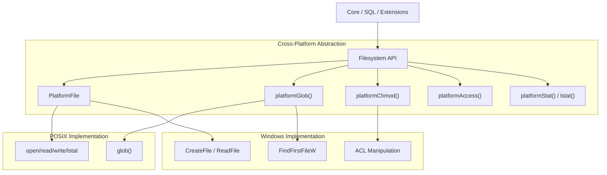
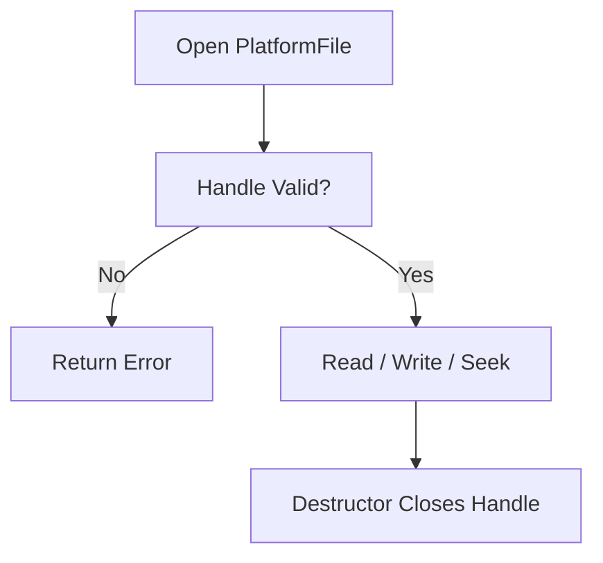
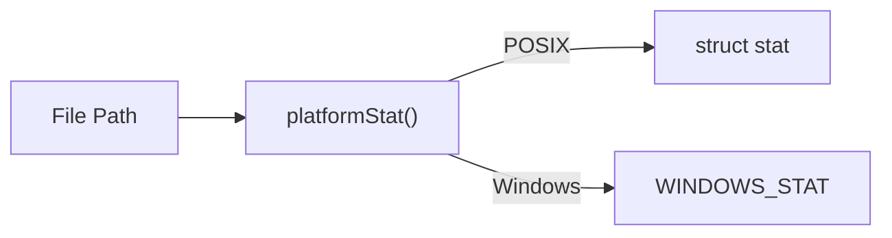
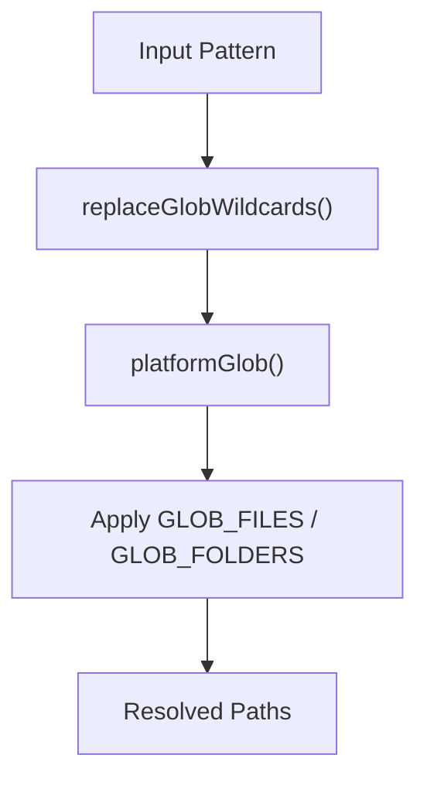
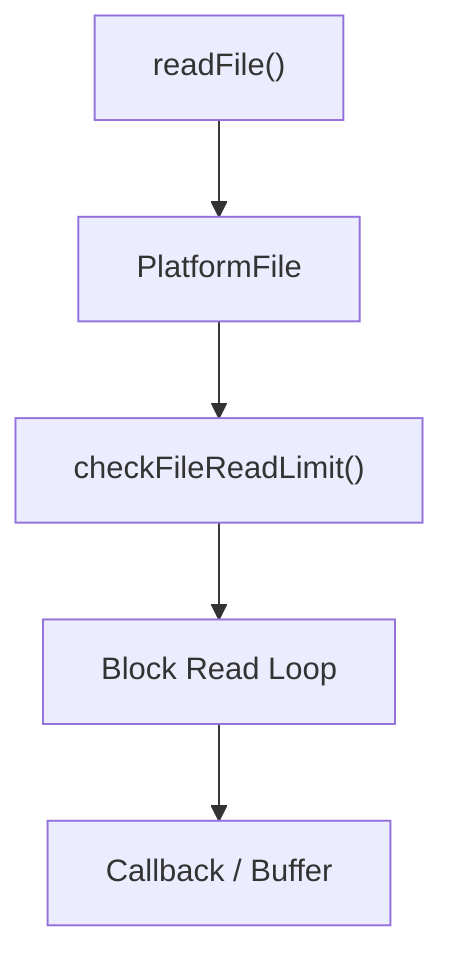
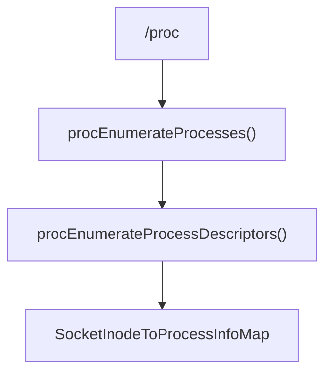
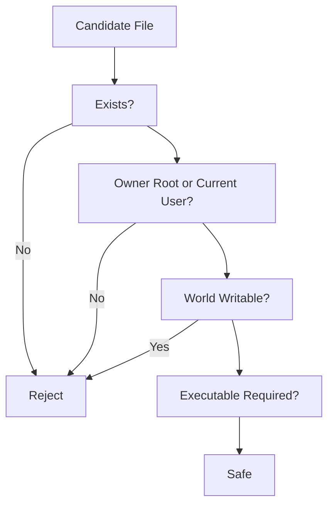

# Filesystem And Path Utilities

## Overview

The **Filesystem And Path Utilities** module provides a cross-platform abstraction layer for file operations, path handling, globbing, permissions, and filesystem metadata inspection across Linux, macOS (POSIX), and Windows systems.

It is a foundational module used by higher-level components to:

- Read and write files safely
- Enforce secure permission models
- Resolve glob patterns
- Inspect file metadata
- Enumerate directories and mounts
- Interact with `/proc` on Linux
- Provide consistent APIs across POSIX and Windows

This module hides operating system differences while preserving security guarantees and performance characteristics.

---

## Architectural Overview

The abstraction layer ensures that callers use a unified API regardless of the underlying OS.

---

## Core Components

### 1. PlatformFile

**Component:** `osquery.osquery.filesystem.fileops.PlatformFile`

`PlatformFile` is the central abstraction for file I/O.

It provides:

- Cross-platform file opening modes (`PF_READ`, `PF_WRITE`, etc.)
- Non-blocking I/O support
- Ownership validation
- Executable checks
- Safe permission verification
- Seek and size inspection
- File time retrieval

### Lifecycle Model

Platform-specific implementations exist for:

- POSIX (`open`, `read`, `write`, `fstat`)
- Windows (`CreateFileW`, `ReadFile`, overlapped I/O)

---

### 2. File Metadata and Stat Structures

#### POSIX
- `osquery.osquery.filesystem.posix.fileops.stat`

Uses:
- `stat`
- `lstat`
- `fstat`

#### Windows
- `osquery.osquery.filesystem.fileops.WINDOWS_STAT`
- `osquery.osquery.filesystem.fileops.win_stat`
- `osquery.osquery.filesystem.windows.fileops.WindowsFindFiles`

Windows provides:
- File ID
- Volume serial
- ACL-derived ownership
- File version metadata
- Attributes (hidden, system, archive)

---

### 3. Globbing and Pattern Resolution

**Core APIs:**
- `platformGlob()`
- `resolveFilePattern()`
- `replaceGlobWildcards()`

Supports:
- `*` and `?`
- `**` recursive globs
- `%` SQL-style wildcard translation
- Brace expansion (Windows regex translation)

Recursive globbing includes loop detection using inode tracking.

---

### 4. Permissions and Security Enforcement

Security is a major responsibility of this module.

#### Ownership Checks
- `isOwnerRoot()`
- `isOwnerCurrentUser()`

#### Safe Permission Enforcement
- `hasSafePermissions()`
- `platformSetSafeDbPerms()`

On Windows, safe permissions require:
- Only Administrators and SYSTEM have write privileges
- Explicit ACL validation

On POSIX, safety approximates:
- Mode `0700` for sensitive files
- No world-writable flags

#### Execution Safety

The `safePermissions()` helper ensures:

- File exists
- Not located in temporary directory
- Proper ownership
- Proper executable bits

This protects extension loading and module execution paths.

---

### 5. File Reading and Writing Utilities

High-level helpers include:

- `readFile()` (streaming and full-buffer versions)
- `writeTextFile()`
- `isReadable()`
- `isWritable()`
- `pathExists()`
- `removePath()`
- `movePath()`

A configurable limit (`read_max`) prevents excessive file reads.

---

### 6. Home Directory and System Paths

Cross-platform resolution of:

- Current user home directory (`getHomeDirectory()`)
- Osquery working directory (`osqueryHomeDirectory()`)
- System root (`getSystemRoot()`)

Fallback behavior:

- Uses environment variables first
- Falls back to system APIs
- Falls back to temp directory if needed

---

## Linux-Specific Extensions

### Mounted Filesystems

**Component:** `osquery.osquery.filesystem.linux.mounts.MountInformation`

Provides structured information for mounted filesystems:

- Device path
- Filesystem type
- Mount flags
- `statfs` block and inode counts

---

### /proc Parsing and Socket Inspection

**Components:**
- `osquery.osquery.filesystem.linux.proc.SocketInfo`
- `osquery.osquery.filesystem.linux.proc.SocketProcessInfo`

Capabilities:

- Enumerate processes via `/proc`
- Map socket inode to process
- Decode hex-encoded network addresses
- Parse `/proc/net/*` files

This enables socket tables and network observability features.

---

## Windows-Specific Enhancements

Windows includes additional capabilities:

- NTFS ACL manipulation
- File version extraction
- Original filename extraction from PE metadata
- Overlapped (async) I/O (`AsyncEvent`)
- Named pipe detection (`socketExists()`)

Windows globbing is implemented using:
- `FindFirstFileW`
- Regex translation for brace patterns

---

## Security Model Summary

This ensures:

- No unsafe extension loading
- No world-writable execution
- No loading from temp directories

---

## Integration Within the System

The Filesystem And Path Utilities module is used by:

- SQL virtual tables for file metadata
- Configuration loading
- Extension management
- Logging subsystems
- Distributed query execution
- Event subscribers

It acts as a **trusted boundary layer** between:

- User-supplied file paths
- The operating system
- Internal execution logic

---

## Key Design Principles

1. **Cross-platform consistency**
2. **Security-first permission enforcement**
3. **Non-blocking support where possible**
4. **Recursive glob loop detection**
5. **Minimal exposure of OS-specific details**

---

## Conclusion

The **Filesystem And Path Utilities** module is a foundational cross-platform subsystem responsible for:

- File I/O abstraction
- Secure permission validation
- Glob resolution
- Filesystem metadata access
- Linux `/proc` inspection
- Windows ACL and metadata handling

It enables higher-level components to operate safely and consistently across heterogeneous operating systems while enforcing strict security guarantees.