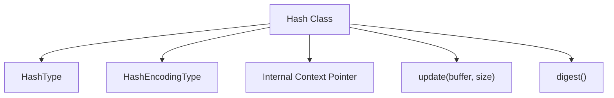
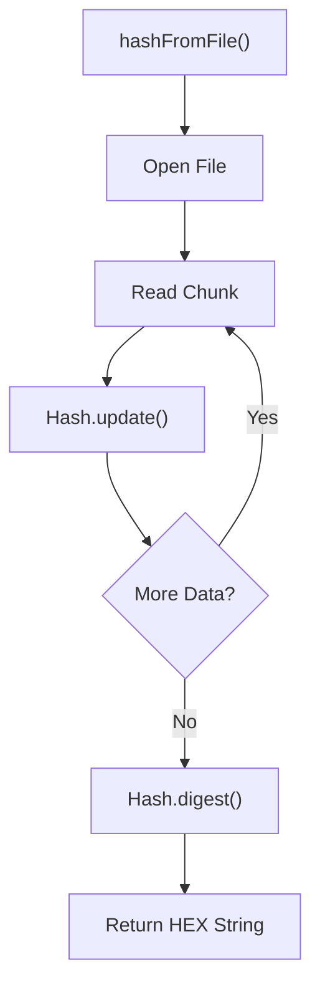
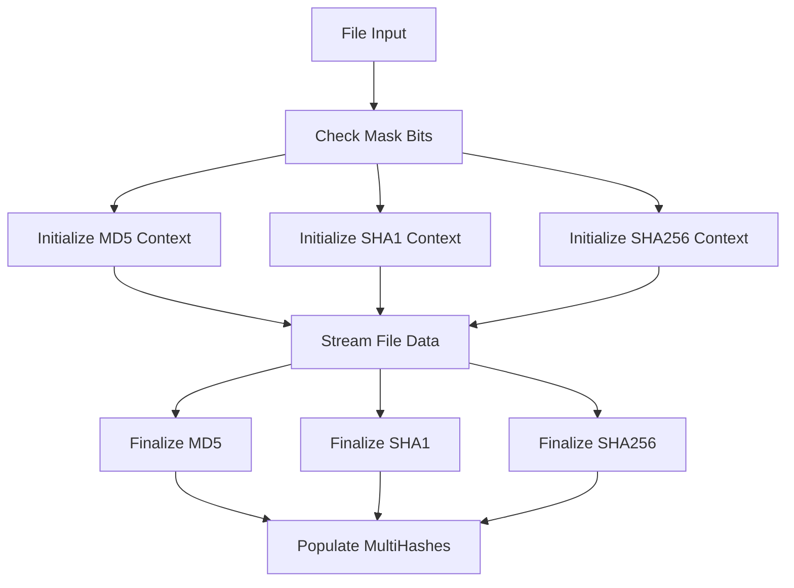
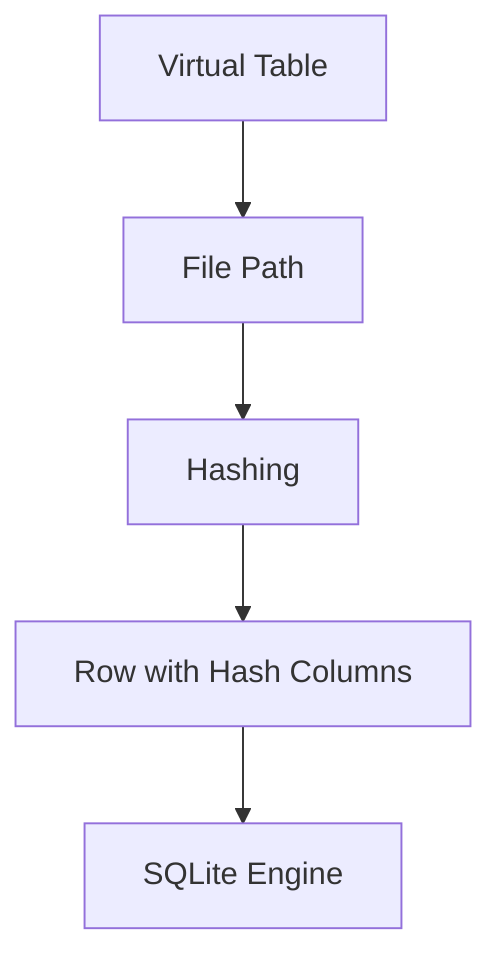
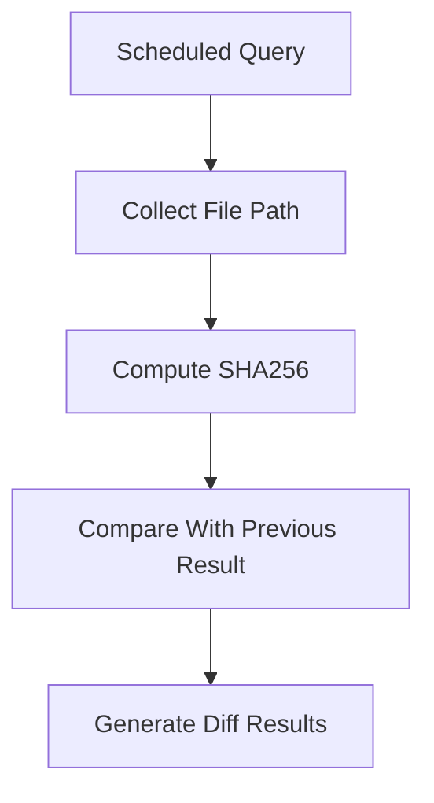
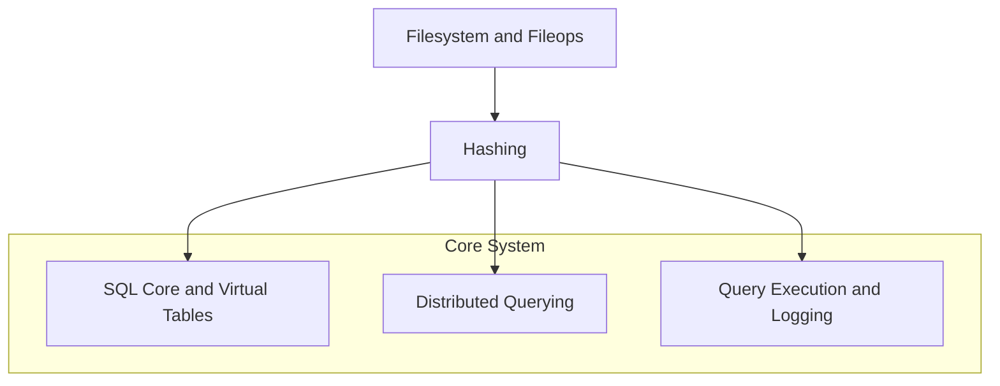

# Hashing

## Overview

The **Hashing** module provides cryptographic digest utilities used across the system to compute file and buffer hashes. It supports multiple algorithms (MD5, SHA1, SHA256) and multiple encodings (HEX, BASE64), and exposes both single-hash and multi-hash interfaces.

At its core, the module is designed for:

- File integrity verification
- Change detection for scheduled queries
- Artifact fingerprinting in distributed and extension workflows
- Efficient streaming of large files without loading them fully into memory

The primary component of this module is `MultiHashes`, supported by the `Hash` class and a set of helper functions:

- `hashFromFile`
- `hashMultiFromFile`
- `hashFromBuffer`

This module integrates closely with:

- [Filesystem and Fileops](../filesystem-and-fileops/filesystem-and-fileops.md)
- [SQL Core and Virtual Tables](../sql-core-and-virtual-tables/sql-core-and-virtual-tables.md)
- [Distributed Querying](../distributed-querying/distributed-querying.md)
- [Query Execution and Logging](../query-execution-and-logging/query-execution-and-logging.md)

---

## Supported Algorithms and Encodings

### Hash Algorithms

The module defines a bitmask-based enumeration of supported algorithms:

- MD5
- SHA1
- SHA256

Each algorithm is represented as a bit flag, enabling multi-algorithm computation in a single pass.

### Encoding Types

Digest output can be encoded as:

- HEX (default)
- BASE64

Encoding is configured at `Hash` construction time.

---

## Core Data Structures

### MultiHashes

`MultiHashes` is a result container used when multiple algorithms are computed simultaneously.

```text
struct MultiHashes {
    int mask;
    std::string md5;
    std::string sha1;
    std::string sha256;
}
```

- `mask` indicates which algorithms were requested.
- Each digest field is populated only if the corresponding bit is set.

This structure allows higher-level modules to request several digests efficiently during a single file scan.

---

## Hash Class Architecture

The `Hash` class is a non-copyable streaming hashing utility.

### Design Characteristics

- Non-copyable (inherits from boost noncopyable)
- Move-constructible and move-assignable
- Streaming interface via `update`
- Explicit `digest` finalization
- Internal opaque context pointer

### Component Structure



### Lifecycle


This streaming model ensures large files can be processed incrementally without high memory usage.

---

## Functional API

The module exposes three primary helper functions.

### 1. hashFromFile

Computes a single digest from file contents.

```text
std::string hashFromFile(HashType hash_type, const std::string& path);
```

Flow:



### 2. hashMultiFromFile

Computes multiple hashes in a single file traversal.

```text
MultiHashes hashMultiFromFile(int mask, const std::string& path);
```

Key advantage:

- Single disk traversal
- Multiple digest contexts
- Efficient for integrity-heavy workflows

### 3. hashFromBuffer

Computes a digest from in-memory data.

```text
std::string hashFromBuffer(HashType hash_type, const void* buffer, size_t size);
```

Used in scenarios such as:

- Virtual table content hashing
- Distributed result validation
- In-memory artifact fingerprinting

---

## Multi-Algorithm Processing Model

The bitmask design enables efficient multi-hash computation.



This design prevents repeated disk reads when multiple digests are required.

---

## Integration Within the System

### 1. Filesystem Interaction

The Hashing module depends on file access primitives from:

- [Filesystem and Fileops](../filesystem-and-fileops/filesystem-and-fileops.md)

It reads file contents in chunks and processes them incrementally.


---

### 2. SQL and Virtual Tables

Hashing is commonly used inside virtual tables that expose file metadata or integrity information.

Relevant module:

- [SQL Core and Virtual Tables](../sql-core-and-virtual-tables/sql-core-and-virtual-tables.md)

Example data flow:



Hashes may appear as columns such as md5, sha1, or sha256 in result sets.

---

### 3. Distributed Query Validation

Within distributed query execution:

- Hashes can verify payload integrity
- Results may include file digests

Related module:

- [Distributed Querying](../distributed-querying/distributed-querying.md)

---

### 4. Query Logging and Change Detection

When scheduled queries monitor file integrity, hash values can be used to detect changes between executions.

Related module:

- [Query Execution and Logging](../query-execution-and-logging/query-execution-and-logging.md)

Conceptual flow:



---

## Memory and Performance Considerations

### Streaming Design

The `update` method allows incremental hashing:

- Large files are processed in chunks
- Memory footprint remains constant
- Suitable for large-scale file scanning

### Move Semantics

The class supports move construction and move assignment:

- Prevents accidental copying of cryptographic state
- Enables efficient transfer of hash contexts

### Single-Pass Multi-Hashing

`hashMultiFromFile` ensures:

- One file open
- One read loop
- Multiple digest computations

This is critical for performance-sensitive subsystems such as:

- File integrity monitoring
- Large pack executions in configuration workflows

---

## Security Considerations

- SHA256 should be preferred for integrity verification.
- MD5 and SHA1 may be used for compatibility but are not collision-resistant.
- Encoding does not affect cryptographic strength, only representation.

When used in security-sensitive contexts such as distributed validation or extension communication, SHA256 is recommended.

---

## High-Level Architecture Summary



The **Hashing** module acts as a foundational cryptographic utility layer that supports integrity, validation, and change detection across the entire system.

---

## Summary

The **Hashing** module provides:

- Streaming cryptographic hashing
- Multi-algorithm single-pass computation
- File and buffer hashing APIs
- Integration with SQL, distributed queries, and logging subsystems

Its design emphasizes:

- Performance
- Memory efficiency
- Clear algorithm selection
- Safe ownership semantics

As a result, Hashing serves as a low-level integrity primitive relied upon by multiple higher-level modules throughout the system.