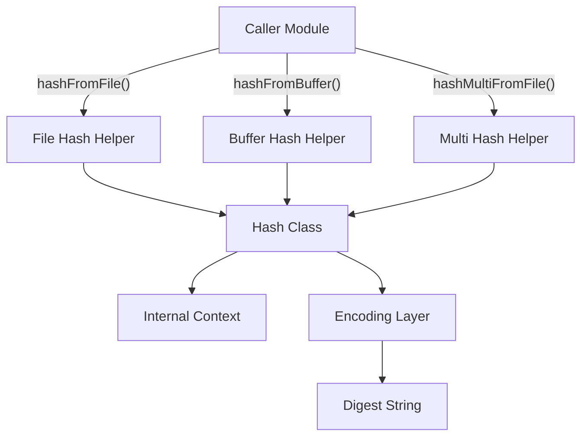
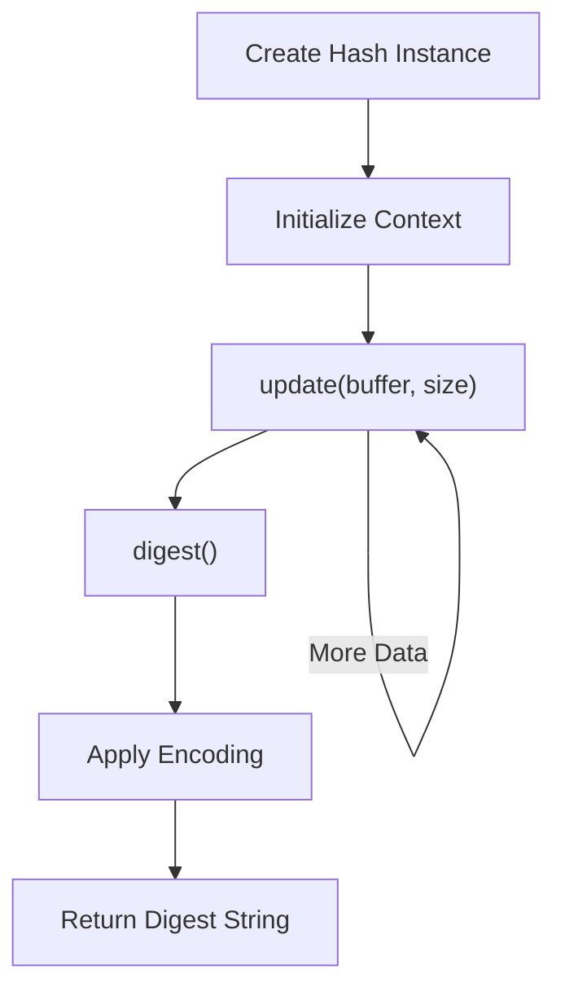
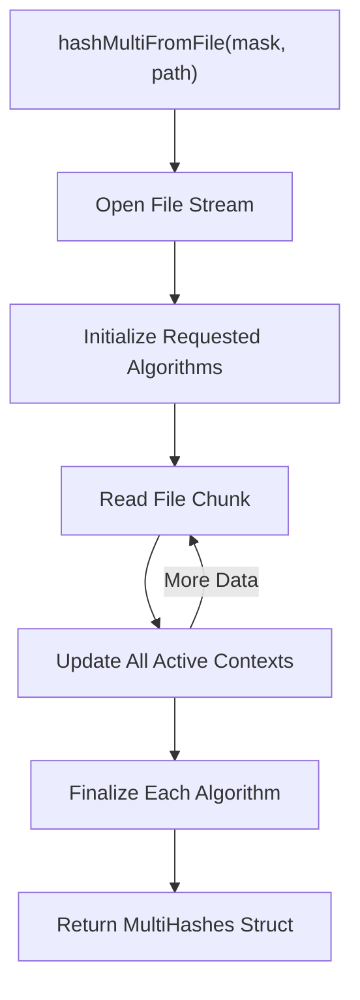

# Hashing

## Overview

The **Hashing** module provides cryptographic hashing utilities used throughout osquery to compute message digests for files and in-memory buffers. It supports multiple algorithms and encodings, enabling consistent integrity verification, file fingerprinting, and change detection across the system.

At its core, the module exposes:

- A `Hash` class for incremental (streaming) hashing
- Helper functions for hashing files and memory buffers
- A `MultiHashes` structure for computing multiple digests in a single pass
- Enumerations describing supported algorithms and encodings

This module is commonly used by file-related functionality, query tables that expose file hashes, distributed query validation, and logging workflows that require content fingerprinting.

---

## Supported Algorithms and Encodings

### HashType

The module defines a bitmask-based enumeration of supported algorithms:

- MD5
- SHA1
- SHA256

Each value is designed to be combined in a mask when computing multiple hashes.

### HashEncodingType

The digest output can be encoded as:

- Hexadecimal (default)
- Base64

Hex encoding is the default for compatibility with most osquery tables and logs.

---

## Architecture

The Hashing module centers around a stateful `Hash` class and stateless helper functions layered on top.



### Key Components

#### 1. Hash (Core Class)

A non-copyable, move-enabled class responsible for:

- Initializing algorithm-specific hashing context
- Accepting incremental updates
- Producing a final digest
- Applying encoding to the raw digest bytes

The class maintains:

- `algorithm_` – selected hashing algorithm
- `encoding_` – output encoding type
- `ctx_` – opaque pointer to algorithm-specific context
- `length_` – digest length in bytes

The class enforces correct usage by:

- Requiring algorithm selection at construction
- Preventing copying (avoids context duplication issues)
- Supporting move semantics for safe transfer of ownership

---

## Hash Class Lifecycle



### Incremental Hashing

The `update()` method allows large files or streams to be processed in chunks, avoiding loading the entire content into memory.

This makes the module suitable for:

- Large file hashing
- Streaming data
- Memory-constrained environments

---

## Multi-Algorithm Hashing

The `MultiHashes` structure enables computing multiple digests in a single file read operation.

### MultiHashes Structure

- `mask` – Bitmask of requested algorithms
- `md5` – MD5 digest string
- `sha1` – SHA1 digest string
- `sha256` – SHA256 digest string

### Multi-Hash Flow



### Benefits

- Single disk read
- Reduced I/O overhead
- Consistent results across algorithms
- Improved performance for file integrity checks

---

## Public API

### hashFromFile

Computes a single hash from file contents.

Responsibilities:

- Open file
- Stream file data into `Hash`
- Return encoded digest string

Typical use cases:

- File integrity verification
- Query table fields exposing file hashes

---

### hashMultiFromFile

Computes multiple hashes simultaneously using a bitmask.

Used when:

- Tables require multiple digest types
- Security workflows require cross-algorithm comparison
- Performance optimization is needed

---

### hashFromBuffer

Computes a hash directly from an in-memory buffer.

Used when:

- Data is already loaded
- Hashing serialized structures
- Hashing query results before logging or transmission

---

## Interaction with Other System Areas

Although the Hashing module is self-contained, it is commonly used by:

- File-related functionality for file fingerprinting
- SQL virtual tables that expose file metadata
- Distributed query workflows that validate returned artifacts
- Logging systems that include content fingerprints

The module intentionally does not:

- Perform file permission handling
- Manage database persistence
- Handle remote transport

It focuses exclusively on deterministic digest computation.

---

## Design Principles

### 1. Streaming First

Hashing operations are chunk-based to prevent excessive memory usage.

### 2. Deterministic Output

Given identical input and encoding configuration, the output digest is always identical.

### 3. Separation of Concerns

- File I/O logic is minimal and contained in helpers
- Hash state management is encapsulated in `Hash`
- Encoding is abstracted from raw algorithm computation

### 4. Move-Only Semantics

The `Hash` class is non-copyable to prevent accidental duplication of internal cryptographic state.

---

## Example Usage Pattern

### Incremental Hashing

```cpp
Hash my_hash(HASH_TYPE_SHA256);
my_hash.update(buffer, buffer_size);
std::string digest = my_hash.digest();
```

### Hashing a File

```cpp
std::string sha256 = hashFromFile(HASH_TYPE_SHA256, "/path/to/file");
```

### Multiple Hashes

```cpp
int mask = HASH_TYPE_MD5 | HASH_TYPE_SHA256;
MultiHashes hashes = hashMultiFromFile(mask, "/path/to/file");
```

---

## Error Handling Considerations

The helper functions rely on:

- Valid file paths
- Successful file reads
- Correct algorithm masks

Callers should ensure:

- Files exist and are accessible
- Mask values match supported `HashType` flags

---

## Security Considerations

- MD5 and SHA1 are supported for compatibility but are not collision-resistant.
- SHA256 should be preferred for integrity and security-sensitive use cases.
- Hashes do not imply trust; they are verification primitives and must be paired with secure transport and validation workflows.

---

## Summary

The **Hashing** module provides efficient, streaming-capable cryptographic digest computation for files and memory buffers. It is designed for:

- Performance (single-pass multi-hash support)
- Low memory overhead (chunk-based updates)
- Deterministic and consistent encoding
- Clean separation from higher-level subsystems

It serves as a foundational utility layer enabling integrity verification and content fingerprinting across osquery.