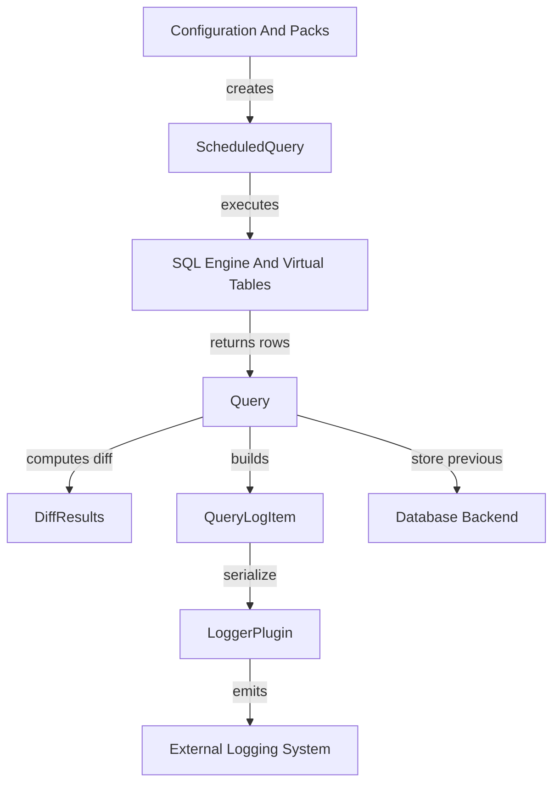
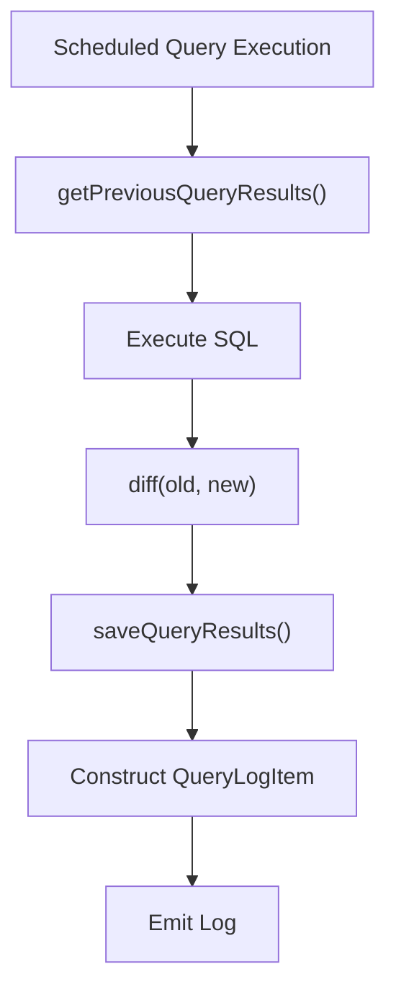
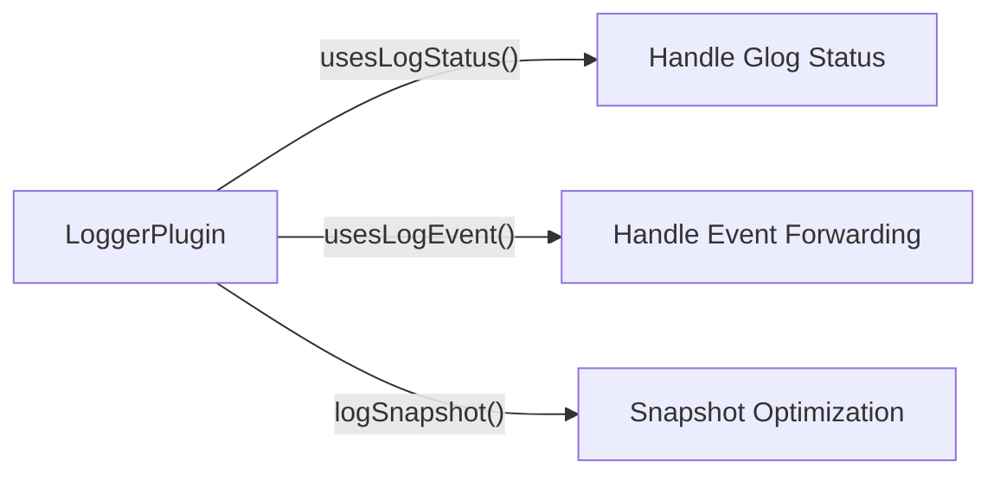
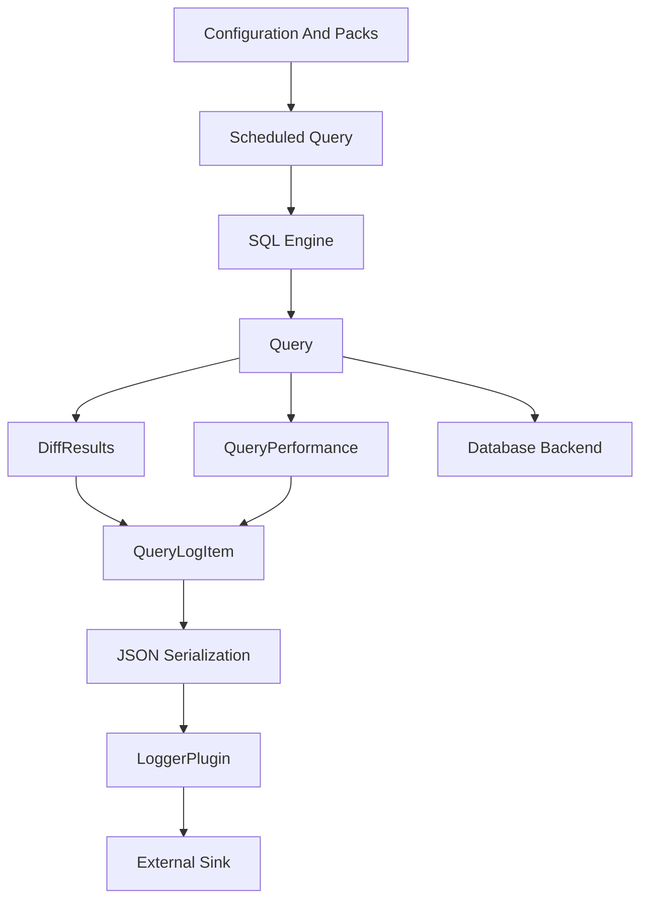

# Logging And Query Metadata

## Overview

The **Logging And Query Metadata** module is responsible for transforming query executions and internal runtime events into structured, serializable, and transportable log artifacts.

It acts as the bridge between:

- The SQL execution engine and scheduler
- The persistent query state stored in the database backend
- The pluggable logging framework
- External logging and distributed systems

This module defines:

- Query result representation (`QueryLogItem`)
- Differential result computation (`DiffResults`)
- Scheduled query metadata (`ScheduledQuery`)
- Query execution performance metrics (`QueryPerformance`)
- Logger plugin contracts and status log lines (`StatusLogLine`)

It does **not** execute SQL directly (see the SQL Engine And Virtual Tables module) and does **not** manage persistent storage directly (see the Database Backend module). Instead, it orchestrates how results and metadata are formatted, diffed, tracked, and emitted.

---

## Architectural Positioning

### Key Relationships

- **Configuration And Packs** defines scheduled queries.
- **SQL Engine And Virtual Tables** executes SQL and produces row sets.
- **Database Backend** persists historical results.
- **Logging And Query Metadata**:
  - Computes diffs between executions
  - Tracks metadata (epoch, counter, timestamps)
  - Serializes results
  - Sends structured logs to logger plugins

---

## Core Responsibilities

### 1. Scheduled Query Metadata

**Component:** `ScheduledQuery`

Represents the runtime metadata of a scheduled query:

- Query name and SQL
- Pack name
- Execution interval and startup priority
- Denylisting state
- Query options (`snapshot`, `removed`, etc.)

Key behaviors:

- `isSnapshotQuery()` determines if the query emits full results every run.
- `reportRemovedRows()` determines whether removed rows are included in logs.

This metadata drives how results are processed and serialized downstream.

---

### 2. Historical State and Diffing

**Components:**

- `Query`
- `DiffResults`

The `Query` class is the stateful interface between execution results and the persistent database.

#### Lifecycle of a Scheduled Query Execution

### `DiffResults`

Encapsulates the difference between:

- Previous result set
- Current result set

Structure:

- `added`: newly observed rows
- `removed`: rows no longer present

Utility:

- `hasNoResults()` avoids emitting empty logs.
- Serialization helpers convert diffs into JSON.

The diff mechanism ensures efficient logging by emitting only state transitions instead of full snapshots (unless configured otherwise).

---

### 3. Query Log Representation

**Component:** `QueryLogItem`

`QueryLogItem` is the canonical log artifact emitted by the system.

It contains:

- `isSnapshot`: snapshot vs differential mode
- `results`: differential results (`DiffResults`)
- `snapshot_results`: full result set
- `name`: scheduled query name
- `identifier`: host identity
- `time` and `calendar_time`
- `epoch`: logical configuration version
- `counter`: execution counter
- `decorations`: additional metadata fields

#### Serialization Paths

The module provides multiple serialization formats:

- `serializeQueryLogItem()` → JSON document
- `serializeQueryLogItemJSON()` → JSON string
- `serializeQueryLogItemAsEvents()` → event-based representation
- `serializeQueryLogItemAsEventsJSON()` → event list JSON strings

This flexibility enables:

- Batch logging
- Event-driven logging
- Snapshot logging
- Differential logging

---

### 4. Query Performance Tracking

**Component:** `QueryPerformance`

Tracks runtime characteristics of each query:

- Execution count
- Wall time (seconds and milliseconds)
- User and system CPU time
- Memory consumption
- Output size

It supports:

- CSV serialization (`toCSV()`)
- CSV deserialization constructor

Performance metrics are essential for:

- Detecting expensive queries
- Observability dashboards
- Adaptive scheduling logic
- Operational debugging

---

### 5. Logging Plugin Interface

**Components:**

- `StatusLogLine`
- `LoggerPlugin`

This module defines the contract between internal logging and pluggable logging backends.

#### `StatusLogLine`

Represents structured status logs:

- Severity (`O_INFO`, `O_WARNING`, `O_ERROR`, `O_FATAL`)
- Filename and line number
- Message
- Timestamps (UNIX and calendar)
- Host identifier

These are buffered during early startup and delivered to the logger during initialization.

---

### `LoggerPlugin`

A pluggable interface allowing integration with:

- Syslog
- Splunk
- Kafka pipelines
- Cloud logging systems

Core extension points:

- `logString()` (mandatory)
- `logStatus()` (optional)
- `logSnapshot()` (optional)
- `logEvent()` (optional)
- `logStringBatch()` (batch event handling)

Feature negotiation:

The logger can opt into:

- Handling Glog statuses directly
- Receiving individual events
- Receiving batched events
- Handling large snapshot payloads separately

This decouples core execution from output transport.

---

## End-to-End Data Flow

---

## Interaction With Other Modules

This module collaborates closely with:

- **Configuration And Packs** (scheduled query definitions)
- **SQL Engine And Virtual Tables** (query execution)
- **Database Backend** (persistent historical state)
- **Distributed Querying** (remote execution results)
- **Extensions Framework** (custom logger plugins)

It intentionally does not:

- Parse SQL
- Implement storage engines
- Perform network transport directly

Instead, it standardizes metadata and logging semantics.

---

## Design Principles

### 1. Differential Logging First
Default behavior minimizes output volume by logging only changes.

### 2. Snapshot Flexibility
Queries can explicitly request snapshot semantics.

### 3. Pluggable Logging
Logging transport is fully decoupled via plugin interfaces.

### 4. Persistent State Awareness
Every scheduled query execution is contextualized by:

- Epoch (configuration version)
- Counter (execution count)
- Previous result set

### 5. Observability Built-In
Performance metrics are tracked alongside result data.

---

## Summary

The **Logging And Query Metadata** module is the structured observability layer of the system.

It:

- Tracks query execution metadata
- Computes result deltas
- Serializes structured logs
- Maintains historical state
- Exposes extensible logging interfaces

By separating execution, storage, and transport concerns, it enables scalable, efficient, and flexible logging architectures while preserving rich metadata for auditing, debugging, and analytics.