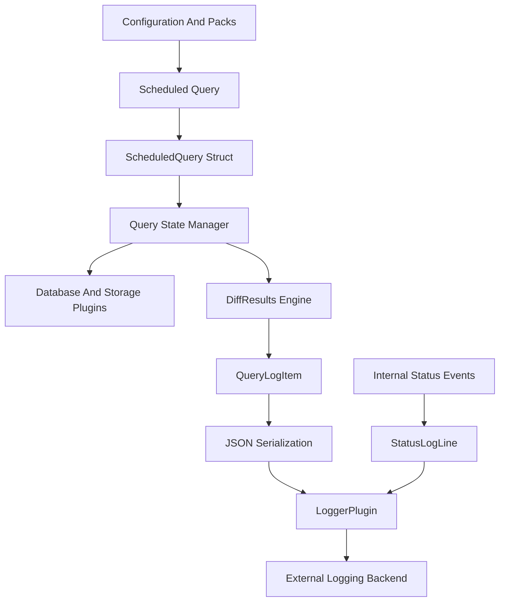
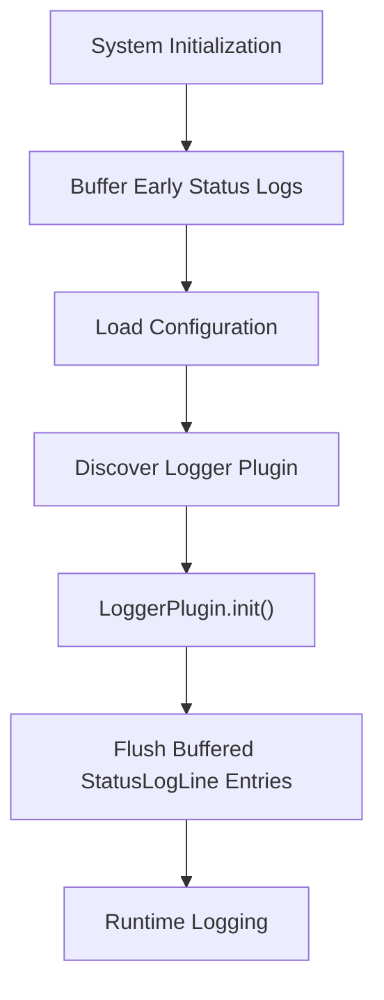
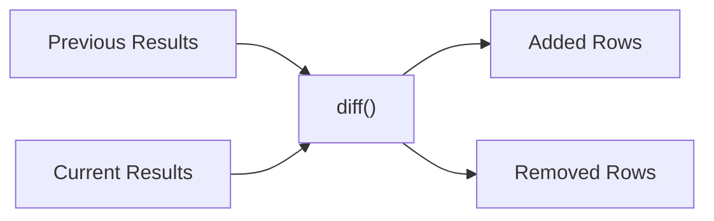
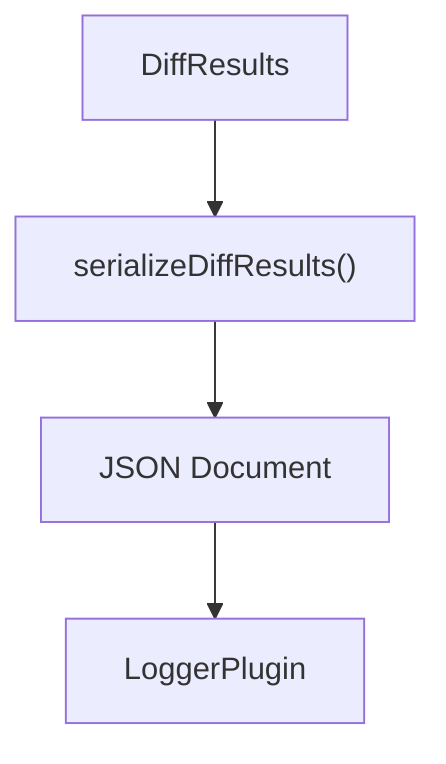
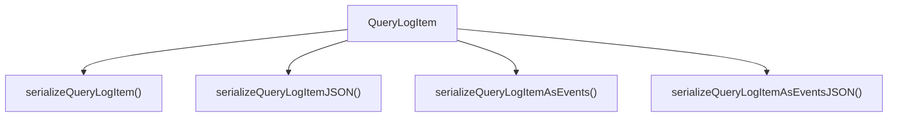
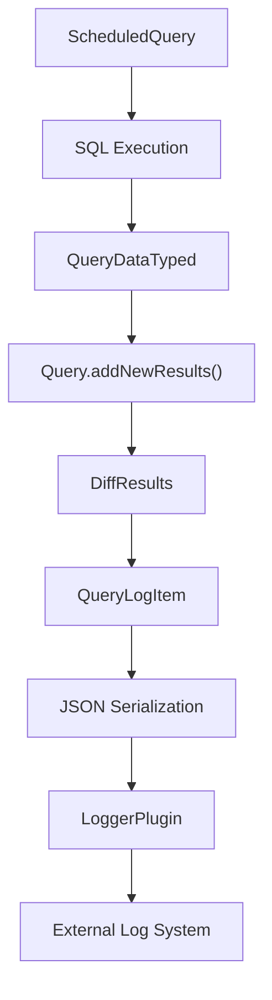
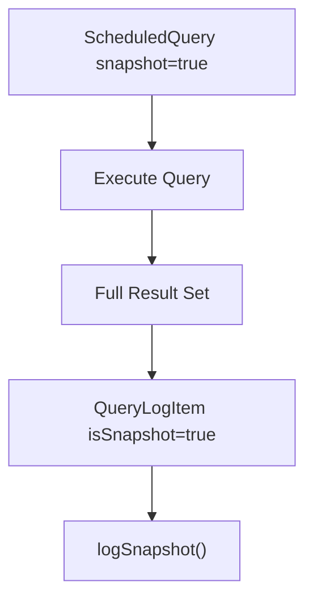

# Logging And Query Observability

## Overview

The **Logging And Query Observability** module is responsible for transforming raw query executions and internal status events into structured, serialized, and transport-ready log artifacts.

It sits at the intersection of:

- The **SQL execution layer** (see [SQL Engine And Virtual Tables](../sql-engine-and-virtual-tables/sql-engine-and-virtual-tables.md))
- The **persistent state layer** (see [Database And Storage Plugins](../database-and-storage-plugins/database-and-storage-plugins.md))
- The **configuration and scheduling layer** (see [Configuration And Packs](../configuration-and-packs/configuration-and-packs.md))
- The **pluggable logging infrastructure**

This module provides:

- Query result diffing and snapshot handling
- Query execution metadata and performance tracking
- Structured log serialization (JSON, event-based)
- Pluggable logger interface for external sinks (TLS, filesystem, syslog, etc.)
- Status log forwarding and event streaming support

---

## Architectural Position

The Logging And Query Observability module acts as a transformation and routing layer:

1. Queries execute.
2. Results are compared with historical state.
3. Changes are wrapped in structured log items.
4. Logs are serialized.
5. A `LoggerPlugin` implementation forwards them upstream.

---

## Core Components

This module consists of five primary building blocks:

- **LoggerPlugin** and **StatusLogLine** – Pluggable logging interface
- **QueryLogItem** – Structured representation of query output
- **DiffResults** – Result set comparison engine
- **QueryPerformance** – Execution metrics and telemetry
- **ScheduledQuery** – Query scheduling metadata model

Each component addresses a specific concern in the observability pipeline.

---

## LoggerPlugin And StatusLogLine

### Purpose

The logging subsystem provides a pluggable abstraction for forwarding:

- Query results
- Snapshot outputs
- Event batches
- Internal status logs

### StatusLogLine

`StatusLogLine` represents a single internal status entry emitted by the runtime. It includes:

- Severity (`O_INFO`, `O_WARNING`, `O_ERROR`, `O_FATAL`)
- Source file and line number
- Human-readable message
- UNIX timestamp and calendar time
- Host identifier

This structure decouples internal logging (e.g., Glog) from external log sinks.

### LoggerPlugin

`LoggerPlugin` is an abstract plugin interface that allows custom logging backends.

Key extensibility points:

- `logString` (required) – Primary logging entrypoint
- `logStatus` – Handles structured status logs
- `logSnapshot` – Special handling for large snapshot queries
- `logEvent` / `logStringBatch` – Direct event forwarding
- `usesLogStatus` – Opt-in takeover of internal status handling
- `usesLogEvent` – Opt-in direct event streaming

### Logger Feature Flags

Logger plugins can advertise support for:

- `LOGGER_FEATURE_LOGSTATUS`
- `LOGGER_FEATURE_LOGEVENT`

This enables selective routing decisions at runtime.

### Logger Lifecycle

Before the logger initializes, early status logs are buffered and later flushed during `init()`.

This ensures no observability gaps during startup.

---

## ScheduledQuery

`ScheduledQuery` models the runtime attributes of a scheduled query.

Key attributes:

- `pack_name` – Configuration pack source
- `name` – Unique identifier
- `query` – SQL statement
- `interval` – Execution frequency
- `startup_priority` – Startup execution control
- `denylisted` – Configuration-level suppression
- `options` – Behavioral flags (e.g., snapshot, removed)

### Behavioral Flags

- `snapshot` → Always log full results
- `removed` → Control reporting of removed rows

This structure originates from configuration parsing (see [Configuration And Packs](../configuration-and-packs/configuration-and-packs.md)) and feeds directly into execution and logging logic.

---

## Query State Management

### Query

The `Query` class maintains persistent state for a scheduled query.

Responsibilities:

- Retrieve previous results from storage
- Compute diffs between executions
- Track query epoch
- Maintain execution counter
- Persist updated result sets

It interacts with the database abstraction (see [Database And Storage Plugins](../database-and-storage-plugins/database-and-storage-plugins.md)).

### Differential Execution Model

The `addNewResults` method:

1. Loads historical state.
2. Computes a `DiffResults` structure.
3. Updates persistent storage.
4. Returns differential output for logging.

This avoids repeatedly logging identical datasets and reduces log volume.

---

## DiffResults

`DiffResults` represents the delta between two query executions.

Structure:

- `added` – Rows present in new results but not old
- `removed` – Rows present in old results but not new

### Properties

- Move-only semantics (efficient handling of large result sets)
- Equality comparison support
- JSON serialization helpers

### Serialization Flow

Diff serialization ensures:

- Stable output format
- Optional numeric preservation
- Compatibility with downstream analytics pipelines

---

## QueryLogItem

`QueryLogItem` is the canonical structured representation of a query execution.

It includes:

- `isSnapshot` – Snapshot vs differential indicator
- `results` – `DiffResults`
- `snapshot_results` – Full results (if snapshot)
- `name` – Query name
- `identifier` – Host ID
- `time` / `calendar_time`
- `epoch`
- `counter`
- `decorations` – Arbitrary metadata

### Equality Semantics

Two `QueryLogItem` instances are equal if:

- Their `DiffResults` match
- Their query names match

This enables deduplication logic in higher-level processing.

### Serialization Variants

The module supports multiple output formats:

1. Structured JSON object
2. JSON string
3. Event-style records (split per action)

Event-based serialization allows each row addition/removal to be emitted as an individual log record.

---

## QueryPerformance

`QueryPerformance` provides execution telemetry.

Metrics tracked:

- Total executions
- Last execution time
- Wall time (total and last)
- User/system CPU time
- Memory usage
- Output size

### CSV Serialization

Performance data is stored and transferred using a CSV representation:

- Constructor accepts CSV
- `toCSV()` exports current state

This lightweight format reduces overhead in persistent storage.

### Observability Use Cases

- Detect slow queries
- Identify resource-heavy packs
- Enforce denylisting via configuration
- Feed monitoring dashboards

---

## End-To-End Query Logging Flow

### Snapshot Query Flow

Snapshot queries bypass diff computation and emit complete result sets.

---

## Relationship With Other Modules

### SQL Engine And Virtual Tables

Query execution originates from the SQL engine layer:

- Virtual table resolution
- SQLite execution
- Result materialization

See: [SQL Engine And Virtual Tables](../sql-engine-and-virtual-tables/sql-engine-and-virtual-tables.md)

### Database And Storage Plugins

Persistent state for query history and counters is managed by the storage abstraction.

See: [Database And Storage Plugins](../database-and-storage-plugins/database-and-storage-plugins.md)

### Configuration And Packs

Scheduled queries and behavioral flags originate from configuration packs.

See: [Configuration And Packs](../configuration-and-packs/configuration-and-packs.md)

### Distributed Querying

When queries are executed via distributed frameworks, results still flow through `QueryLogItem` and the logger interface.

See: [Distributed Querying](../distributed-querying/distributed-querying.md)

---

## Design Principles

### 1. Pluggability

Logging is abstracted via `LoggerPlugin` to allow:

- TLS streaming
- Filesystem logging
- Syslog integration
- Custom enterprise pipelines

### 2. Efficiency

- Differential logging reduces noise
- Move semantics for result sets
- CSV encoding for performance stats

### 3. Deterministic Serialization

All log structures have explicit JSON serializers to guarantee:

- Backward compatibility
- Stable schema
- Predictable downstream parsing

### 4. Observability-First Model

Every query execution produces:

- State delta
- Execution metadata
- Performance metrics
- Host attribution

This ensures complete auditability of query behavior.

---

## Summary

The **Logging And Query Observability** module transforms raw SQL execution results and runtime status events into structured, serialized, and pluggable log outputs.

It provides:

- Differential result tracking (`DiffResults`)
- Query metadata encapsulation (`QueryLogItem`)
- Performance telemetry (`QueryPerformance`)
- Scheduling metadata (`ScheduledQuery`)
- Extensible logging backends (`LoggerPlugin`)

By cleanly separating execution, state management, serialization, and transport, this module forms the backbone of osquery’s observability and audit pipeline.