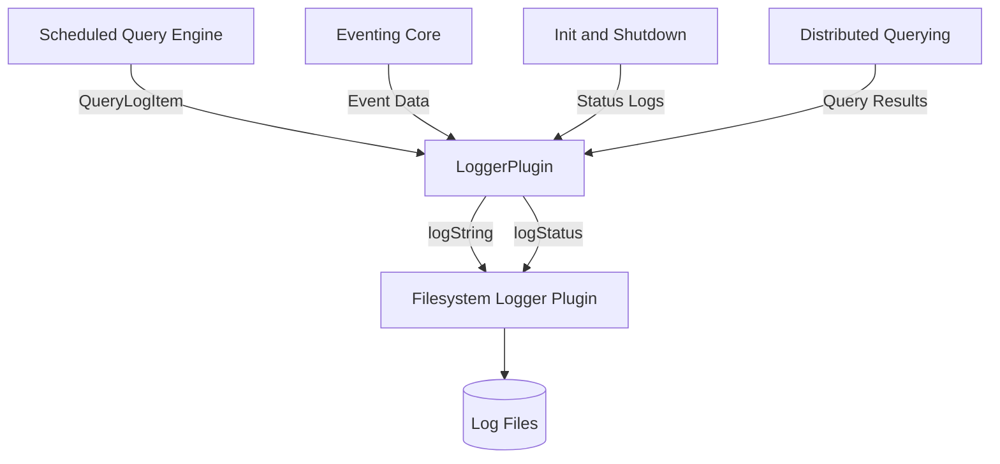
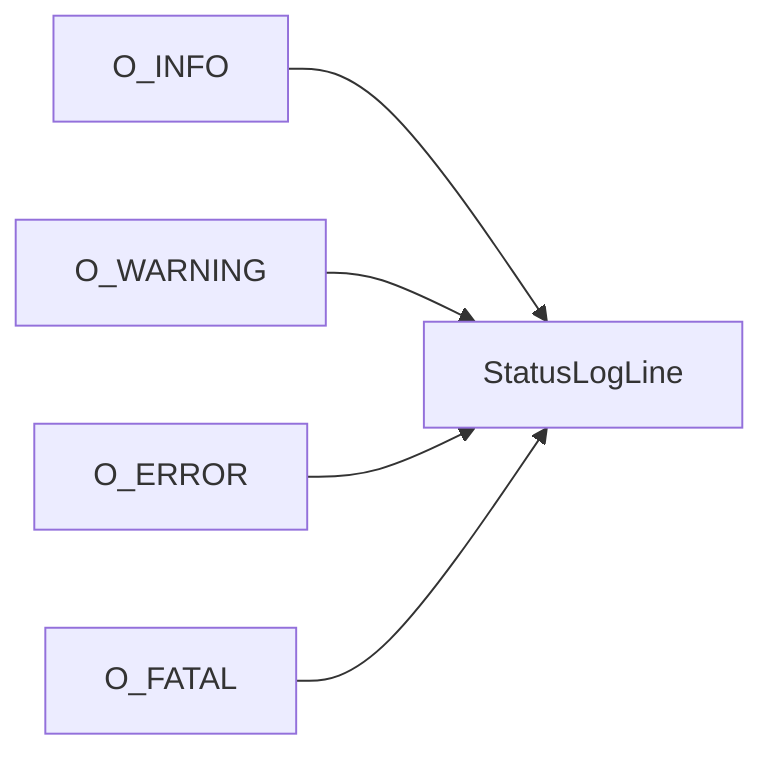
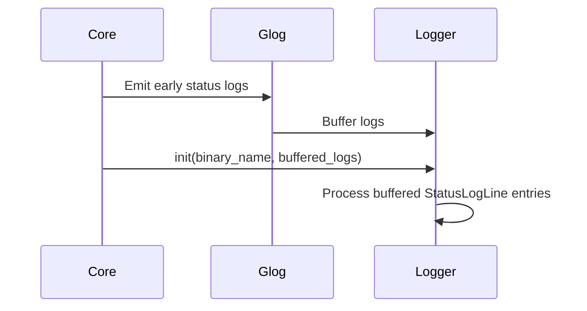
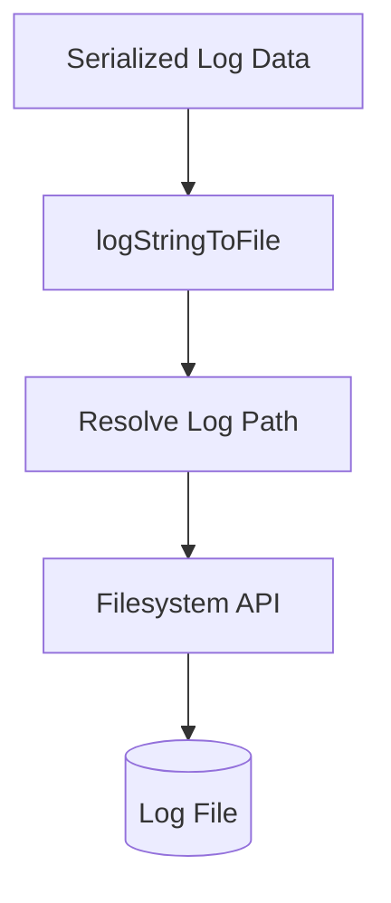
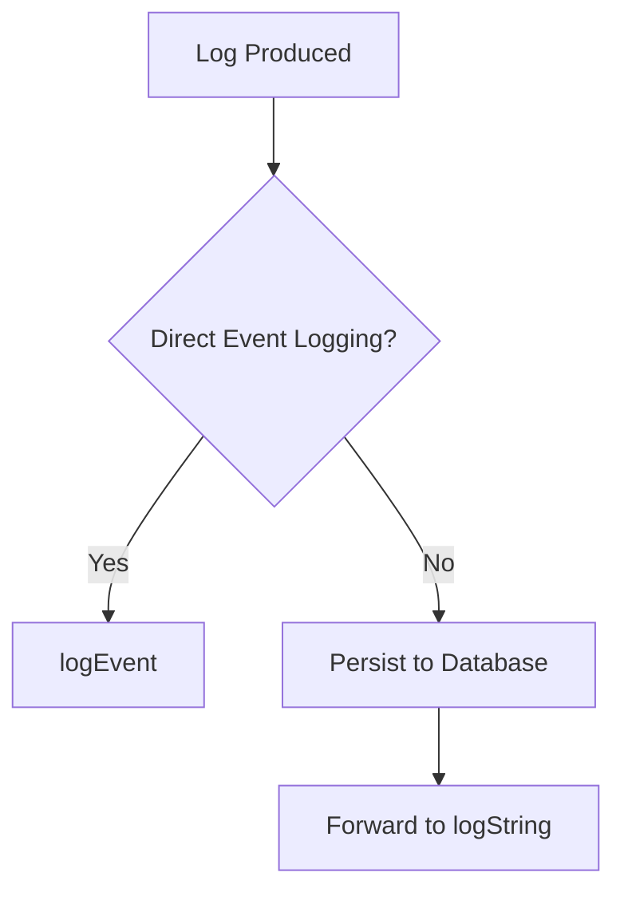

# Logging

## Overview

The **Logging** module provides the pluggable infrastructure used by osquery to emit:

- Scheduled query results (differential and snapshot)
- Status and diagnostic messages (INFO, WARNING, ERROR, FATAL)
- Event-based data from the eventing subsystem

It is built around a **plugin-based logger interface**, allowing osquery deployments to forward data to different backends such as local files, remote collectors, or custom enterprise logging systems.

At its core, the Logging module defines:

- A structured representation of status log entries (`StatusLogLine`)
- A pluggable base class (`LoggerPlugin`) for all logger implementations
- A built-in filesystem implementation (`FilesystemLoggerPlugin`)

---

## Architectural Position

The Logging module acts as a sink for data produced by several other subsystems:

- Query execution from [SQL Core and Virtual Tables](sql-core-and-virtual-tables/sql-core-and-virtual-tables.md)
- Scheduled queries and performance metrics
- Event publishing from Eventing
- Distributed query results
- Initialization and shutdown diagnostics

### High-Level Data Flow



The `LoggerPlugin` abstraction ensures that producers of log data are decoupled from the final storage or transport mechanism.

---

## Core Components

### StatusLogLine

**Component:** `osquery.osquery.core.plugins.logger.StatusLogLine`

`StatusLogLine` is a structured representation of an internal status message emitted by osquery.

It contains:

- `severity` — One of `O_INFO`, `O_WARNING`, `O_ERROR`, `O_FATAL`
- `filename` — Source file emitting the message
- `line` — Source line number
- `message` — Human-readable log message
- `calendar_time` — ASCII timestamp
- `time` — UNIX timestamp
- `identifier` — Host identifier

### Severity Model



This structure allows logger plugins to:

- Serialize status messages as JSON
- Forward them to external systems
- Override default glog handling

---

## LoggerPlugin Base Class

**Component:** `osquery.osquery.core.plugins.logger.LoggerPlugin`

`LoggerPlugin` is the abstract base class for all logging backends.

It extends the generic `Plugin` interface and defines a set of required and optional logging methods.

### Required Method

```text
virtual Status logString(const std::string& s) = 0;
```

Every logger must implement `logString`, which handles serialized result data.

### Optional Feature Methods

The logger system supports opt-in feature flags:

- `usesLogStatus()` — Indicates whether the plugin handles glog status lines
- `usesLogEvent()` — Indicates whether the plugin receives event data directly

These correspond to internal feature bits:

```text
LOGGER_FEATURE_LOGSTATUS
LOGGER_FEATURE_LOGEVENT
```

### Extended Logging Methods

| Method | Purpose |
|--------|----------|
| `logStatus` | Handle structured status logs (`StatusLogLine`) |
| `logSnapshot` | Handle large snapshot query results separately |
| `logEvent` | Handle individual event payloads |
| `logStringBatch` | Handle batched event payloads |
| `init` | Initialize logger after configuration and registry setup |

### Initialization Lifecycle

The logger is initialized **after**:

- CLI flags are parsed
- The registry is constructed
- Extensions are discovered
- Configuration is loaded

During early startup, status logs are buffered. Once `init` is called, those buffered `StatusLogLine` entries are forwarded to the active logger.



This guarantees that no early diagnostic messages are lost.

---

## Filesystem Logger Plugin

**Component:** `osquery.plugins.logger.filesystem_logger.impl`

The Filesystem Logger Plugin is the built-in logger implementation.

It writes:

- Differential query results
- Snapshot query results
- Status logs

To files on disk.

### Design Characteristics

- Implements `logString` for differential results
- Overrides `logSnapshot` to store large snapshot outputs separately
- Implements `logStatus` to write structured status entries
- Uses an internal PIMPL (`impl`) to encapsulate filesystem details

### Special Initialization Behavior

Unlike other logger plugins, the filesystem logger may return an error during `init`. When this happens:

- Glog continues writing directly to its configured log path
- Logging remains functional without custom interception

This makes the filesystem logger safe as a default fallback.

### Internal Write Flow



The internal `logStringToFile` method abstracts file naming and write semantics.

---

## Integration with Other Modules

### SQL Core and Virtual Tables

Scheduled queries generate `QueryLogItem` structures which are serialized and forwarded to the logger via `logString` or `logSnapshot`.

See: [SQL Core and Virtual Tables](sql-core-and-virtual-tables/sql-core-and-virtual-tables.md)

### Distributed Querying

Distributed query results are serialized and passed to the active logger backend.

See: [Distributed Querying](distributed-querying/distributed-querying.md)

### Eventing Core

Event subscribers may either:

- Persist events to the database first
- Or forward events directly to the logger if `usesLogEvent()` is enabled

See: [Eventing Core](eventing-core/eventing-core.md)

### Core Initialization and Shutdown

Startup and shutdown diagnostics are emitted as `StatusLogLine` entries and forwarded after logger initialization.

See: [Core Init Shutdown and Watcher](core-init-shutdown-and-watcher/core-init-shutdown-and-watcher.md)

---

## Logging Modes

The Logging module supports multiple operational modes depending on plugin capabilities:



This flexibility allows deployments to optimize for:

- Durability (database-backed event storage)
- Performance (direct streaming to remote sink)
- Storage isolation (separate snapshot logging)

---

## Extending the Logging Module

To implement a custom logger:

1. Subclass `LoggerPlugin`
2. Implement `logString`
3. Optionally override `logStatus`, `logSnapshot`, or `logEvent`
4. Register the plugin in the `logger` registry

Minimal example structure:

```text
class CustomLoggerPlugin : public LoggerPlugin {
  Status logString(const std::string& s) override;
  void init(const std::string& name,
            const std::vector<StatusLogLine>& log) override;
};
```

Custom loggers can integrate with:

- Centralized log collectors
- Message queues
- HTTP ingestion endpoints
- SIEM platforms

---

## Key Design Principles

- **Pluggability** — Logging backend is interchangeable via registry
- **Structured Status Logging** — Uses typed `StatusLogLine`
- **Startup Safety** — Buffered logs ensure no early message loss
- **Feature Negotiation** — Logger declares capabilities via feature flags
- **Separation of Concerns** — Producers do not depend on storage implementation

The Logging module therefore acts as the central abstraction layer between data-producing subsystems and external observability infrastructure.