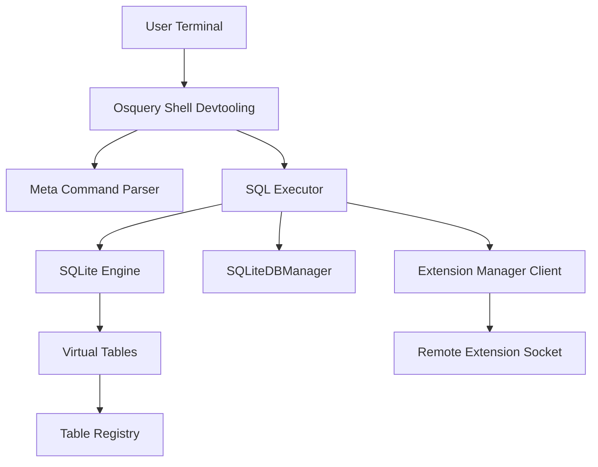
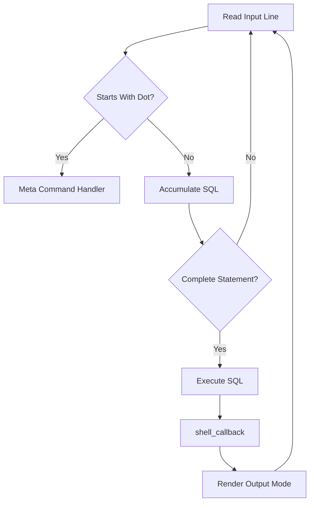
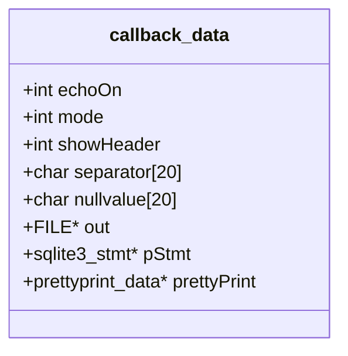
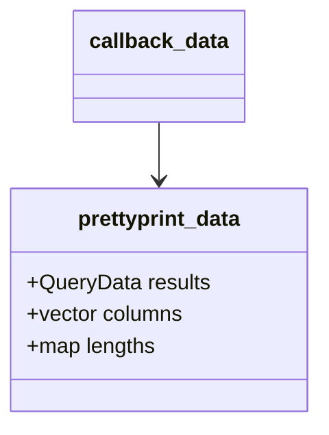
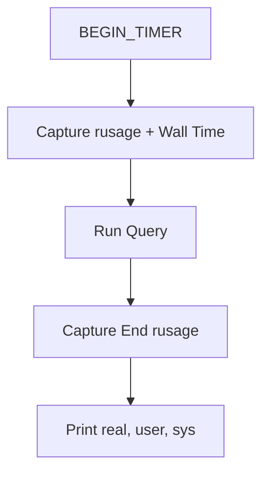
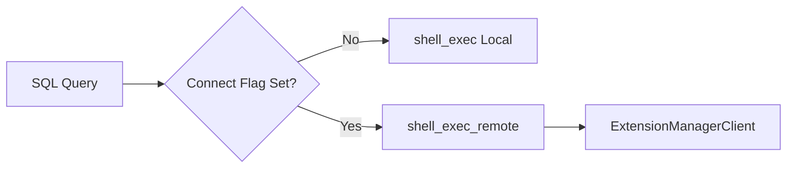
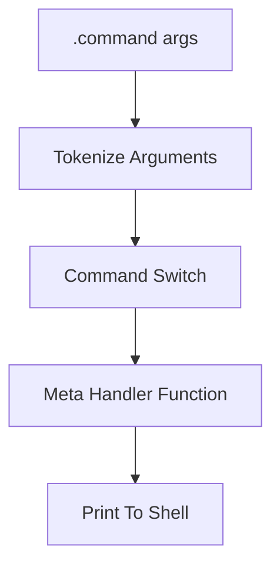
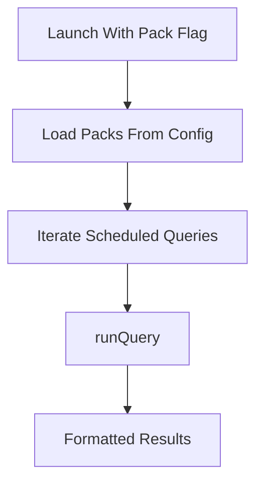

# Osquery Shell Devtooling

## Overview

The **Osquery Shell Devtooling** module implements the interactive `osqueryi` shell experience. It provides:

- An interactive SQLite-based SQL console
- Multiple output rendering modes (pretty, column, line, list, CSV, JSON)
- Meta-commands (e.g., `.tables`, `.schema`, `.show`, `.connect`)
- Integration with extensions and remote query execution
- Runtime profiling via CPU and wall-clock timing

This module acts as a developer-facing entry point into the osquery runtime, bridging the SQL engine, registry, configuration system, extensions framework, and database backend into a cohesive CLI tool.

Core components documented here:

- `callback_data`
- `prettyprint_data`
- `rusage` (platform-dependent CPU accounting structure)

---

## Architectural Position

The shell sits on top of the SQL engine and database manager while optionally delegating execution to extensions.



### Key Responsibilities

1. Accept and parse interactive input
2. Distinguish SQL statements from meta-commands
3. Execute SQL locally or remotely
4. Format and render result sets
5. Provide runtime diagnostics and environment introspection

---

## Execution Flow

The shell processes user input in a loop, accumulating SQL until it forms a complete statement or identifying a meta-command.



### Major Functions

- `process_input` – Main input loop
- `do_meta_command` – Parses and dispatches dot commands
- `shell_exec` – Executes SQL locally
- `shell_exec_remote` – Executes SQL through extensions
- `shell_callback` – Row-level result handler

---

## Core Data Structures

### callback_data

`callback_data` is the primary state container for the shell runtime.

It maintains:

- Output mode (`MODE_Pretty`, `MODE_Column`, etc.)
- Header visibility
- Field separator
- Column widths
- Null display value
- Output file handle
- Current prepared statement
- Pretty-print state



This structure is passed through execution layers and into `shell_callback`, allowing output behavior to remain configurable and consistent.

---

### prettyprint_data

`prettyprint_data` buffers result rows before formatting when in `MODE_Pretty`.

It contains:

- `QueryData results` – Collected rows
- `vector<string> columns` – Column order
- `map<string, size_t> lengths` – Computed width per column



This buffering allows the shell to compute column widths dynamically before rendering formatted output.

---

### rusage

The `rusage` structure tracks CPU time for the `.timer` feature.

- On Unix: uses `getrusage`
- On Windows: wraps `FILETIME`

The timing workflow:



The timer reports:

- Real (wall-clock) time
- User CPU time
- System CPU time

---

## Output Modes

The shell supports multiple rendering strategies.

| Mode | Description |
|------|-------------|
| Pretty | Default aligned table format |
| Column | Fixed-width columns |
| Line | One column per line |
| List | Separator-delimited rows |
| CSV | Quoted CSV output |
| JSON | JSON output via flags |

### Rendering Strategy

All result rows are passed through:

```text
shell_exec → shell_callback → output mode switch → formatting logic
```

In Pretty mode:

1. Rows are buffered
2. Column widths are computed
3. Final formatted output is rendered
4. Buffers are cleared

---

## Local vs Remote Execution

The shell can execute queries either:

- Directly against the embedded SQLite database
- Through an extension socket using the extension client



### Remote Path

- Connect via `FLAGS_connect`
- Use `ExtensionManagerClient`
- Retrieve rows and column types
- Replay results through `shell_callback`

This design preserves formatting behavior regardless of execution backend.

---

## Meta Commands

Meta-commands begin with `.` and are handled separately from SQL.

Examples:

- `.tables` – List registered tables
- `.schema` – Show CREATE statements
- `.show` – Display runtime configuration
- `.features` – Show enable or disable flags
- `.connect` / `.disconnect` – Manage extension sockets
- `.timer ON` – Enable profiling

### Meta Command Processing



Meta commands may:

- Interact with the registry
- Query internal virtual tables
- Adjust shell runtime flags
- Invoke SQL indirectly

---

## Input Handling and History

Interactive input uses `linenoise` for:

- Line editing
- Command history
- Table name completion

Completion is implemented by querying the table registry and matching prefixes.

Non-interactive mode supports piped input and file-driven execution.

---

## Integration with the Larger System

The shell integrates tightly with:

- SQL Engine and Virtual Tables
- Database Backend (via `SQLiteDBManager`)
- Extensions Framework
- Configuration and Packs (via `runPack`)
- Flags and Runtime Options

### Pack Execution

When `--pack` is provided:



This allows the shell to function as a lightweight pack executor for development and debugging.

---

## Error Handling

Errors are managed at multiple levels:

- SQLite prepare and step failures
- Extension RPC failures
- Incomplete SQL detection
- Interrupt handling via SIGINT

Behavior is influenced by:

- `.bail ON|OFF`
- Interactive vs non-interactive mode

---

## Key Design Characteristics

### 1. Stateful Rendering Model

All output behavior is driven by `callback_data`, enabling:

- Consistent formatting
- Mode switching at runtime
- File redirection support

### 2. Backend-Agnostic Execution

The shell abstracts execution so that:

- Local SQLite
- Remote extension queries

produce identical output paths.

### 3. Developer-Centric Tooling

Features like:

- `.types`
- `.features`
- `.show`
- `.timer`

make the shell a debugging surface for the entire osquery stack.

---

## Summary

The **Osquery Shell Devtooling** module provides a fully featured interactive SQL interface on top of the osquery runtime.

It:

- Bridges user input to the SQL engine
- Supports local and extension-based execution
- Implements flexible and extensible output formatting
- Integrates with configuration, packs, and flags
- Provides runtime diagnostics and profiling

Architecturally, it is the developer-facing gateway into osquery’s SQL engine, virtual tables, extension framework, and database layer — combining them into a cohesive, interactive experience.