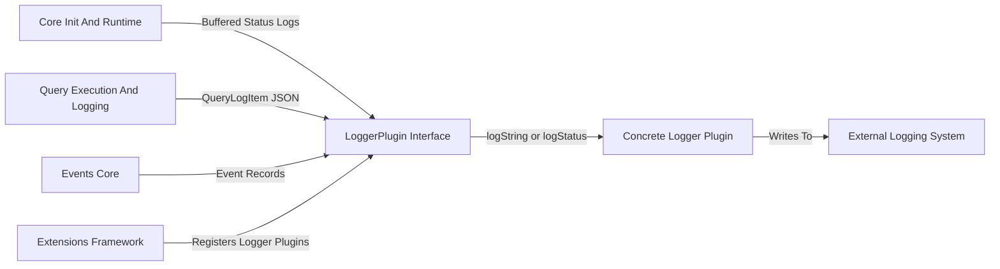
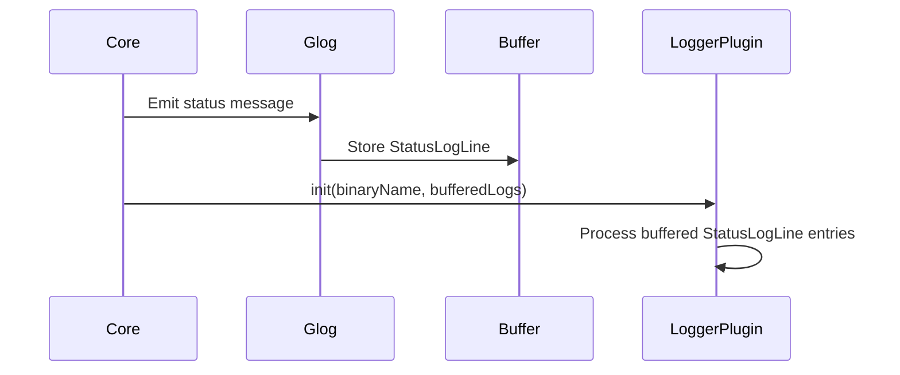
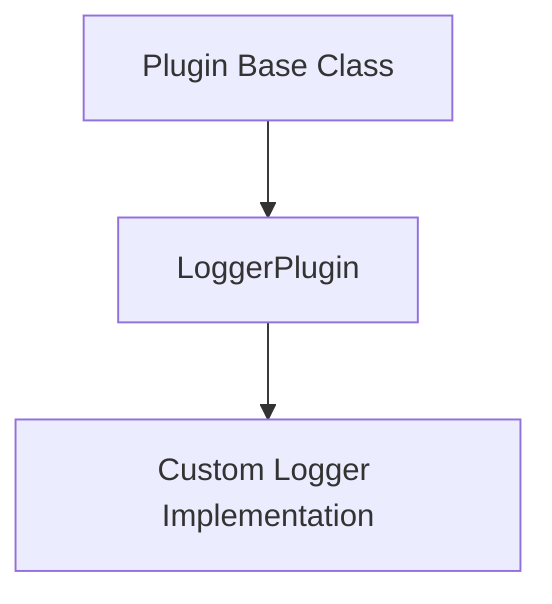
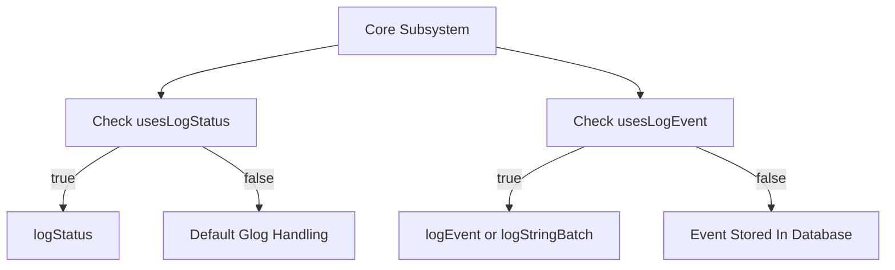
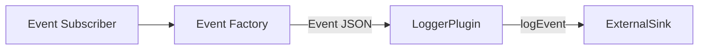
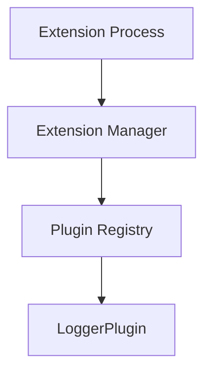
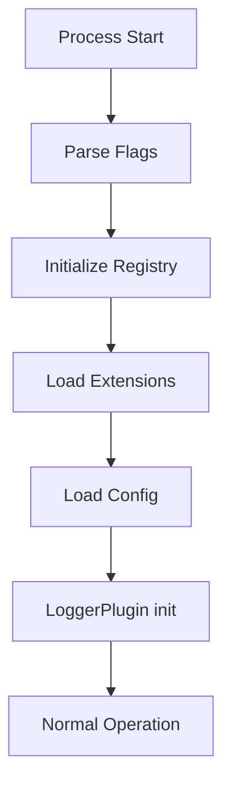

# Plugin Interfaces And Logging

The Plugin Interfaces And Logging module defines the extensible logging architecture used by osquery. It provides the abstraction layer that allows osquery to forward status logs, query results, snapshots, and events to pluggable backends such as file loggers, TLS loggers, syslog, or custom enterprise pipelines.

At the center of this module is the `LoggerPlugin` interface and the `StatusLogLine` data structure, which together enable:

- Structured status logging (INFO, WARNING, ERROR, FATAL)
- Snapshot and differential result logging
- Optional direct event forwarding
- Feature negotiation between the core and logger plugins

This module acts as a bridge between core execution components and external log consumers.

---

## Architectural Role

The Plugin Interfaces And Logging module sits between the core runtime and downstream logging implementations. It integrates with:

- [Core Init And Runtime](core-init-and-runtime/core-init-and-runtime.md) for startup lifecycle and early log buffering
- [Query Execution And Logging](query-execution-and-logging/query-execution-and-logging.md) for structured query result emission
- [Events Core](events-core/events-core.md) for event subscriber forwarding
- [Extensions Framework](extensions-framework/extensions-framework.md) when logger plugins are provided as extensions

### High-Level Architecture



The LoggerPlugin interface standardizes how log data flows from internal subsystems to an external destination.

---

## Core Data Structure: StatusLogLine

The `StatusLogLine` structure represents a parsed and normalized status log entry emitted by the internal logging system.

### Fields

```text
StatusLogLine
 ├─ severity        (StatusLogSeverity)
 ├─ filename        (string)
 ├─ line            (uint64)
 ├─ message         (string)
 ├─ calendar_time   (string)
 ├─ time            (uint64)
 └─ identifier      (string)
```

### Severity Model

Severity is mapped using an internal enum compatible with Glog levels:

- O_INFO
- O_WARNING
- O_ERROR
- O_FATAL

This ensures that logger plugins can:

- Preserve original severity
- Map severity to external systems
- Filter or route based on severity

### Lifecycle of a Status Log



During initialization, buffered status logs are passed into the active logger plugin through the protected `init` method.

---

## LoggerPlugin Interface

The `LoggerPlugin` class is the extensible abstraction that concrete loggers must implement.

### Inheritance Model



LoggerPlugin inherits from the generic Plugin base and participates in the osquery plugin registry.

### Mandatory Implementation

Every logger plugin must implement:

```text
Status logString(const std::string& s)
```

This method receives serialized log payloads (typically JSON) and forwards them to the external system.

---

## Optional Feature Negotiation

Logger plugins may opt-in to advanced behaviors using feature methods.

### LoggerFeatures Enumeration

```text
LOGGER_FEATURE_BLANK
LOGGER_FEATURE_LOGSTATUS
LOGGER_FEATURE_LOGEVENT
```

These features correspond to optional capabilities implemented by a logger.

### Feature Methods

| Method | Purpose |
|--------|----------|
| usesLogStatus | Take exclusive ownership of status logs |
| usesLogEvent | Receive events directly from subscribers |
| logSnapshot | Handle large snapshot result sets separately |
| logEvent | Handle single event forwarding |
| logStringBatch | Handle batch event forwarding |

### Feature Flow



This mechanism allows sophisticated loggers to:

- Replace default status logging
- Bypass the database for event streaming
- Handle large payloads efficiently

---

## Snapshot and Query Logging

The Plugin Interfaces And Logging module integrates tightly with [Query Execution And Logging](query-execution-and-logging/query-execution-and-logging.md).

When scheduled or distributed queries execute, they generate structured log entries that are serialized and passed to `logString` or `logSnapshot`.

### Snapshot Handling

If a plugin overrides `logSnapshot`, snapshot query results can be:

- Written to a separate stream
- Batched or chunked differently
- Routed to a high-throughput pipeline

Otherwise, snapshot results fall back to `logString`.

---

## Event Forwarding Integration

This module optionally bypasses database storage defined in [Database Backends](database-backends/database-backends.md) when `usesLogEvent` returns true.

### Event Processing Flow



If disabled, events are first stored in the database and later queried through virtual tables.

---

## Extension-Based Loggers

Logger plugins may be:

- Built-in compiled plugins
- Extension-based plugins registered via the [Extensions Framework](extensions-framework/extensions-framework.md)

### Extension Registration Flow



Because logger plugins can be loaded as extensions, initialization order is critical. The logger is initialized only after:

- CLI flags are parsed
- Registry items are constructed
- Extensions are discovered
- Configuration is loaded

This ensures all early logs are preserved and flushed.

---

## Initialization Lifecycle

The protected `init` method is invoked once the system is ready.

### Initialization Responsibilities

A logger plugin should:

1. Store or process buffered status logs
2. Record the binary process name
3. Establish connections to remote sinks
4. Validate configuration

### Startup Sequence



This design guarantees that no logs are lost during early startup.

---

## Error Handling Model

All logging methods return a `Status` object, which provides:

- Success indication
- Error codes
- Failure messages

Batch logging (`logStringBatch`) tracks individual event failures and returns a consolidated failure status if any entry fails.

This enables the core to:

- Detect logger failures
- Emit fallback logs
- Surface operational health issues

---

## Design Characteristics

### 1. Pluggable by Design
The logging layer is fully abstracted behind the Plugin interface.

### 2. Backward Compatible
Default behavior relies only on `logString`, ensuring minimal implementation overhead.

### 3. Feature Opt-In
Advanced capabilities are enabled explicitly via feature methods.

### 4. Extension Friendly
Logger plugins can run in isolated extension processes.

### 5. Performance Aware
Supports:

- Snapshot specialization
- Event batch processing
- Direct event streaming

---

## Relationship to Other Modules

- Uses lifecycle guarantees from [Core Init And Runtime](core-init-and-runtime/core-init-and-runtime.md)
- Receives structured query output from [Query Execution And Logging](query-execution-and-logging/query-execution-and-logging.md)
- Can bypass storage in [Database Backends](database-backends/database-backends.md)
- May be deployed via [Extensions Framework](extensions-framework/extensions-framework.md)
- Integrates with event pipelines in [Events Core](events-core/events-core.md)

The Plugin Interfaces And Logging module is therefore the central abstraction for exporting observability data from osquery into external ecosystems.

---

## Summary

The Plugin Interfaces And Logging module provides:

- A standardized logging interface (`LoggerPlugin`)
- A structured status log representation (`StatusLogLine`)
- Optional advanced feature negotiation
- Tight integration with query, event, and extension systems

By decoupling log production from log transport, this module enables flexible deployment scenarios ranging from local file logging to enterprise-scale distributed telemetry pipelines.