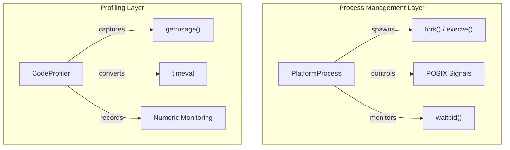
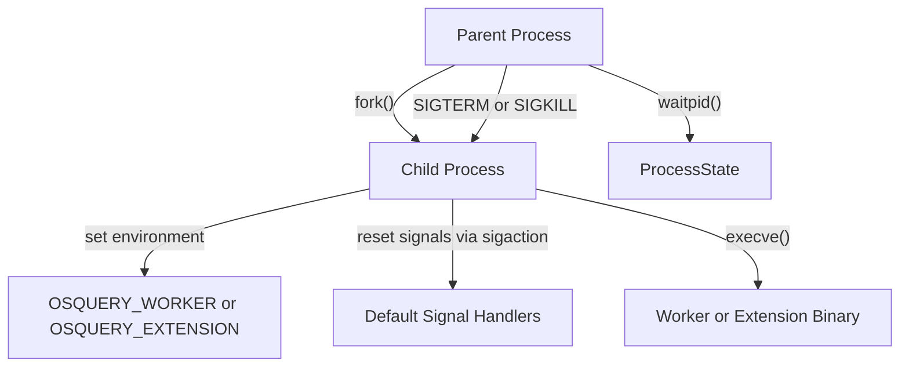
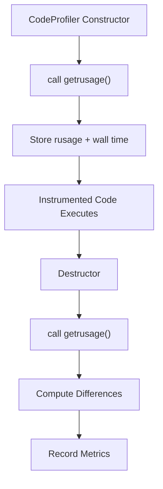

# Process And Profiler

## Overview

The **Process And Profiler** module provides low-level POSIX process management and runtime profiling capabilities for the osquery runtime. It is responsible for:

- Spawning and managing worker and extension processes
- Handling process lifecycle events (fork, exec, signals, wait)
- Graceful and forced process termination
- Resource usage measurement (CPU, memory, I/O)
- Wall-clock timing and performance instrumentation

This module acts as a foundational runtime layer that supports higher-level components such as:

- [Extensions Framework](../extensions-framework/extensions-framework.md)
- [SQL Core And Virtual Tables](../sql-core-and-virtual-tables/sql-core-and-virtual-tables.md)
- [Query Execution And Logging](../query-execution-and-logging/query-execution-and-logging.md)

It bridges operating system primitives (signals, `fork`, `exec`, `waitpid`, `getrusage`) with osquery’s internal abstractions.

---

## Architectural Overview

The module is composed of two main responsibilities:

1. **Process Lifecycle Management** (POSIX layer)
2. **Runtime Resource Profiling** (CodeProfiler)

The **PlatformProcess** abstraction encapsulates process operations, while **CodeProfiler** instruments execution scopes to capture resource metrics.

---

## Process Management

### PlatformProcess

Core component:

- `osquery.osquery.process.posix.process.sigaction`

The `PlatformProcess` class encapsulates a native POSIX process identifier and exposes lifecycle operations.

### Responsibilities

- Track process identity (`pid()`)
- Launch workers and extensions
- Send signals (SIGTERM, SIGKILL, SIGUSR1)
- Check process state via `waitpid`
- Reset signal handlers for child processes

### Process Lifecycle

### Launching Workers

`launchWorker()`:

- Calls `fork()`
- Sets `OSQUERY_WORKER` environment variable
- Replaces child image with `execve()`
- Returns a `PlatformProcess` wrapper for the parent

Workers are used to isolate query execution and runtime logic from the supervising daemon.

### Launching Extensions

`launchExtension()`:

- Forks a child
- Sets `OSQUERY_EXTENSION` environment variable
- Resets all signal handlers using `sigaction`
- Constructs CLI arguments (`--socket`, `--timeout`, `--interval`, `--verbose`)
- Calls `execve()`

Resetting signals ensures extension processes do not inherit unsafe handlers from the parent.

This directly supports the [Extensions Framework](../extensions-framework/extensions-framework.md).

### Process State Monitoring

`checkStatus()` uses:

- `waitpid(..., WNOHANG)`
- Exit status macros (`WIFEXITED`, `WIFSIGNALED`, `WEXITSTATUS`)

It returns a `ProcessState` enum:

- `PROCESS_STILL_ALIVE`
- `PROCESS_EXITED`
- `PROCESS_ERROR`
- `PROCESS_STATE_CHANGE`

This mechanism is critical for supervising long-running workers and extensions.

---

## Runtime Profiling

### CodeProfiler

Core components:

- `osquery.osquery.profiler.posix.code_profiler.rusage`
- `osquery.osquery.profiler.posix.code_profiler.timeval`

`CodeProfiler` is an RAII-based instrumentation utility. It captures system resource usage at construction and computes deltas at destruction.

### Profiling Model

The profiler captures:

- Maximum RSS (`ru_maxrss`)
- RSS increase
- Input blocks (`ru_inblock`)
- Output blocks (`ru_oublock`)
- User CPU time (`ru_utime`)
- System CPU time (`ru_stime`)
- Total CPU time (derived)
- Wall clock duration

### Rusage Granularity

On Linux:

- Uses `RUSAGE_THREAD` for per-thread granularity

On other POSIX systems:

- Uses `RUSAGE_SELF`

This ensures more precise profiling where supported.

### Time Conversion

`timeval` structures are converted into milliseconds using:

- Seconds (`tv_sec`)
- Microseconds (`tv_usec`)
- `std::chrono` duration casting

The module normalizes all time metrics to millisecond precision for consistent monitoring.

### Metric Recording

Metrics are recorded via the numeric monitoring subsystem:

- Pre-aggregation: `Min`
- Pre-aggregation: `Sum`
- Entity naming: `"<scope>.<metric>"`

For example:

- `query.time.user.millis`
- `query.time.wall.millis`
- `query.rss.increase.kb`

These metrics are consumed by performance dashboards and internal telemetry.

---

## Interaction With Other Modules

### SQL Core And Virtual Tables

Query execution paths instrument expensive operations using `CodeProfiler` to measure:

- Query latency
- CPU usage
- Memory growth

See: [SQL Core And Virtual Tables](../sql-core-and-virtual-tables/sql-core-and-virtual-tables.md)

### Query Execution And Logging

Profiling results are often correlated with structured query logs for performance analysis.

See: [Query Execution And Logging](../query-execution-and-logging/query-execution-and-logging.md)

### Extensions Framework

`PlatformProcess` is responsible for launching and supervising extension binaries.

See: [Extensions Framework](../extensions-framework/extensions-framework.md)

---

## Error Handling Strategy

### Process Errors

- `fork()` failure returns null process wrapper
- `execve()` failure logs error and exits child
- `waitpid()` errors are mapped to `PROCESS_ERROR`

### Profiling Errors

- `getrusage()` errors are wrapped in an `Expected` type
- Fatal errors log descriptive messages
- Unsupported fields are traced but not fatal

Overflow and negative deltas are guarded to prevent invalid metric reporting.

---

## Design Characteristics

### RAII-Based Instrumentation

`CodeProfiler` automatically measures duration between construction and destruction, reducing the risk of missing instrumentation cleanup.

### POSIX Abstraction Layer

`PlatformProcess` encapsulates raw system calls, allowing the rest of the codebase to operate on a stable abstraction.

### Isolation-Oriented Runtime Model

Worker and extension processes are intentionally isolated:

- Separate address spaces
- Independent signal handling
- Controlled environment variables

This improves fault tolerance and security.

---

## Summary

The **Process And Profiler** module provides:

- Safe and controlled process lifecycle management
- Worker and extension process orchestration
- Precise resource usage measurement
- Millisecond-level wall time tracking
- Integration with osquery’s monitoring infrastructure

It serves as a foundational runtime component that enables robust execution, isolation, and performance visibility across the osquery system.