# Query Execution And Logging

The Query Execution And Logging module is responsible for transforming raw SQL execution results into structured, state-aware, and loggable artifacts. It bridges the SQL engine, scheduled query framework, persistent storage layer, and logging plugins by:

- Tracking historical query results
- Computing differential results between executions
- Managing epochs and execution counters
- Serializing results into structured JSON formats
- Preparing log items for upstream logging systems

At the center of this module are two primary abstractions:

- `QueryLogItem` — the log-ready representation of a query execution
- `Query` — the stateful interface to historical query storage and diff computation

This module integrates closely with:

- [SQL Core And Virtual Tables](sql-core-and-virtual-tables/sql-core-and-virtual-tables.md)
- [Database Backends](database-backends/database-backends.md)
- [Plugin Interfaces And Logging](plugin-interfaces-and-logging/plugin-interfaces-and-logging.md)
- [Config And Packs](config-and-packs/config-and-packs.md)
- [Events Core](events-core/events-core.md)

---

## Architectural Overview

The Query Execution And Logging module sits between query execution and the logging pipeline.

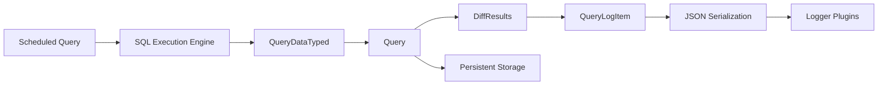

### Responsibilities by Stage

1. **Execution** — SQL engine returns raw result rows.
2. **State Management** — `Query` retrieves previous results from persistent storage.
3. **Diff Computation** — New results are compared with stored results.
4. **Metadata Enrichment** — Time, epoch, counter, identifier, and decorations are added.
5. **Serialization** — `QueryLogItem` is converted into structured JSON.
6. **Logging** — Output is passed to logger plugins for transport.

---

## Core Component: QueryLogItem

`QueryLogItem` represents a fully-formed query execution log record.

It encapsulates:

- Differential or snapshot results
- Query metadata
- Execution timing
- Epoch and invocation counter
- Host identifier
- Custom decorations

### Data Model

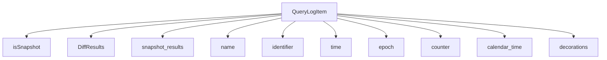

### Snapshot vs Differential Modes

- **Snapshot mode** (`isSnapshot = true`):
  - Entire result set is emitted.
  - Used for ad-hoc queries or first executions.

- **Differential mode** (`isSnapshot = false`):
  - Only added and removed rows are logged.
  - Reduces log volume and highlights changes.
  - Uses `DiffResults` from the SQL core module.

See [SQL Core And Virtual Tables](sql-core-and-virtual-tables/sql-core-and-virtual-tables.md) for details on `DiffResults`.

---

## Query Class: Historical State And Diff Engine

The `Query` class manages:

- Historical storage of query results
- Epoch tracking
- Invocation counters
- Differential computation

It provides the persistence-backed execution state for scheduled queries.

### Lifecycle Of A Scheduled Query Execution

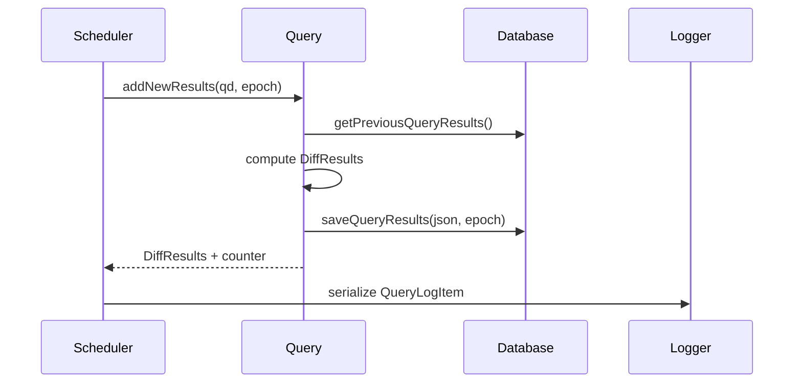

---

## Persistent Storage Integration

The module relies on the Database Backends module for durable state.

Key interactions:

- Retrieve previous results
- Store current results
- Store epoch
- Maintain query execution counters

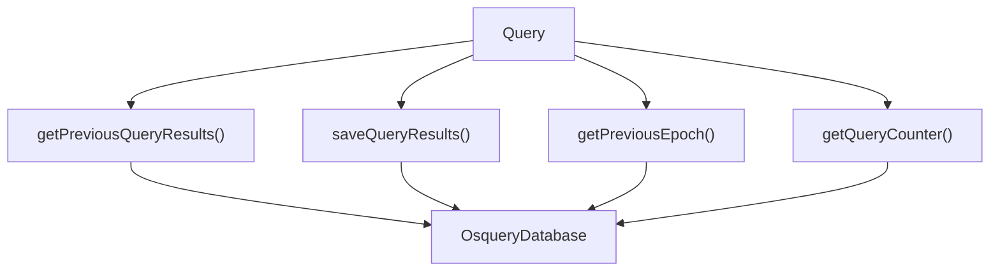

See [Database Backends](database-backends/database-backends.md) for storage engine details.

---

## Epoch And Counter Semantics

Two mechanisms guarantee correctness and replay safety:

### Epoch

- Represents a configuration generation.
- Changes when configuration changes.
- Forces fresh result evaluation.

### Counter

- Tracks how many times a query executed within an epoch.
- Automatically increments per execution.
- Resets depending on query reset semantics.

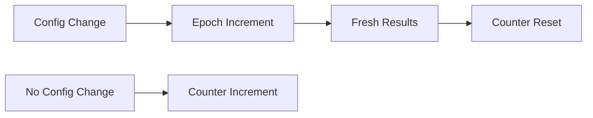

Epoch coordination is driven by configuration updates from:

- [Config And Packs](config-and-packs/config-and-packs.md)

---

## Differential Result Computation

When new results are available:

1. Previous results are retrieved from storage.
2. Both old and new sets are normalized.
3. A diff is computed.
4. Added and removed rows are captured in `DiffResults`.

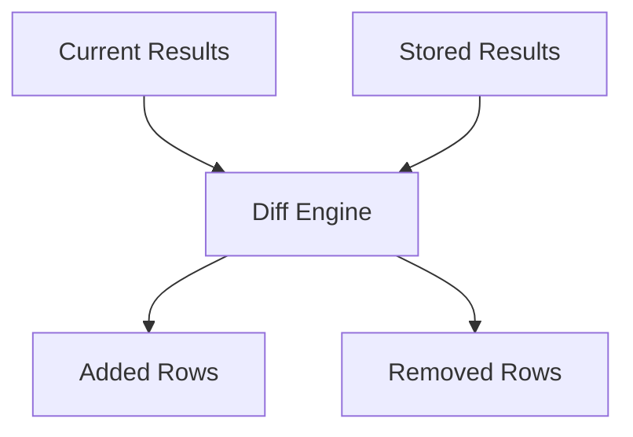

The diff logic leverages data structures from the SQL core layer.

See [SQL Core And Virtual Tables](sql-core-and-virtual-tables/sql-core-and-virtual-tables.md).

---

## Serialization Paths

The module supports multiple serialization formats.

### Standard Log Serialization

- `serializeQueryLogItem`
- `serializeQueryLogItemJSON`

Produces a JSON object containing:

- Metadata
- Differential or snapshot results
- Decorations

### Events-Based Serialization

- `serializeQueryLogItemAsEvents`
- `serializeQueryLogItemAsEventsJSON`

Used for event-style queries where each row represents an action.

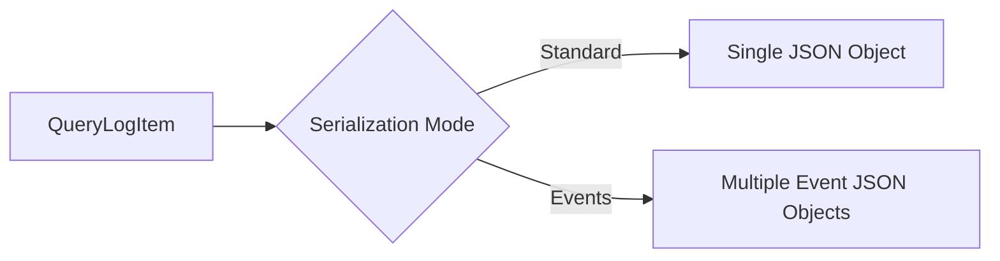

Serialized output is consumed by logging plugins in:

- [Plugin Interfaces And Logging](plugin-interfaces-and-logging/plugin-interfaces-and-logging.md)

---

## Interaction With Scheduled Queries

Scheduled queries are defined in the configuration layer and represented by `ScheduledQuery` objects.

The Query Execution And Logging module:

- Uses query name as storage key
- Detects SQL changes via `isNewQuerySql()`
- Determines first run via `getQueryStatus()`
- Applies reset semantics

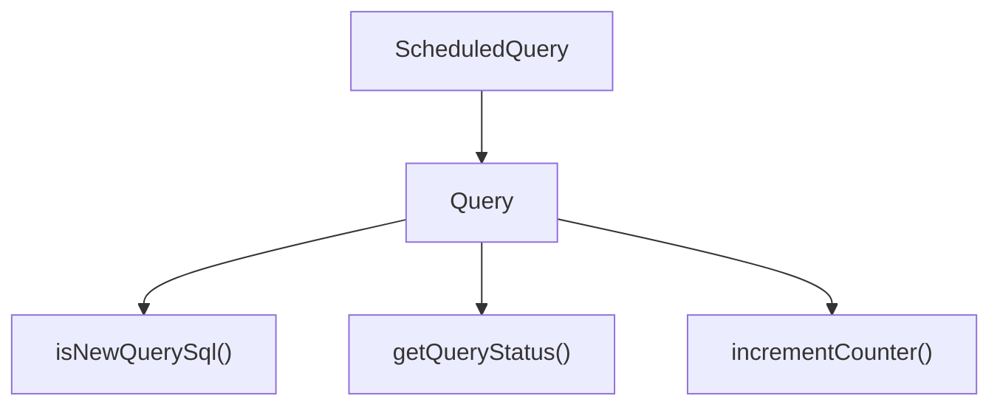

See [Config And Packs](config-and-packs/config-and-packs.md) for how scheduled queries are defined and refreshed.

---

## Events-Based Queries

For event-driven queries (from the Events Core module):

- Results accumulate over time.
- `addNewEvents()` is used instead of `addNewResults()`.
- Diff semantics may differ depending on event expiration.

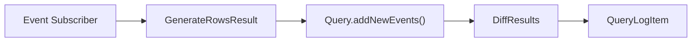

See [Events Core](events-core/events-core.md) for event subscription and row generation.

---

## Query Storage Maintenance

The module provides utilities for:

- Listing stored query names
- Checking existence in storage
- Retrieving current results

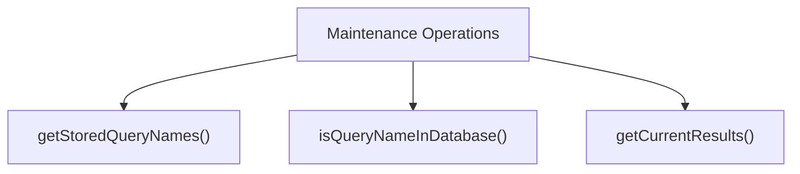

This enables database cleanup and migration logic.

---

## End-To-End Data Flow

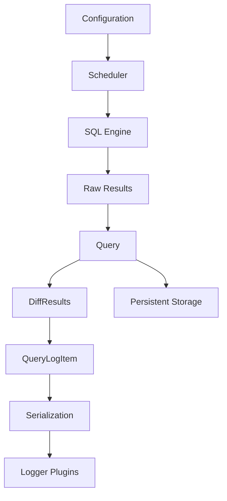

This pipeline ensures:

- Deterministic result tracking
- Efficient differential logging
- Accurate epoch-based resets
- Pluggable logging backends

---

## How This Module Fits In The Overall System

The Query Execution And Logging module is the stateful boundary between execution and observability.

- It depends on SQL execution for result generation.
- It depends on database backends for persistent state.
- It feeds logger plugins with structured, serialized output.
- It responds to configuration and epoch changes.

Without this module:

- Scheduled queries would lack historical context.
- Logging volume would be excessive (no diffs).
- Epoch resets would not propagate cleanly.
- Distributed and event-based logging would be inconsistent.

It is therefore a critical coordination layer that ensures correctness, efficiency, and structured output across the entire query lifecycle.