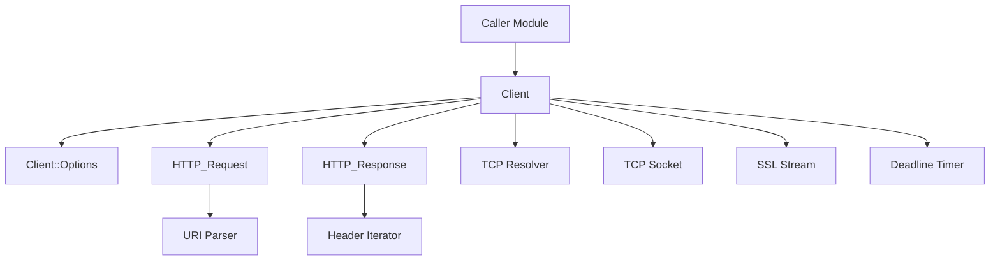
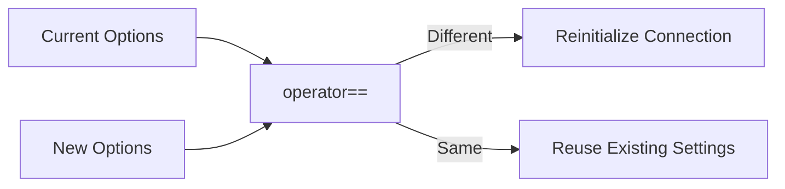
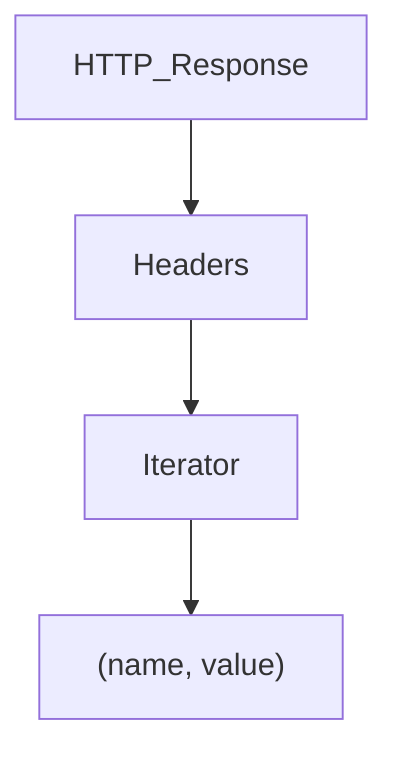
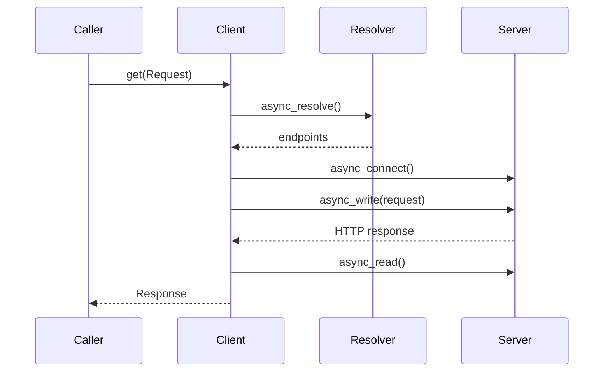
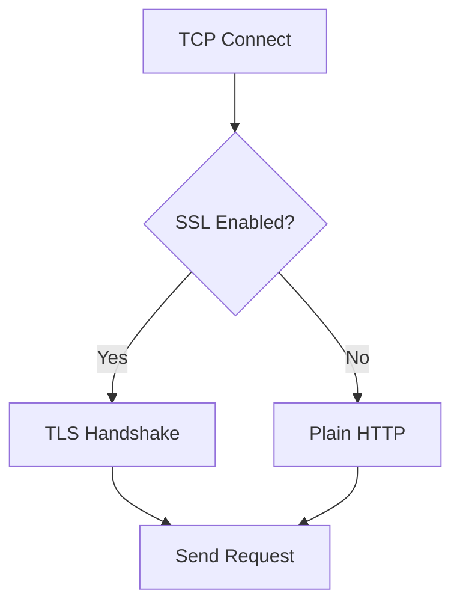
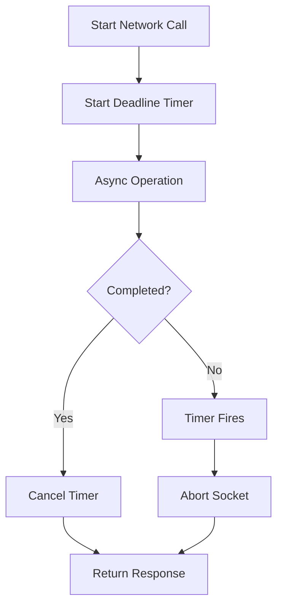

# Remote Http Client

The **Remote Http Client** module provides a general-purpose HTTP and HTTPS client implementation used across the system for secure remote communication. Built on top of Boost.Asio and Boost.Beast, it enables synchronous-style HTTP operations backed by asynchronous networking primitives, with full TLS support, timeout handling, redirect control, and proxy configuration.

This module acts as the foundational networking layer for components that need to communicate with remote services, such as:

- [Distributed Querying](distributed-querying/distributed-querying.md)
- [Logging and Query Observability](logging-and-query-observability/logging-and-query-observability.md)
- [Configuration and Packs](configuration-and-packs/configuration-and-packs.md)

It abstracts low-level socket management, TLS setup, request serialization, and response parsing into a reusable and secure HTTP client interface.

---

## 1. Purpose and Responsibilities

The Remote Http Client module is responsible for:

- Creating and managing TCP and TLS connections
- Executing HTTP methods: `GET`, `POST`, `PUT`, `HEAD`, `DELETE`
- Managing request headers and body serialization
- Parsing HTTP responses
- Enforcing timeouts and connection lifecycle rules
- Handling TLS verification, certificates, and cipher configuration
- Supporting optional proxy routing
- Supporting redirect and keep-alive behavior

It provides a high-level API while internally orchestrating asynchronous Boost networking operations.

---

## 2. High-Level Architecture

The module is centered around three main abstractions:

- `Client` – Connection lifecycle and HTTP execution engine
- `HTTP_Request<T>` – URI-aware request wrapper
- `HTTP_Response<T>` – Response wrapper with header iteration support

### 2.1 Architectural Overview



The `Client` orchestrates the network stack and delegates URI parsing to `HTTP_Request`, while wrapping Boost.Beast responses inside `HTTP_Response`.

---

## 3. Core Components

### 3.1 Client

The `Client` class implements a general-purpose HTTP/HTTPS client built on:

- `boost::asio::io_context`
- `boost::asio::ip::tcp::resolver`
- `boost::asio::ip::tcp::socket`
- `boost::asio::ssl::stream`
- `boost::beast::http`

It exposes the following public methods:

- `get(Request&)`
- `post(Request&, body, content_type)`
- `put(Request&, body, content_type)`
- `head(Request&)`
- `delete_(Request&)`

Each method:
1. Initializes the request
2. Establishes or reuses a connection
3. Sends the request asynchronously
4. Waits for response or timeout
5. Returns a `Response` object

The destructor ensures that open sockets are closed safely.

---

### 3.2 Client Options

The `Client::Options` class drives client behavior.

It supports configuration for:

- TLS enablement (`ssl_connection`)
- Keep-alive behavior
- Redirect following
- Peer verification enforcement
- Timeout configuration
- Cipher selection
- Certificate and private key files
- CA verify path
- Proxy hostname
- Remote hostname and port overrides

#### Options Comparison

The equality operator allows the `Client` to detect configuration changes:



This prevents unnecessary TLS reconfiguration and socket churn.

---

### 3.3 HTTP_Request

`HTTP_Request<T>` extends Boost.Beast request objects with:

- URI parsing support
- Host, port, path extraction
- Protocol detection
- Header insertion via operator overloading

#### URI Handling

The request wraps an internal `Uri` object and exposes:

- `remoteHost()`
- `remotePort()`
- `remotePath()`
- `protocol()`

This allows the `Client` to resolve and connect without requiring manual URL parsing.

#### Header Injection

Headers are added using a helper struct:

```text
Request req("https://example.com/api");
req << HTTP_Request::Header("Authorization", "Bearer token");
```

This keeps header logic encapsulated within the request abstraction.

---

### 3.4 HTTP_Response

`HTTP_Response<T>` extends Boost.Beast response objects and provides:

- `status()` – numeric HTTP status
- `body()` – response body string
- `headers()` – iterable header collection

#### Header Iteration Model



Example usage pattern:

```text
for (const auto& header : resp.headers()) {
  header.first;
  header.second;
}
```

This abstraction avoids exposing raw Boost iterators directly.

---

## 4. Request Lifecycle

The `Client` wraps asynchronous Boost operations into a controlled flow.

### 4.1 End-to-End Flow



### 4.2 TLS Flow (HTTPS)

If `ssl_connection` is enabled:



TLS configuration respects:

- Cipher restrictions
- Verify path
- Server certificate pinning
- Client certificate and private key

Legacy SSL versions and MD5 are explicitly disabled at compile time.

---

## 5. Timeout and Error Handling

The client uses a `boost::asio::deadline_timer` to enforce network timeouts.

### 5.1 callNetworkOperation Wrapper

The `callNetworkOperation` method:

1. Starts the timeout timer
2. Executes the async operation
3. Waits for completion or timeout
4. Cancels the opposing operation
5. Sets the final error code



### 5.2 TLS Short Read Handling

During TLS shutdown, some servers may not perform proper `shutdown()` calls. The client treats certain short-read conditions as success in post-response handling to avoid false-negative errors.

---

## 6. Proxy and Metadata Support

### 6.1 Proxy Routing

If a proxy hostname is configured:

- Connection is established to the proxy
- Request routing logic is adapted accordingly

This enables deployment behind corporate proxies.

### 6.2 Cloud Metadata Authority

The constant `kInstanceMetadataAuthority` (`169.254.169.254`) identifies the authority used by cloud metadata services (e.g., EC2, Azure).

This allows safe and consistent access to instance metadata endpoints when required by higher-level modules.

---

## 7. Interaction with Other Modules

The Remote Http Client module acts as an infrastructure dependency for modules that require outbound HTTP communication.

### 7.1 Distributed Querying

The [Distributed Querying](distributed-querying/distributed-querying.md) module typically relies on HTTP transport (e.g., TLS-based distributed plugins) to:

- Fetch remote queries
- Submit query results

The Remote Http Client provides the secure communication backbone for these operations.

### 7.2 Logging and Query Observability

The [Logging and Query Observability](logging-and-query-observability/logging-and-query-observability.md) module may use HTTP/TLS transports for remote log submission.

The client ensures:

- TLS enforcement
- Certificate verification
- Controlled timeout behavior

### 7.3 Configuration and Packs

The [Configuration and Packs](configuration-and-packs/configuration-and-packs.md) module can retrieve configuration from remote endpoints via HTTP plugins. The Remote Http Client supplies:

- Secure GET/POST support
- Redirect handling
- Proxy awareness

---

## 8. Security Model

The module enforces multiple security measures:

- SSLv2 and SSLv3 disabled
- MD5 disabled
- Deprecated OpenSSL features disabled
- Optional strict peer verification
- Optional custom cipher suites
- Support for certificate pinning

Security behavior is fully driven by `Client::Options`, allowing different modules to enforce different policies.

---

## 9. Summary

The **Remote Http Client** module provides a robust, TLS-capable HTTP client abstraction built on Boost.Asio and Boost.Beast. It encapsulates:

- Connection lifecycle management
- TLS negotiation and verification
- Asynchronous networking orchestration
- Timeout enforcement
- Request and response abstraction

By centralizing HTTP communication logic, it ensures consistent, secure, and configurable remote connectivity across the system, serving as the networking foundation for distributed querying, logging, and remote configuration workflows.
