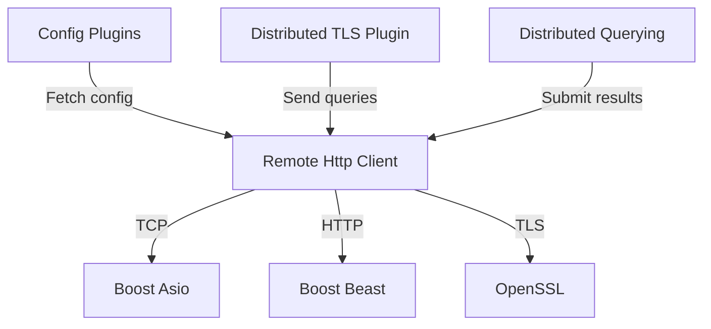
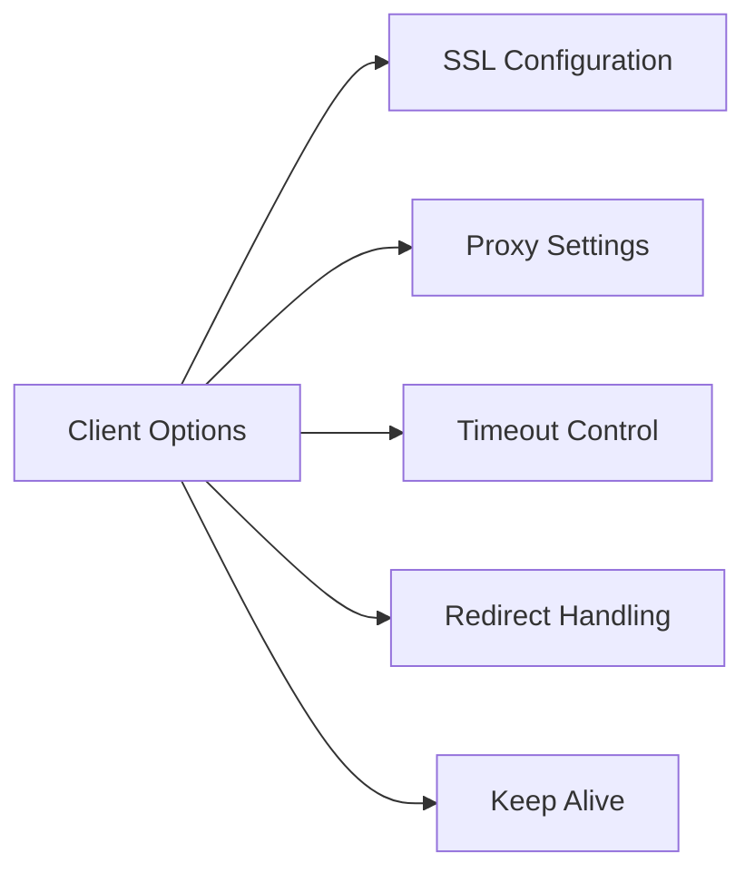
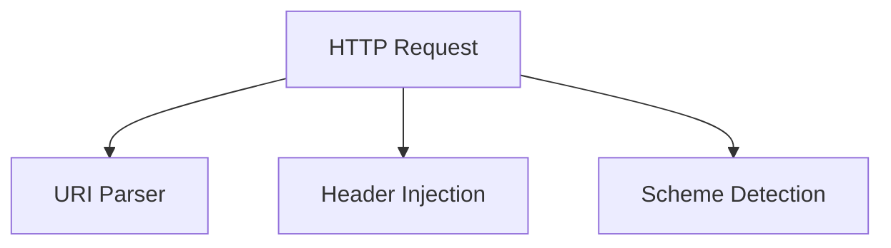
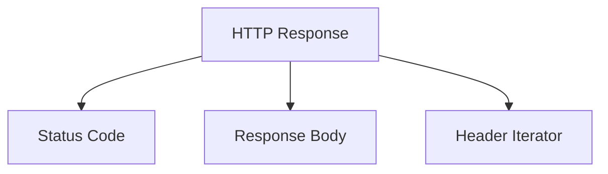
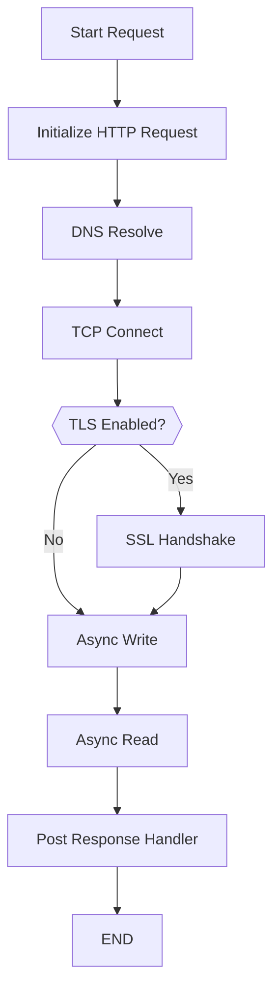

# Remote Http Client

## Overview

The **Remote Http Client** module provides a general-purpose HTTP and HTTPS client implementation built on top of Boost.Asio and Boost.Beast. It is responsible for outbound network communication between osquery and remote services such as configuration endpoints, logging backends, distributed query servers, and metadata services.

This module abstracts:

- TCP connection management
- TLS/SSL negotiation and certificate handling
- HTTP request/response lifecycle
- Header manipulation and URI parsing
- Timeout and error handling
- Optional proxy support

It serves as a foundational networking layer used by higher-level modules such as:

- [Distributed TLS Plugin](distributed-tls-plugin/distributed-tls-plugin.md)
- [Distributed Querying](distributed-querying/distributed-querying.md)
- [Config Plugins](config-plugins/config-plugins.md)

---

## Architectural Context

Within the osquery architecture, the Remote Http Client sits below plugin implementations that require remote communication but above the raw networking libraries (Boost.Asio, OpenSSL).

The module provides a clean interface for sending HTTP requests while encapsulating:

- Asynchronous IO coordination
- SSL context configuration
- Request serialization and response parsing
- Timeout enforcement

---

## Core Components

The Remote Http Client module revolves around the following key abstractions:

### 1. Client

`osquery::http::Client` is the main entry point for executing HTTP operations.

It supports:

- `GET`
- `POST`
- `PUT`
- `HEAD`
- `DELETE`

Each method:

- Accepts a `Request`
- Optionally accepts a body and content type
- Returns a `Response` by value

The Client encapsulates:

- `boost::asio::io_context`
- TCP resolver
- TCP socket
- Optional TLS socket wrapper
- Deadline timer for timeouts

---

### 2. Client Options

The nested `Client::Options` class controls behavior and security settings.

Supported configuration areas:

- TLS enable/disable (`ssl_connection`)
- Certificate validation (`always_verify_peer`)
- Custom CA verification path
- Client certificate and private key
- Cipher selection
- Proxy hostname
- Remote hostname override
- Remote port override
- Timeout configuration
- Redirect handling
- Keep-alive support

Options are compared for equality to determine whether connection state must be refreshed.

This design allows higher-level plugins to define secure communication policies without interacting directly with OpenSSL or Boost internals.

---

### 3. HTTP Request

`HTTP_Request<T>` extends Boost.Beast request types and adds URI parsing capabilities.

Key features:

- Parses full URLs via `osquery::Uri`
- Extracts host, port, path, query, fragment
- Determines protocol (http or https)
- Supports header injection via operator overloading

Example header usage conceptually:

- Create `Header(name, value)`
- Stream into request using `operator<<`

This allows concise header manipulation while maintaining strong typing.

---

### 4. HTTP Response

`HTTP_Response<T>` wraps the Beast response and provides:

- `status()` for HTTP status code
- `body()` for response payload
- `headers()` iterator interface

The nested `Headers` helper exposes:

- Indexed header access
- Iterable header enumeration

---

## Request Lifecycle

The Client orchestrates a structured asynchronous workflow:

### Key Internal Mechanisms

- `createConnection()` selects direct or proxy connection
- `encryptConnection()` upgrades TCP socket to SSL stream
- `callNetworkOperation()` wraps async calls and timeout control
- `timeoutHandler()` aborts operations if deadline expires
- `postResponseHandler()` treats certain TLS short-read conditions as success

This architecture ensures:

- Non-blocking network behavior
- Deterministic timeout handling
- Controlled error propagation

---

## Timeout and Error Handling Model

The module uses a `boost::asio::deadline_timer` to enforce timeouts.

Network operations are wrapped inside `callNetworkOperation()` which:

1. Starts the timeout timer
2. Executes the async operation
3. Waits for either completion or timeout
4. Cancels the alternate event

Error codes are stored in an internal `boost::system::error_code` field.

This ensures:

- Unified timeout behavior
- Safe cancellation
- Clear separation between network and protocol errors

---

## TLS and Security Model

Security behavior is controlled via `Client::Options`.

Security capabilities include:

- Disable legacy SSL versions
- Custom OpenSSL cipher configuration
- Client certificate authentication
- Custom CA verification paths
- Enforced peer verification

The module explicitly disables insecure OpenSSL features such as SSLv2, SSLv3, MD5, and deprecated APIs.

Special handling is included for cloud metadata endpoints such as:

- `169.254.169.254`

This authority constant supports integration with instance metadata services.

---

## Interaction with Other Modules

### Distributed TLS Plugin

The [Distributed TLS Plugin](distributed-tls-plugin/distributed-tls-plugin.md) uses the Remote Http Client to:

- Fetch distributed queries
- Submit query results
- Maintain secure TLS sessions

### Distributed Querying

The [Distributed Querying](distributed-querying/distributed-querying.md) module relies on this client for:

- Remote query retrieval
- Result delivery to orchestration servers

### Config Plugins

The [Config Plugins](config-plugins/config-plugins.md) leverage this module to:

- Fetch remote configuration
- Support dynamic config refresh

By isolating HTTP behavior in this module, higher-level components remain focused on business logic rather than networking.

---

## Design Characteristics

### 1. Abstraction Over Boost

Consumers do not interact with:

- Boost.Asio sockets
- SSL stream configuration
- HTTP parser internals

All networking complexity is encapsulated.

### 2. Explicit Security Configuration

TLS behavior is not implicit. It must be enabled and configured via options.

### 3. Stateless Usage Model

Each request:

- Initializes request state
- Establishes connection if needed
- Executes operation
- Cleans up socket on destruction

### 4. Header and URI Convenience

The extended request/response wrappers provide ergonomic access while preserving Beast compatibility.

---

## Summary

The **Remote Http Client** module provides the secure, asynchronous HTTP transport layer for osquery. It abstracts Boost networking primitives and OpenSSL configuration into a clean, high-level interface used by configuration, logging, and distributed execution subsystems.

Its responsibilities include:

- Secure HTTP and HTTPS communication
- Timeout and error orchestration
- Proxy and redirect support
- TLS certificate management
- URI parsing and header handling

By centralizing outbound HTTP behavior, the module ensures consistent security posture and networking semantics across the entire osquery system.