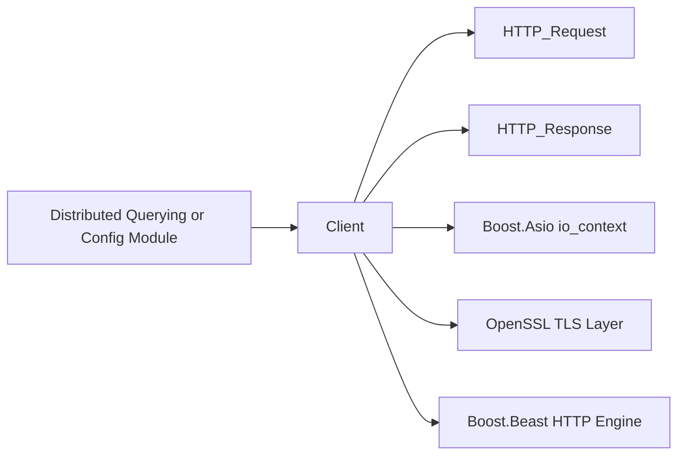
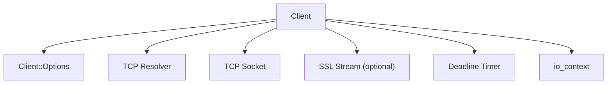
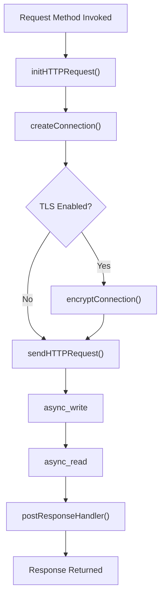
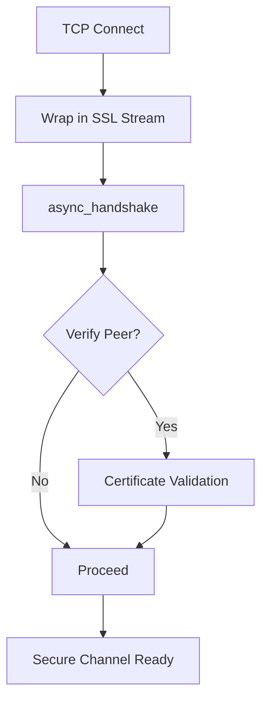
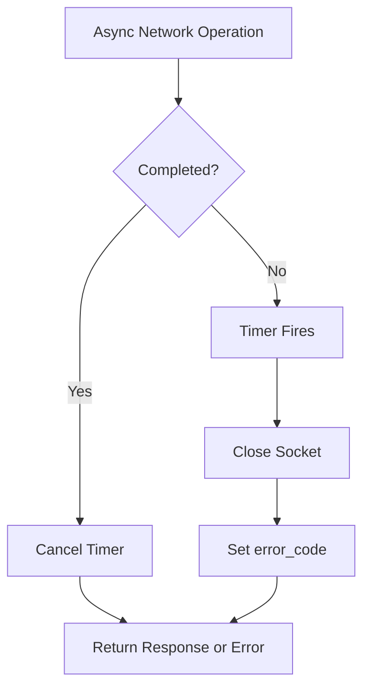
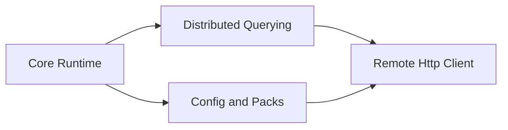

# Remote Http Client

The **Remote Http Client** module provides a general-purpose HTTP and HTTPS client implementation built on top of Boost.Asio, Boost.Beast, and OpenSSL. It is responsible for all outbound network communication that requires HTTP semantics, including secure TLS connections, proxy support, timeout handling, and request/response abstraction.

This module acts as the networking backbone for features such as:

- Distributed query transport (see [Distributed Querying](distributed-querying/distributed-querying.md))
- Remote configuration retrieval (see [Config and Packs](config-and-packs/config-and-packs.md))
- TLS-based logging plugins (see [Plugin Interfaces and Logging](plugin-interfaces-and-logging/plugin-interfaces-and-logging.md))

It encapsulates low-level socket management and asynchronous operations behind a simple request/response API.

---

## 1. Purpose and Responsibilities

The Remote Http Client module is designed to:

- Provide HTTP methods: `GET`, `POST`, `PUT`, `HEAD`, `DELETE`
- Support both plain HTTP and HTTPS (TLS) connections
- Enforce configurable TLS behavior and certificate validation
- Manage asynchronous networking with timeouts
- Support proxy connections
- Provide request/response abstractions with URI parsing
- Offer structured access to headers and response metadata

It ensures that higher-level modules (such as distributed querying or configuration fetching) do not need to interact directly with Boost or OpenSSL primitives.

---

## 2. High-Level Architecture

The module is centered around three primary abstractions:

- `Client` – orchestrates connection lifecycle and request execution
- `HTTP_Request<T>` – extends Boost.Beast request with URI parsing and header helpers
- `HTTP_Response<T>` – extends Boost.Beast response with structured accessors

### 2.1 Component Overview



### 2.2 Internal Client Composition



The `Client` coordinates networking through:

- `boost::asio::io_context`
- `boost::asio::ip::tcp::resolver`
- `boost::asio::ip::tcp::socket`
- Optional `ssl_stream` wrapping the TCP socket
- `boost::asio::deadline_timer` for request timeouts

---

## 3. Client Class

### 3.1 Client Options

The `Client::Options` class drives behavior and security posture.

Key configuration dimensions:

- TLS enablement (`ssl_connection_`)
- Certificate validation (`always_verify_peer_`)
- Cipher selection
- Client certificate and private key
- Verify path
- Proxy hostname
- Remote hostname and port overrides
- Timeout configuration
- Redirect following
- Keep-alive support

Options comparison is implemented via `operator==`, allowing detection of configuration changes and connection reinitialization.

### 3.2 Connection Lifecycle

The lifecycle of a typical request is:



### 3.3 Asynchronous Operation Wrapper

All network operations are wrapped via `callNetworkOperation()`:

Responsibilities:

1. Start timeout timer
2. Trigger asynchronous network operation
3. Wait for either completion or timeout
4. Cancel timer and propagate error

This design ensures:

- Deterministic timeout enforcement
- Safe error propagation via `boost::system::error_code`
- Centralized network error management

---

## 4. HTTP_Request Abstraction

`HTTP_Request<T>` extends the underlying Boost.Beast request with:

- URI parsing via `osquery::Uri`
- Accessors for host, port, path, and protocol
- Header helper via `operator<<`

### 4.1 URI Handling

The request stores a parsed `Uri` and exposes:

- `remoteHost()`
- `remotePort()`
- `remotePath()`
- `protocol()`

This separation allows:

- Clean redirect handling
- Transparent switching between HTTP and HTTPS
- Automatic host and path resolution

### 4.2 Header Helper

The nested `Header` struct enables intuitive header insertion:

```text
Request req("https://example.com/api");
req << Request::Header("Content-Type", "application/json");
```

Internally this calls the underlying Beast `set()` method.

---

## 5. HTTP_Response Abstraction

`HTTP_Response<T>` enhances the Beast response with:

- `status()` – numeric HTTP status
- `body()` – response body
- `headers()` – iterable headers container

### 5.1 Header Iteration

The `Headers` and `Iterator` helper classes allow structured access:

```text
for (const auto& header : resp.headers()) {
  header.first;   // name
  header.second;  // value
}
```

This abstraction shields higher-level modules from Boost-specific iterator types.

---

## 6. TLS and Security Model

The Remote Http Client enforces strong security defaults:

- SSLv2 and SSLv3 disabled
- MD5 disabled
- Deprecated OpenSSL APIs disabled
- Optional peer verification
- Configurable cipher suites
- Optional client certificate authentication

### 6.1 TLS Flow



Special handling exists for TLS short-read conditions where a remote peer does not properly shut down the TLS session.

---

## 7. Timeout and Error Handling

Timeouts are enforced using `boost::asio::deadline_timer`.

Error flow:



This ensures:

- No hung connections
- Proper resource cleanup
- Deterministic behavior under network instability

---

## 8. Integration with Other Modules

### 8.1 Distributed Querying

The [Distributed Querying](distributed-querying/distributed-querying.md) module uses the Remote Http Client to:

- Fetch remote queries
- Submit query results
- Communicate with TLS endpoints

The `TLSDistributedPlugin` depends on secure HTTP transport provided by this module.

### 8.2 Config and Packs

The [Config and Packs](config-and-packs/config-and-packs.md) module may retrieve configuration over HTTPS using this client.

The HTTP abstraction ensures:

- Clean retry behavior
- TLS verification
- Controlled timeouts

### 8.3 Logging Plugins

TLS-based logging (see [Plugin Interfaces and Logging](plugin-interfaces-and-logging/plugin-interfaces-and-logging.md)) relies on the client to:

- Deliver logs to remote collectors
- Enforce TLS certificate verification

---

## 9. Interaction with Core Runtime

The module operates within the broader runtime managed by [Core Init and Runtime](core-init-and-runtime/core-init-and-runtime.md).



The HTTP client itself does not manage threading beyond its `io_context`, making it safe to use from higher-level schedulers and execution engines.

---

## 10. Design Principles

### 10.1 Encapsulation of Networking Complexity

All Boost and OpenSSL details are isolated inside this module. Higher-level modules interact only with:

- `Request`
- `Response`
- `Client`

### 10.2 Security-First Defaults

- Legacy TLS protocols disabled
- Strong cipher configuration supported
- Certificate validation configurable but explicit

### 10.3 Deterministic Resource Management

- Explicit socket closing
- Destructor calls `closeSocket()`
- Centralized timeout logic

### 10.4 Extensibility

Template-based `HTTP_Request` and `HTTP_Response` allow reuse with different Beast message types while maintaining abstraction.

---

## 11. Summary

The **Remote Http Client** module is the secure, asynchronous networking foundation of the system. It:

- Abstracts Boost.Asio and Boost.Beast
- Provides structured HTTP request/response APIs
- Enforces TLS security
- Handles timeouts and connection lifecycle
- Enables distributed querying, remote configuration, and TLS logging

By isolating HTTP and TLS complexity into a single, well-defined module, the system achieves strong separation of concerns, improved maintainability, and consistent security guarantees across all outbound communications.
