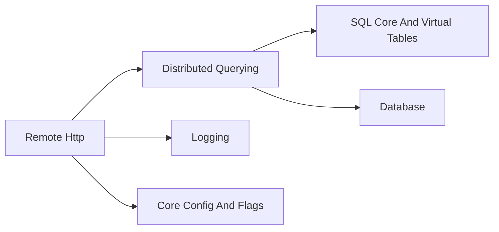
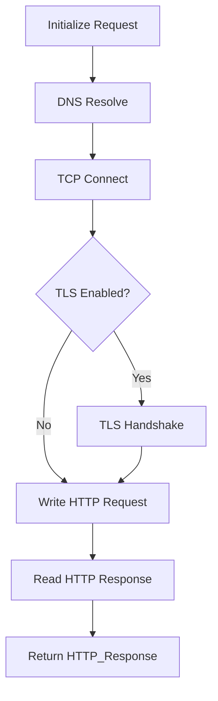
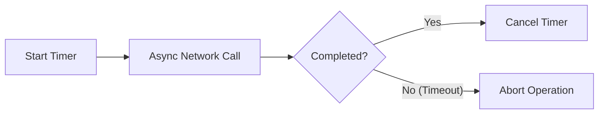
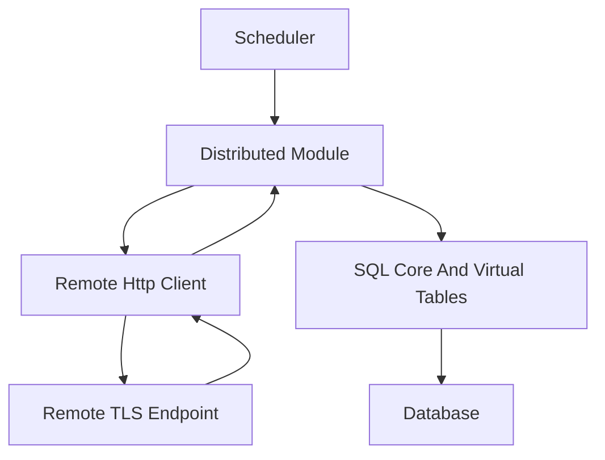

# Remote Http

## Overview

The **Remote Http** module provides a general-purpose HTTP and HTTPS client implementation used across osquery for secure communication with remote services. It is built on top of Boost.Asio and Boost.Beast, with OpenSSL for TLS support.

This module abstracts low-level networking, TLS configuration, request serialization, response parsing, timeout handling, and connection lifecycle management. It is a foundational building block for modules that require outbound communication such as distributed querying and TLS-based plugins.

Core component:
- `osquery.osquery.remote.http_client.Header`

Although only the `Header` type is listed as a core component, it is part of a larger HTTP client implementation that includes:
- `Client` – the main HTTP/HTTPS client
- `HTTP_Request` – extended request wrapper with URI parsing
- `HTTP_Response` – extended response wrapper with header iteration

---

## Architectural Role in the System

The Remote Http module acts as the networking layer for higher-level features that communicate with remote servers.

Typical consumers include:
- Distributed query plugins (e.g., TLS-based distributed execution)
- Remote logging backends
- Remote configuration retrieval

High-level relationship with other modules:



- **Distributed Querying** uses HTTP(S) to fetch queries and submit results.
- **Logging** may use HTTP-based logger plugins.
- **Core Config And Flags** may retrieve configuration from remote endpoints.

---

## Core Concepts

### 1. Client

The `Client` class implements:

- HTTP methods: `GET`, `POST`, `PUT`, `HEAD`, `DELETE`
- Optional TLS (HTTPS) wrapping
- Proxy support
- Connection timeout handling
- Redirect following
- Keep-alive support
- Certificate and key configuration

It uses:
- `boost::asio::io_context`
- `boost::asio::ip::tcp::socket`
- `boost::asio::ssl::stream`
- `boost::beast::http`

### 2. Client Options

The nested `Client::Options` class drives client behavior.

Configurable aspects include:

- TLS enablement (`ssl_connection`)
- Peer verification (`always_verify_peer`)
- Custom CA verify path
- Client certificate and private key
- Cipher selection
- Timeout (seconds)
- Redirect following
- Keep-alive
- Proxy hostname
- Remote hostname and port overrides

Options are compared using an equality operator to detect runtime reconfiguration.

### 3. HTTP_Request

`HTTP_Request<T>` extends the underlying Boost.Beast request object and adds:

- URI parsing (via `osquery::Uri`)
- Host extraction
- Port extraction
- Path/query/fragment composition
- Protocol detection
- Header insertion operator

The nested `Header` helper simplifies header assignment:

```text
Request req("https://example.com/api");
req << Request::Header("Content-Type", "application/json");
```

This wrapper enables clean request construction without exposing internal Beast details.

### 4. HTTP_Response

`HTTP_Response<T>` wraps the Beast response and provides:

- `status()` – numeric HTTP status
- `body()` – response body access
- `headers()` – iterable header collection

Header iteration example:

```text
for (const auto& header : response.headers()) {
  auto name = header.first;
  auto value = header.second;
}
```

---

## Connection Lifecycle

The `Client` manages a complete asynchronous lifecycle using Boost.Asio.

### High-Level Flow



### Detailed Stages

1. **initHTTPRequest**
   - Extract host, port, path
   - Prepare Beast request object

2. **createConnection**
   - DNS resolution
   - TCP connect
   - Optional proxy routing

3. **encryptConnection** (if TLS enabled)
   - Wrap socket in SSL stream
   - Perform handshake

4. **sendRequest**
   - Serialize request
   - Async write
   - Async read response

5. **postResponseHandler**
   - Normalize error conditions
   - Handle TLS short read edge case

6. **closeSocket**
   - Graceful shutdown
   - Socket cleanup

---

## Timeout and Error Handling

The client uses a `boost::asio::deadline_timer` to enforce request timeouts.

### Network Operation Wrapper

All asynchronous operations are wrapped via `callNetworkOperation`, which:

1. Starts the timer
2. Initiates async operation
3. Waits for either completion or timeout
4. Cancels timer and sets error code



Special case handling:
- TLS short read errors may be treated as success if remote server does not perform orderly shutdown.

---

## TLS and Security Model

The module enforces strong TLS defaults:

- SSLv2 and SSLv3 disabled
- MD5 disabled
- Deprecated OpenSSL APIs disabled

Configurable security features:

- Peer verification control
- Custom CA verify path
- Server certificate pinning
- Client certificate authentication
- Cipher suite selection

The decision to enable TLS is controlled by the `ssl_connection` option and, in higher-level modules, may be influenced by configuration flags.

---

## Proxy and Metadata Support

### Proxy Support

If `proxy_hostname` is set in options:
- TCP connects to proxy
- HTTP request is tunneled or forwarded

### Cloud Metadata Access

The constant:

```text
169.254.169.254
```

represents the well-known link-local metadata service address used by cloud providers (e.g., EC2, Azure). This enables osquery to retrieve instance metadata when required.

---

## Integration with Distributed Querying

A common use case is distributed query execution.



Flow summary:

1. Distributed module requests new queries.
2. Remote Http performs HTTPS call.
3. Server returns query payload.
4. Query executed via SQL Core.
5. Results stored in Database.
6. Results sent back via Remote Http.

---

## Header Abstraction

The `Header` structure inside `HTTP_Request` provides a strongly-typed way to attach headers:

```text
Request::Header("Authorization", "Bearer token")
```

Internally, this forwards to the underlying Beast request via `set(name, value)`.

This abstraction ensures:
- Clear header construction
- Fluent request configuration
- Encapsulation of Boost.Beast specifics

---

## Resource Management and Cleanup

Key cleanup behaviors:

- Destructor calls `closeSocket()`
- Socket shutdown requested before closing
- Timer cancellation on completion
- Error code captured in `ec_`

On Windows, special handling ensures proper Boost thread termination using `std::call_once`.

---

## Design Characteristics

### Asynchronous but Synchronous-Style Interface

Internally:
- Fully asynchronous (Boost.Asio)

Externally:
- Methods return `Response` by value
- Network complexity hidden

### Strong Encapsulation

- URI parsing isolated inside `HTTP_Request`
- TLS and socket management isolated inside `Client`
- Response iteration abstracted through custom iterators

### Pluggable Security

Security posture can be tuned without modifying calling modules.

---

## Summary

The **Remote Http** module provides:

- A robust HTTP/HTTPS client built on Boost.Beast
- Configurable TLS and certificate handling
- Timeout and asynchronous lifecycle management
- Proxy support
- Clean request and response abstractions

It serves as the transport layer for remote communication in osquery, enabling distributed querying, remote configuration, and HTTP-based logging while maintaining strong security defaults and modular separation of concerns.