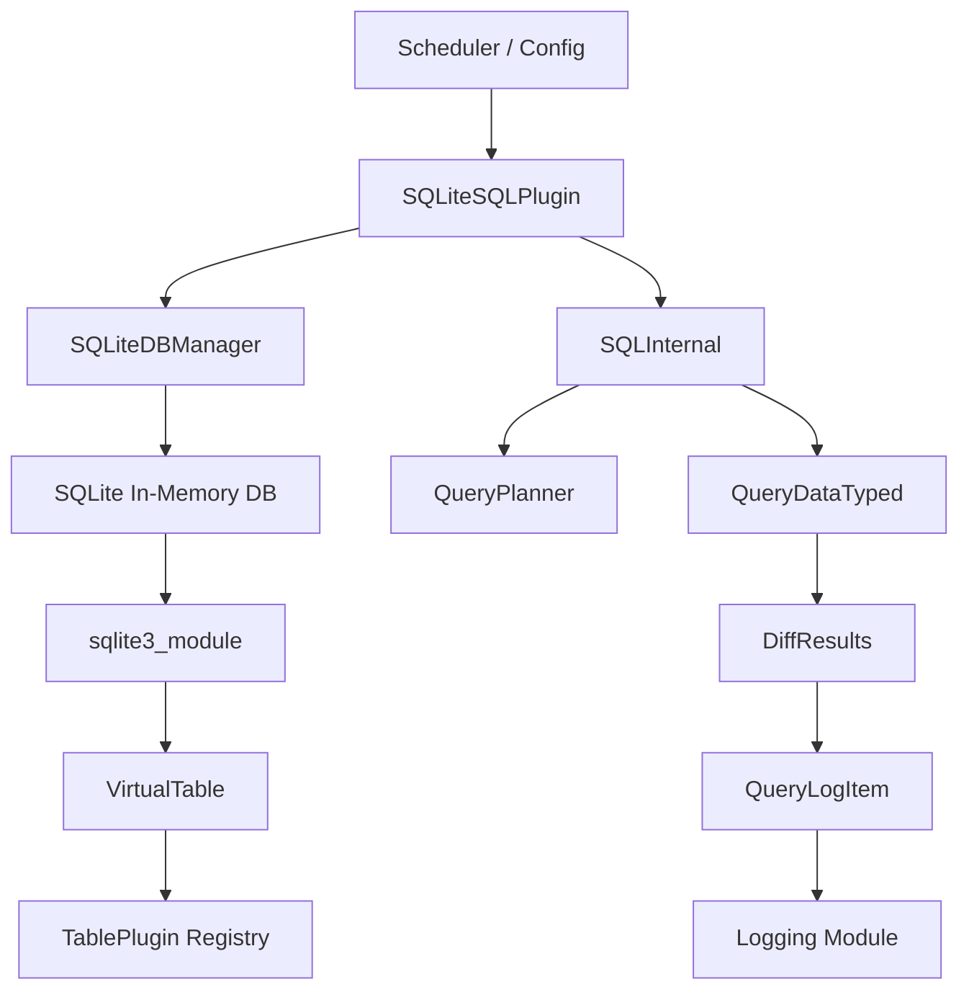
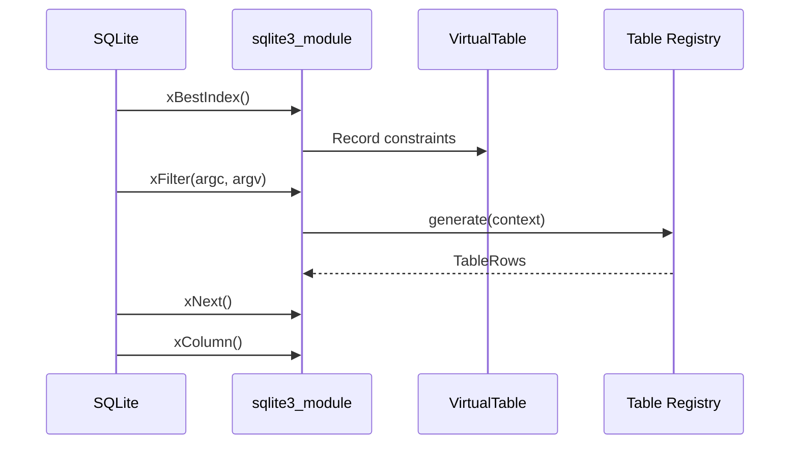
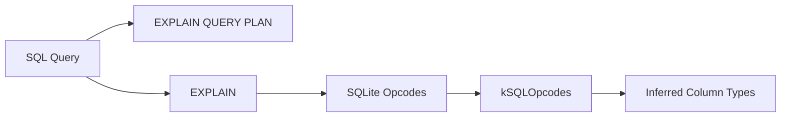
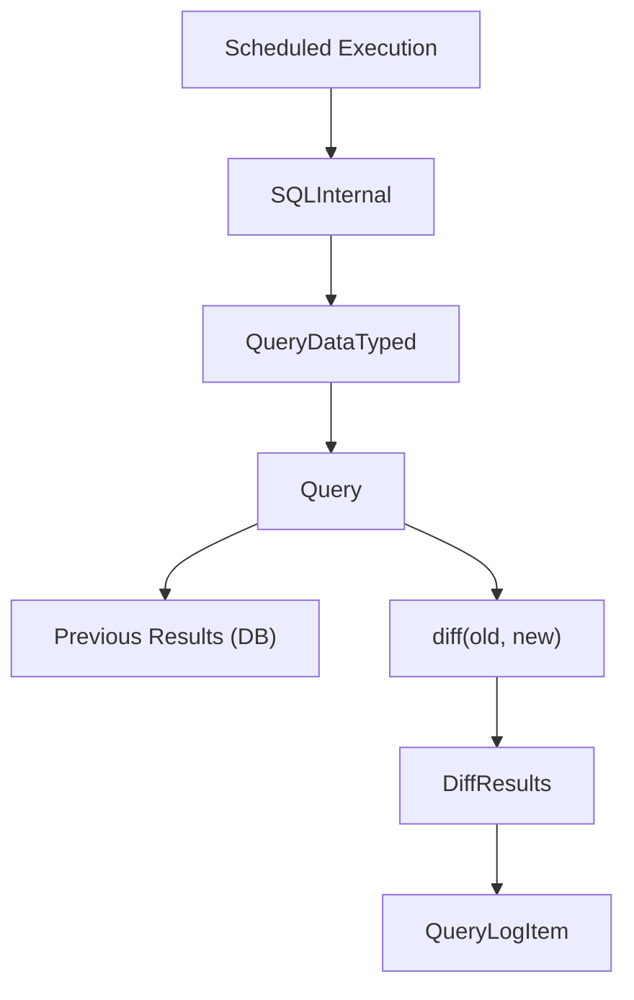
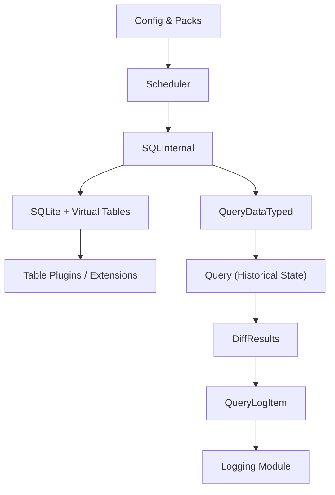

# Sql Core And Virtual Tables

The **Sql Core And Virtual Tables** module is the execution heart of osquery. It embeds and manages SQLite, exposes osquery tables as SQLite virtual tables, executes scheduled and ad-hoc queries, computes differential results, and produces structured query logs.

This module sits between:

- The **configuration and scheduler layer** (see [Core Config And Flags](../core-config-and-flags/core-config-and-flags.md))
- The **persistent storage layer** (see [Database](../database/database.md))
- The **table and extension ecosystem** (see [Extensions And IPC](../extensions-and-ipc/extensions-and-ipc.md))
- The **logging pipeline** (see [Logging](../logging/logging.md))

It transforms high-level SQL into controlled, sandboxed execution over virtualized system tables and returns structured results with performance and diff metadata.

---

## Architectural Overview

At a high level, the module consists of four major areas:

1. **SQLite Core Management** – Securely embedding and controlling SQLite.
2. **Virtual Table Framework** – Mapping osquery tables to SQLite virtual tables.
3. **Query Execution & Planning** – Running queries and inferring metadata.
4. **Scheduled Query & Diff Engine** – Managing historical results and logging.

---

## 1. SQLite Core Management

Core components:

- `SQLiteDBManager`
- `SQLiteDBInstance`
- `SQLiteSQLPlugin`
- `sqliteAuthorizer`
- `queryInternal`

### SQLiteDBManager

`SQLiteDBManager` is the **singleton resource controller** for SQLite. It:

- Maintains the primary in-memory SQLite database.
- Creates transient connections when contention occurs.
- Attaches all virtual tables at initialization.
- Enforces table enable/disable policies via flags.

It ensures that SQLite access is:

- Thread-safe
- Memory-controlled
- Centrally managed

### SQLiteDBInstance

`SQLiteDBInstance` is a RAII wrapper around a `sqlite3*` handle. It:

- Provides scoped locking.
- Tracks which virtual tables were used in a query.
- Controls cache usage per query.
- Clears per-query table state after execution.

### SQLiteSQLPlugin

`SQLiteSQLPlugin` implements the internal **SQL registry plugin**. It:

- Executes queries via `query()`.
- Introspects columns via `getQueryColumns()`.
- Lists scanned tables via `getQueryTables()`.
- Attaches and detaches virtual tables dynamically.

This allows the rest of the system to treat SQL as a pluggable backend.

### SQLite Authorizer (Security Boundary)

The `sqliteAuthorizer` function enforces a strict allowlist:

- Only safe SQLite opcodes are permitted.
- Dangerous actions like `SQLITE_ATTACH` are denied.
- Only approved PRAGMA statements are allowed.

This ensures that:

- Queries cannot access arbitrary files.
- SQLite cannot be abused to escape sandbox constraints.

---

## 2. Virtual Table Framework

Core components:

- `VirtualTable`
- `BaseCursor`
- `sqlite3_module`
- `attachTableInternal()`
- `attachVirtualTables()`

The Virtual Table layer maps osquery tables into SQLite’s virtual table API.

### VirtualTable

`VirtualTable` wraps:

- The `sqlite3_vtab` structure.
- A `VirtualTableContent` object (schema, constraints, attributes).
- The `SQLiteDBInstance` associated with the query.

It acts as the bridge between SQLite and the osquery TablePlugin registry.

### BaseCursor

`BaseCursor` represents an active scan. It tracks:

- Current row index
- Row set or generator
- Constraint context
- Planner ID (for debugging)

### sqlite3_module Implementation

The `sqlite3_module` implementation defines:

- `xCreate` / `xConnect`
- `xBestIndex`
- `xFilter`
- `xNext`
- `xColumn`
- `xRowid`
- `xUpdate` (for writable extension tables)

These callbacks:

1. Receive SQLite constraints.
2. Convert them into a `QueryContext`.
3. Call the TablePlugin registry.
4. Return rows to SQLite.

### Constraint & Planner Integration

`xBestIndex` analyzes constraints and:

- Determines usable indexes.
- Marks required constraints.
- Computes estimated cost.
- Stores constraint sets per cursor.

This dramatically improves performance by:

- Avoiding full table scans when indexed columns exist.
- Enforcing required column semantics.

---

## 3. Query Execution & Planning

Core components:

- `SQLInternal`
- `QueryPlanner`
- `Opcode`
- `kSQLOpcodes`
- `StringEscaperVisitor`

### SQLInternal

`SQLInternal` is a lightweight execution wrapper that:

- Executes a query using internal SQLite APIs.
- Collects `QueryDataTyped` results.
- Detects if a query uses event-based tables.
- Escapes non-printable characters.
- Calculates output size.

It is used by higher-level components such as the scheduler.

### QueryPlanner

`QueryPlanner` runs:

- `EXPLAIN QUERY PLAN`
- `EXPLAIN`

It parses SQLite opcode output and:

- Infers result column types.
- Determines which tables are scanned.
- Applies type inference using `kSQLOpcodes`.

### StringEscaperVisitor

Used by `SQLInternal::escapeResults()`, this visitor:

- Traverses typed column values.
- Escapes non-printable bytes in strings.

This protects logging pipelines from malformed output.

---

## 4. Scheduled Query & Diff Engine

Core components:

- `ScheduledQuery`
- `Query`
- `DiffResults`
- `QueryLogItem`
- `QueryPerformance`

This subsystem handles historical tracking, diffing, and structured logging.

### ScheduledQuery

Represents scheduler configuration:

- Query name
- SQL text
- Interval
- Snapshot vs differential mode
- Removed-row reporting policy
- Priority and denylisting

It is populated by the configuration layer (see [Core Config And Flags](../core-config-and-flags/core-config-and-flags.md)).

### Query (Historical State Manager)

The `Query` class:

- Reads previous results from persistent storage (see [Database](../database/database.md)).
- Computes diffs.
- Stores new results.
- Tracks epoch and invocation counter.

### DiffResults

`DiffResults` contains:

- `added` rows
- `removed` rows

It supports:

- Equality comparison
- JSON serialization
- Efficient set-diff via sorted multiset operations

Differential queries dramatically reduce log volume compared to snapshots.

### QueryLogItem

`QueryLogItem` is the structured logging unit. It includes:

- Snapshot or differential results
- Host identifier
- Query name
- Execution time
- Epoch and counter
- Decorations (metadata fields)

It can be serialized into:

- Standard JSON
- Event-style JSON

This is forwarded to the [Logging](../logging/logging.md) module.

### QueryPerformance

Tracks cumulative and per-run metrics:

- Executions count
- Wall time (total and last)
- User/system time
- Memory usage
- Output size

This data supports:

- Performance debugging
- Scheduler tuning
- Resource monitoring

---

## End-to-End Query Lifecycle

1. Configuration defines a `ScheduledQuery`.
2. Scheduler executes via `SQLInternal`.
3. SQLite runs the query using virtual tables.
4. Table plugins generate rows.
5. Results are diffed against historical state.
6. A `QueryLogItem` is created.
7. The logging module emits structured output.

---

## Security and Safety Guarantees

The Sql Core And Virtual Tables module enforces:

- SQLite opcode allowlisting.
- PRAGMA restrictions.
- Table enable/disable filtering.
- Required column enforcement.
- Controlled virtual table attachment.
- Safe string escaping.

Together, these ensure that SQL remains a controlled inspection language rather than a general-purpose execution engine.

---

## Relationship to Other Modules

- **Core Config And Flags** – Provides scheduled query definitions and runtime flags.
- **Database** – Stores historical query results and epochs.
- **Extensions And IPC** – Supplies external table implementations.
- **Logging** – Consumes `QueryLogItem` JSON output.
- **Eventing Core** – Supplies event-based tables that influence differential behavior.

The Sql Core And Virtual Tables module is the execution backbone that connects configuration, data collection, and logging into a coherent query pipeline.
