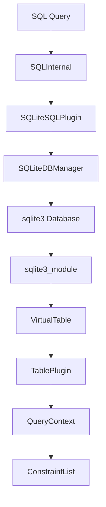
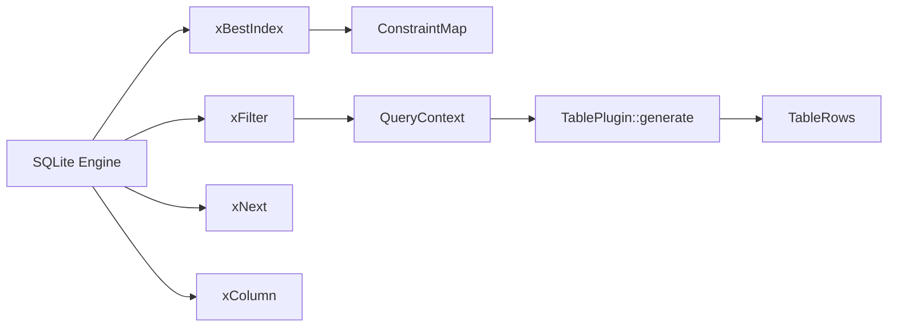
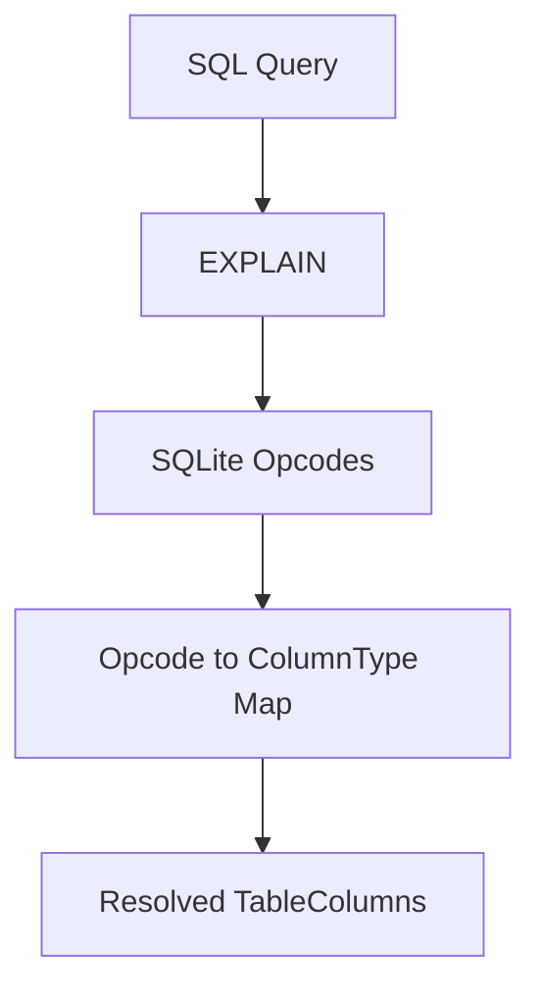
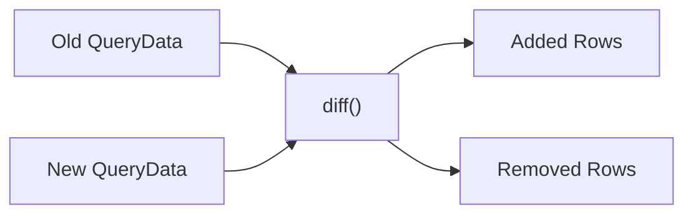
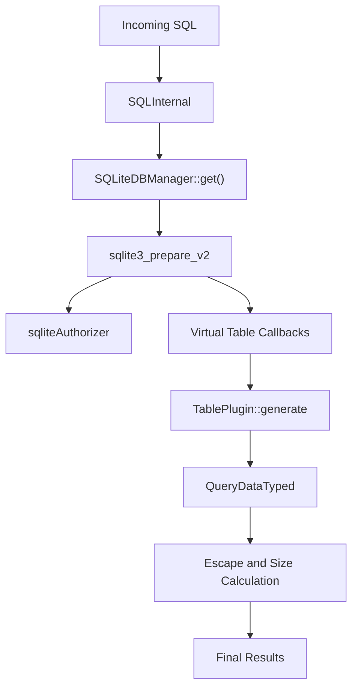

# Sql Core And Virtual Tables

## Overview

The **Sql Core And Virtual Tables** module implements the internal SQL execution engine for osquery. It provides:

- An embedded SQLite runtime with strict authorization controls
- A virtual table abstraction over osquery TablePlugin implementations
- Query planning and column type inference
- Scheduled query metadata and performance tracking
- Result diffing utilities for stateful query comparison

This module is the foundation of how osquery turns system data into relational tables and executes SQL queries against them.

---

## High-Level Architecture

At runtime, the module layers osquery-specific abstractions on top of SQLite:

### Key Layers

1. **SQLInternal / SQLiteSQLPlugin** – Entry points for executing queries.
2. **SQLiteDBManager / SQLiteDBInstance** – Lifecycle and concurrency control for SQLite connections.
3. **VirtualTable / sqlite3_module** – SQLite virtual table glue code.
4. **TablePlugin / QueryContext** – Table implementations and constraint-aware row generation.
5. **DiffResults / QueryPerformance / ScheduledQuery** – Query lifecycle and result management.

---

## Core Components

### SQLInternal

`SQLInternal` executes a query directly against the internal SQLite engine and exposes:

- Typed result rows (`QueryDataTyped`)
- Execution status
- Event-based table detection
- Result size computation
- Output escaping via `StringEscaperVisitor`

It is typically used by higher-level systems such as the scheduler or distributed query executor.

---

### SQLiteSQLPlugin

`SQLiteSQLPlugin` is the internal SQL registry provider. It:

- Executes SQL queries
- Attaches and detaches virtual tables
- Retrieves query column metadata
- Enumerates tables used in a query via `QueryPlanner`

It acts as the bridge between osquery's plugin system and SQLite.

---

### SQLiteDBManager and SQLiteDBInstance

These classes manage SQLite lifecycle and concurrency.

#### SQLiteDBManager

- Owns the primary in-memory SQLite database
- Attaches all registered virtual tables
- Handles enable/disable table flags
- Provides transient connections under contention

#### SQLiteDBInstance

- RAII wrapper around `sqlite3*`
- Tracks affected tables per query
- Controls warm query cache usage
- Applies a strict SQLite authorizer

Security is enforced through an allowlist of:

- SQLite action codes
- SQLite PRAGMA statements

Any non-allowlisted action is denied at prepare time.

---

## Virtual Table Integration

The Virtual Table layer connects SQLite to osquery TablePlugin implementations.

### VirtualTable

`VirtualTable` wraps:

- SQLite `sqlite3_vtab`
- Shared `VirtualTableContent`
- Associated `SQLiteDBInstance`

### BaseCursor

`BaseCursor` manages:

- Row iteration
- Generator-based row streaming
- Cursor position and state

### sqlite3_module

Defined in `virtual_table.cpp`, this structure provides SQLite callbacks:

- `xCreate`
- `xBestIndex`
- `xFilter`
- `xNext`
- `xColumn`
- `xRowid`
- `xUpdate` (for extension-backed writable tables)

These callbacks translate SQLite operations into `TablePlugin` calls.

---

## Constraint and QueryContext Model

The constraint system enables predicate pushdown and efficient table scanning.

### Constraint

Represents a single operator-expression pair:

- Operator (e.g., EQUALS, LIKE, GREATER_THAN)
- Expression string

### ConstraintList

For each column:

- Stores multiple constraints
- Evaluates matching expressions
- Supports operator filtering
- Handles affinity-aware comparisons

### QueryContext

`QueryContext` is passed to every table generator. It contains:

- Column-to-constraint mappings
- Used column tracking
- Cache control flags
- Table-level metadata

It enables:

- Required constraint enforcement
- Selective column population
- Efficient index usage
- Constraint expansion (e.g., globbing)

---

## Query Planning and Type Inference

### QueryPlanner

`QueryPlanner` executes:

- `EXPLAIN QUERY PLAN`
- `EXPLAIN`

It extracts:

- Tables referenced
- SQLite opcodes
- Inferred result column types

A map of specific SQLite opcodes to result types enables type inference for expression-based columns.

This avoids treating expression columns as UNKNOWN whenever possible.

---

## Scheduled Query Support

### ScheduledQuery

Represents metadata for a scheduled query:

- Pack name
- Query name
- SQL string
- Execution interval
- Startup priority
- Snapshot mode
- Removed row reporting option

Helper methods determine:

- Whether the query is snapshot-based
- Whether removed rows should be reported

This structure is used by the scheduler in conjunction with the query execution and logging subsystems.

---

## Result Diffing

### DiffResults

`DiffResults` represents the difference between:

- Previous query results
- Current query results

It contains:

- `added` rows
- `removed` rows

It supports:

- Equality comparison
- Empty diff detection
- JSON serialization

This is critical for scheduled queries that operate in differential mode.

---

## Query Performance Tracking

### QueryPerformance

Tracks execution metrics across runs:

- Execution count
- Last execution timestamp
- Wall time (total and last)
- User and system CPU time
- Memory usage
- Output size

It supports:

- CSV serialization
- Equality comparison

This enables persistent performance analysis and tuning.

---

## Caching Model

The module implements two levels of caching:

1. **Table-level caching** via `TablePlugin`:
   - Controlled by scheduled interval
   - Avoids recomputation for identical intervals

2. **QueryContext in-memory cache**:
   - Per-query temporary cache
   - Optimizes repeated filter operations

Cache usage is coordinated via:

- `SQLiteDBInstance::useCache`
- `QueryContext::useCache`
- Table attribute flags (e.g., CACHEABLE)

---

## Security Model

The Sql Core And Virtual Tables module enforces strict SQLite restrictions:

- Only allowlisted action codes are permitted
- `SQLITE_ATTACH` is explicitly disallowed
- Only allowlisted PRAGMA statements are permitted
- Virtual tables are attached under controlled mutex locks

This prevents arbitrary file writes, unsafe pragmas, and unintended schema manipulation.

---

## End-to-End Execution Flow

---

## Role Within the Overall System

The Sql Core And Virtual Tables module:

- Powers the interactive shell
- Executes scheduled queries
- Serves distributed query results
- Bridges extension-provided tables into the core SQL engine
- Enforces security boundaries for query execution

It acts as the central data execution engine that transforms system state into relational query results.

---

## Summary

The **Sql Core And Virtual Tables** module combines:

- A secured embedded SQLite engine
- A high-performance virtual table abstraction
- Constraint-aware query execution
- Query planning and type inference
- Result diffing and performance tracking

It is the core execution layer that enables osquery to behave like a distributed, secure, and extensible SQL-based operating system instrumentation platform.
