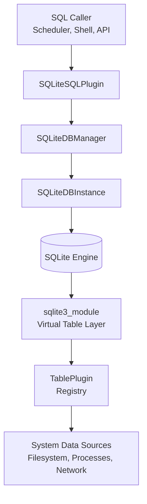
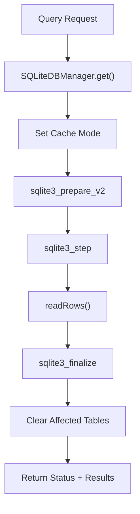
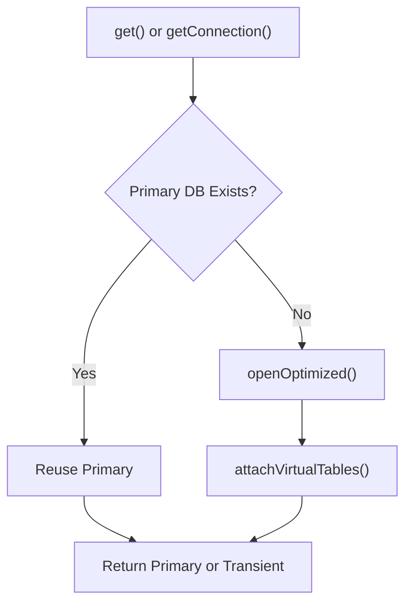
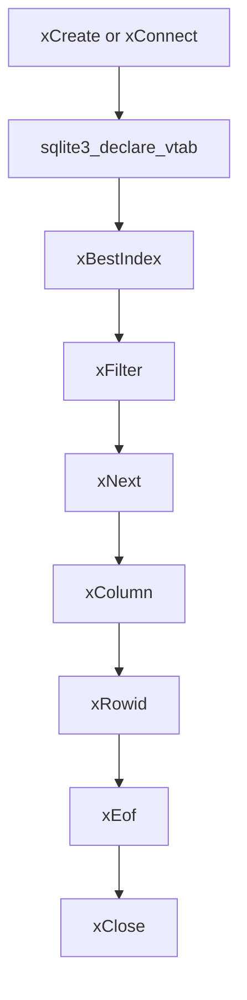
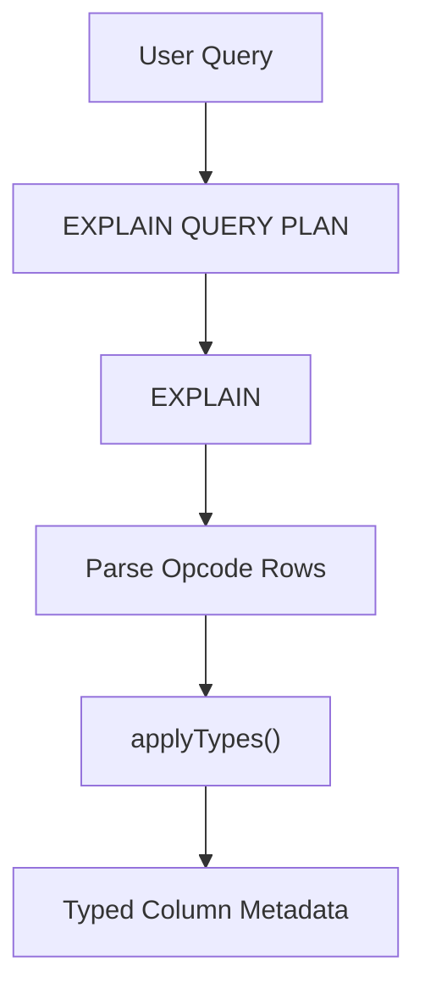

# Sql Engine And Virtual Tables

## Overview

The **Sql Engine And Virtual Tables** module is the execution backbone of osquery. It embeds and manages an in-memory SQLite engine, exposes osquery tables as SQLite virtual tables, enforces SQL safety policies, and provides query planning and column type introspection.

This module acts as the bridge between:

- The **SQLite core engine** (query parsing, planning, execution)
- The **Table Plugin framework** (C++ and extension-based tables)
- The **Registry system** (plugin discovery and invocation)
- Higher-level components such as logging, scheduling, and distributed querying

At runtime, nearly every query flows through this module.

---

## High-Level Architecture

### Key Responsibilities

| Layer | Responsibility |
|--------|----------------|
| SQLiteSQLPlugin | Public SQL interface and plugin registration |
| SQLiteDBManager | Connection lifecycle and resource management |
| SQLiteDBInstance | Per-query SQLite wrapper with attach safety |
| QueryPlanner | Query analysis and type inference |
| sqlite3_module | SQLite virtual table implementation |
| BaseCursor / VirtualTable | Runtime cursor and table state |

---

## Core Components

### SQLiteSQLPlugin

**Namespace:** `osquery.osquery.sql.sqlite_util.SQLiteSQLPlugin`

The `SQLiteSQLPlugin` implements the `SQLPlugin` registry interface and provides:

- `query()` – Execute SQL queries
- `getQueryColumns()` – Infer result column names and types
- `getQueryTables()` – Extract referenced tables
- `attach()` – Attach virtual tables dynamically
- `detach()` – Detach virtual tables

It is registered as an internal plugin under the name `sql`.

### Execution Flow

---

## SQLiteDBManager

**Namespace:** `osquery.osquery.sql.sqlite_util.SQLiteDBManager`

The `SQLiteDBManager` is the central access point for SQLite resources.

### Responsibilities

- Maintain the primary SQLite database instance
- Provide transient instances during contention
- Attach virtual tables automatically
- Enforce enabled/disabled table policies
- Manage SQLite memory limits

### Connection Strategy

If contention occurs, a transient `SQLiteDBInstance` is created with its own in-memory database.

---

## SQLiteDBInstance

**Namespace:** `osquery.osquery.sql.sqlite_util.SQLiteDBInstance`

A RAII wrapper around `sqlite3*` that tracks:

- Query cache usage
- Attached tables
- Table attributes (such as EVENT_BASED)
- Per-query constraint state

### Important Capabilities

- `attachLock()` – Safe attach operations
- `addAffectedTable()` – Track accessed tables
- `clearAffectedTables()` – Reset state post-query
- `useCache()` – Enable virtual table caching

This isolation allows safe concurrent execution across threads.

---

## SQLite Security Model

The module enforces strict SQLite authorizer rules.

### Authorizer: `sqliteAuthorizer`

Allowed operations include:

- SELECT
- READ
- INSERT, UPDATE, DELETE
- CREATE/DROP TABLE or VIEW
- CREATE/DROP VIRTUAL TABLE
- FUNCTION calls
- RECURSIVE queries
- TRANSACTION

Explicitly denied:

- ATTACH DATABASE
- Non-allowlisted PRAGMA calls

If a forbidden action is attempted:

- An error is logged
- SQLite returns `SQLITE_DENY`

This prevents arbitrary file writes or unsafe database attachment.

---

## Virtual Table Integration

**Namespace:** `osquery.osquery.sql.virtual_table`

osquery tables are implemented as SQLite virtual tables.

### Core Structures

- `sqlite3_module` – SQLite callback table
- `VirtualTable` – Wrapper around sqlite3_vtab
- `BaseCursor` – Per-query cursor state

### Virtual Table Lifecycle

---

## Constraint Pushdown and Query Planning

### xBestIndex

`xBestIndex` evaluates WHERE constraints and determines:

- Which columns are indexed
- Required column presence
- Estimated cost
- Constraint ordering

It builds:

- ConstraintSet
- UsedColumns
- Bitset of accessed columns

If required constraints are missing, cost is set to a high sentinel value.

### xFilter

`xFilter`:

- Applies constraints to a `QueryContext`
- Validates required columns
- Executes the associated `TablePlugin`
- Returns row sets or generator-backed cursors

---

## QueryPlanner and Type Inference

**Namespace:** `osquery.osquery.sql.sqlite_util.QueryPlanner`

Used primarily for column introspection when SQLite cannot determine expression types.

### Strategy

1. Execute `EXPLAIN QUERY PLAN`
2. Execute `EXPLAIN`
3. Parse opcodes
4. Map SQLite opcodes to osquery column types

The `Opcode` structure maps:

- Register position (P1, P2, P3)
- Resulting ColumnType

This enables inference of types for:

- Arithmetic operations
- Aggregates
- Comparators
- CAST expressions

---

## SQLInternal

`SQLInternal` is a lower-level execution wrapper that:

- Returns `QueryDataTyped`
- Tracks whether results are EVENT_BASED
- Allows result escaping
- Computes result size

### Additional Features

- `escapeResults()` – Escapes non-printable bytes
- `getSize()` – Computes result memory size
- `eventBased()` – Detect event-based tables

This is used by higher-level components that need typed results.

---

## Attach and Detach Mechanism

Virtual tables can be dynamically attached:

- `attachTableInternal()` registers a SQLite module
- `detachTableInternal()` drops the temp virtual table

Attachment occurs during:

- Startup
- Extension loading
- Explicit attach requests

All operations are guarded by `attachLock()`.

---

## Integration with Other Modules

The Sql Engine And Virtual Tables module integrates closely with:

- Core runtime for shutdown handling and flags
- Logging for error reporting
- Extensions framework for external tables
- Database backend for persistent storage tables
- Events framework for EVENT_BASED table semantics

It forms the execution boundary between SQL logic and system instrumentation.

---

## Design Principles

1. Security-first SQL execution
2. Deterministic virtual table behavior
3. Thread-safe database access
4. Efficient constraint pushdown
5. Minimal SQLite surface exposure
6. Strong separation between SQL layer and table logic

---

## Summary

The **Sql Engine And Virtual Tables** module transforms osquery into a SQL-powered operating system instrumentation engine.

It:

- Embeds and secures SQLite
- Converts table plugins into virtual tables
- Plans and executes queries
- Infers types for expressions
- Enforces constraint semantics
- Provides safe attach/detach mechanisms

Without this module, osquery would be a collection of system probes. With it, those probes become a relational query engine capable of complex joins, filtering, aggregation, and introspection.