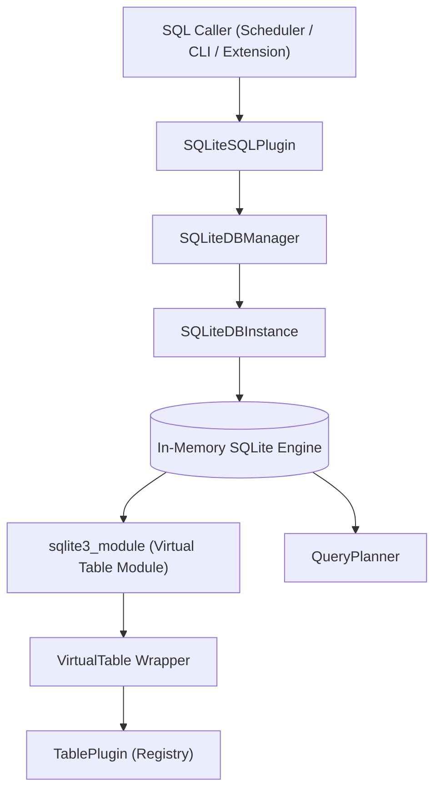
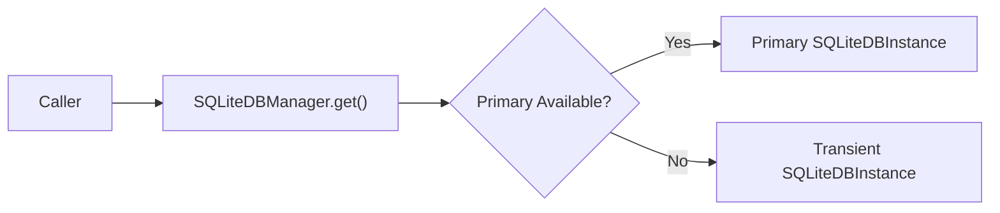
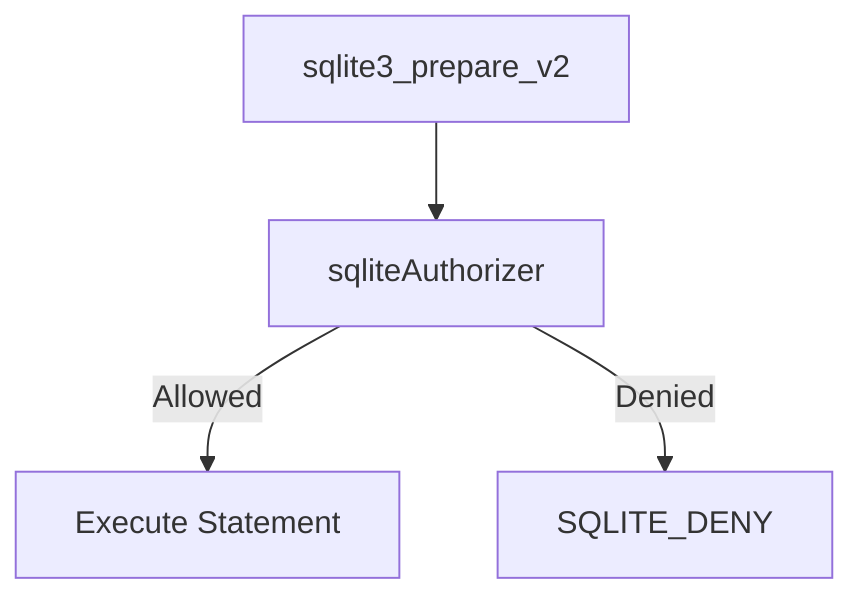
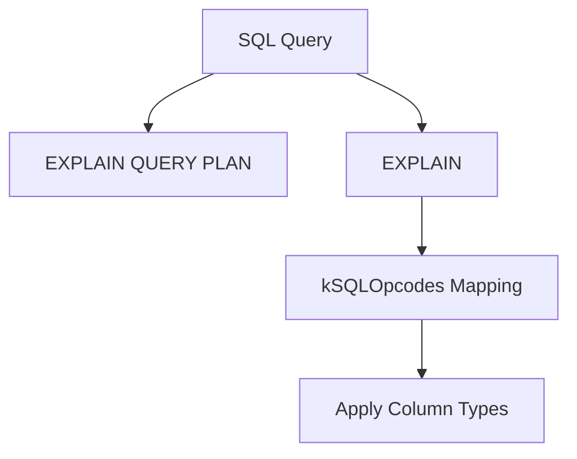
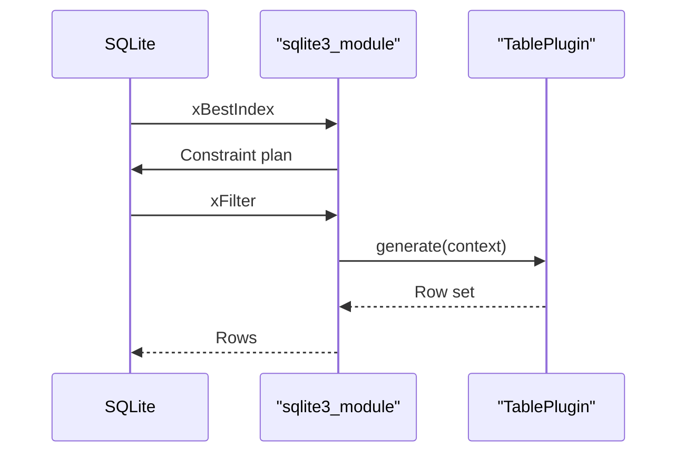
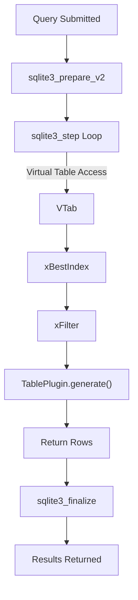

# Sql Engine And Virtual Tables

## Overview

The **Sql Engine And Virtual Tables** module is the execution core of osquery. It embeds and configures SQLite as an in-memory analytical engine and exposes operating system data through dynamically attached virtual tables.

This module is responsible for:

- Managing and optimizing SQLite database instances
- Enforcing SQL security through authorizers and allowlists
- Attaching and detaching virtual tables backed by TablePlugin implementations
- Planning and introspecting queries
- Executing SQL statements and returning typed results
- Bridging SQLite’s virtual table API with osquery’s plugin system

It acts as the execution layer between:

- Table plugins (from the Registry)
- The scheduler and query interfaces
- Extensions providing additional tables

---

## High-Level Architecture

### Flow Summary

1. A SQL query is submitted via the SQL registry.
2. `SQLiteSQLPlugin` obtains a database connection from `SQLiteDBManager`.
3. The query is prepared and executed using `queryInternal`.
4. When a virtual table is accessed, SQLite invokes the `sqlite3_module` callbacks.
5. The virtual table implementation forwards execution to a `TablePlugin`.
6. Results are returned to SQLite and then to the caller as typed rows.

---

## Core Components

### SQLiteSQLPlugin

Implements the internal `sql` registry plugin.

**Responsibilities:**

- Execute SQL queries (`query`)
- Introspect query columns (`getQueryColumns`)
- Determine scanned tables (`getQueryTables`)
- Attach/detach virtual tables dynamically

It acts as the primary entry point for SQL execution inside osquery.

---

### SQLiteDBManager

Singleton responsible for lifecycle and concurrency management of SQLite instances.

**Key Features:**

- Maintains a primary in-memory SQLite database
- Creates transient database instances under contention
- Applies memory optimizations (PRAGMA tuning)
- Attaches all registered virtual tables
- Enforces table enable/disable flags

This design minimizes resource usage while ensuring thread safety.

---

### SQLiteDBInstance

RAII wrapper around a `sqlite3*` pointer.

**Responsibilities:**

- Provide safe access to SQLite handle
- Manage locking and attach mutexes
- Track affected virtual tables per query
- Clear per-query table state
- Support query result caching

Each query receives a scoped database instance. On destruction:

- Transient connections are closed
- Primary connections remain managed

---

### Security Enforcement (Authorizer)

The module enforces strict SQL safety using `sqliteAuthorizer`.

**Allowlisted Actions:**

- `SELECT`, `READ`
- Controlled `INSERT`, `UPDATE`, `DELETE`
- Virtual table creation and drop
- Limited `PRAGMA` commands

**Explicitly Denied:**

- `SQLITE_ATTACH`
- Any non-allowlisted opcode

This ensures osquery cannot be abused to modify arbitrary files or attach external databases.

---

### QueryPlanner

Performs query introspection using:

- `EXPLAIN QUERY PLAN`
- `EXPLAIN`

Used for:

- Inferring column types for expressions
- Determining scanned tables
- Inspecting SQLite opcodes

The planner maps SQLite opcodes to osquery `ColumnType` using `kSQLOpcodes`.

This enables accurate schema introspection even when SQLite cannot directly determine expression types.

---

### SQLInternal

A lower-level SQL execution wrapper used internally.

**Capabilities:**

- Executes queries bypassing registry lookup
- Returns typed results (`QueryDataTyped`)
- Detects event-based tables
- Escapes non-printable bytes
- Calculates result size

It is used when deeper inspection of query attributes is required.

---

## Virtual Table Subsystem

The Virtual Table subsystem connects SQLite’s virtual table API with osquery’s `TablePlugin` abstraction.

### VirtualTable

Wraps:

- `sqlite3_vtab`
- `VirtualTableContent` (metadata, schema, constraints)
- Associated `SQLiteDBInstance`

It maintains:

- Column definitions
- Aliases
- Attributes (EVENT_BASED, USER_BASED, etc.)
- Constraint tracking

---

### BaseCursor

Represents an active scan of a virtual table.

Tracks:

- Row set or generator
- Cursor position
- Current row
- Planner ID

Supports both:

- Pre-generated row sets
- Streaming generator-based tables

---

### sqlite3_module Implementation

Implements the SQLite virtual table callbacks:

- `xCreate`
- `xBestIndex`
- `xFilter`
- `xNext`
- `xColumn`
- `xRowid`
- `xUpdate`

---

## Constraint Optimization

`xBestIndex` evaluates constraints provided by SQLite and:

- Identifies indexed and required columns
- Calculates estimated cost
- Rewrites `IN` constraints for optimized handling
- Tracks used columns for projection pushdown

If required constraints are missing:

- Cost is set to a maximum
- Query may fail with `SQLITE_CONSTRAINT`

This enables efficient filtering at the table implementation level.

---

## Query Execution Flow

---

## Extension and Writable Tables

If a table originates from an extension:

- `xUpdate` is enabled
- INSERT / UPDATE / DELETE are forwarded
- Parameters are serialized into JSON
- Responses are validated

This allows controlled writable virtual tables.

---

## Memory and Performance Optimizations

When opening the in-memory database:

- `journal_mode=OFF`
- `synchronous=OFF`
- `auto_vacuum=FULL`
- Custom function extensions registered
- Authorizer installed

Additionally:

- SQLite soft heap limit configured
- Memory released after each query
- Transient DB instances created only under contention

---

## Interaction with Other Modules

The Sql Engine And Virtual Tables module integrates closely with:

- Table plugins (Registry)
- Extensions (for remote virtual tables)
- Logging and query observability (for execution results)
- Eventing framework (for event-based tables)
- Core initialization (for flag configuration)

It does not duplicate table logic; it provides the execution infrastructure.

---

## Key Design Principles

1. **Security First** – Strict SQLite authorizer and allowlists
2. **In-Memory Execution** – No persistent database files
3. **Plugin-Based Tables** – Data sources abstracted behind registry
4. **Query-Aware Optimization** – Constraint and projection pushdown
5. **Thread-Safe Resource Management** – Managed primary DB with transient fallback
6. **Extension-Friendly** – Writable virtual tables supported

---

## Summary

The **Sql Engine And Virtual Tables** module is the execution backbone of osquery.

It transforms SQLite into a secure, extensible, in-memory analytics engine that:

- Executes SQL safely
- Dynamically attaches system-backed virtual tables
- Optimizes query plans
- Bridges plugins and extensions with SQLite’s execution engine

Without this module, osquery would not be able to expose system data through a unified SQL interface.
