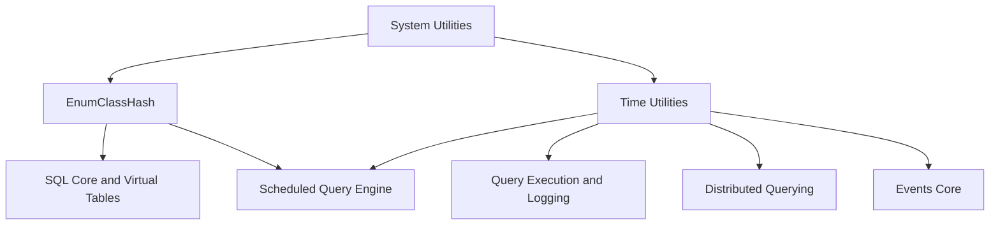
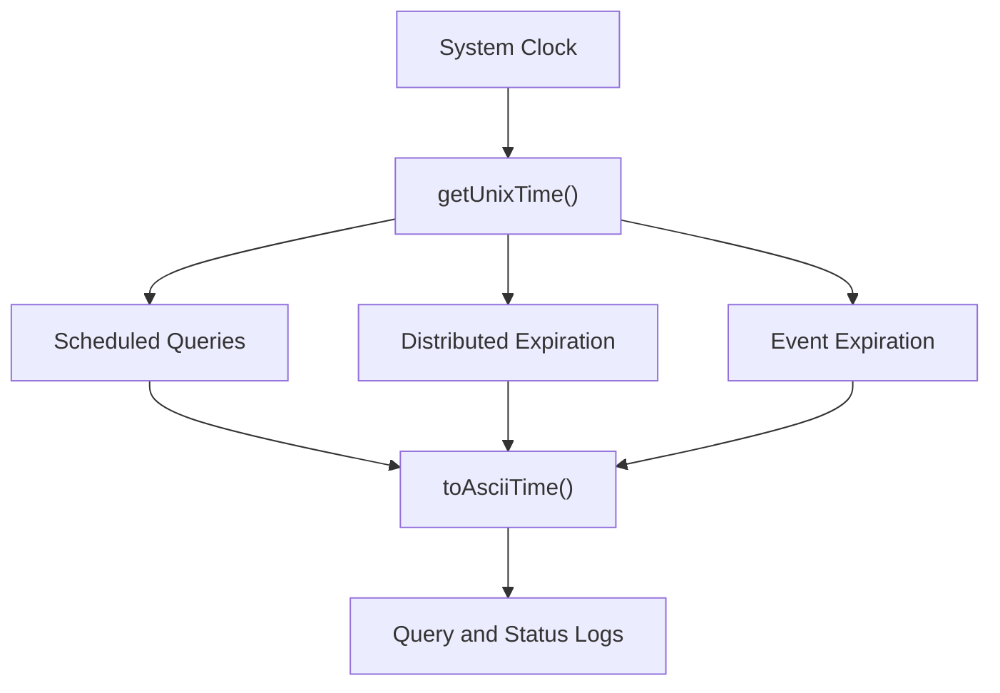

# System Utilities

The **System Utilities** module provides low-level helper primitives used across the osquery codebase. While small in scope, it plays a foundational role in enabling consistent behavior for:

- Enum hashing compatibility across standard libraries
- Time conversion and formatting
- Cross-platform time normalization

These utilities are intentionally lightweight and dependency-minimal so they can be safely reused across core systems such as SQL execution, scheduling, distributed querying, logging, and extensions.

---

## Purpose and Design Principles

The System Utilities module exists to:

1. Provide safe, reusable abstractions over platform-specific behavior
2. Normalize time handling across the runtime
3. Offer compatibility fixes for C++ standard library inconsistencies
4. Avoid introducing heavy dependencies into core systems

Because these utilities are used by multiple subsystems (SQL, scheduler, events, distributed querying, logging), correctness and determinism are critical.

---

## Architecture Overview

Although small, this module supports multiple high-level subsystems.



### Key Observations

- **EnumClassHash** enables safe use of strongly-typed enums in hash-based containers.
- **Time utilities** ensure consistent UNIX epoch and ASCII time formatting across the system.
- The module introduces no runtime state and is purely functional.

---

# Core Components

## 1. EnumClassHash

**Component:** `osquery.osquery.utils.enum_class_hash.EnumClassHash`

### Problem Addressed

Historically, certain versions of `libc++` and `libstdc++` did not properly support hashing of `enum class` types in unordered containers.

This utility provides a small compatibility layer allowing `enum class` values to be used in:

- `std::unordered_map`
- `std::unordered_set`
- Other hash-based STL containers

### Implementation Strategy

The implementation uses SFINAE (`std::enable_if`) and `std::is_enum` to restrict hashing only to enum types:

```cpp
struct EnumClassHash {
  template <typename EnumClassType>
  typename std::enable_if<std::is_enum<EnumClassType>::value, std::size_t>::type
  operator()(EnumClassType t) const {
    return static_cast<std::size_t>(t);
  }
};
```

### Design Characteristics

- Compile-time type restriction
- Zero runtime overhead
- No external dependencies
- Safe conversion via `static_cast<std::size_t>`

### Typical Usage Pattern

```cpp
std::unordered_map<MyEnumClass, ValueType, osquery::EnumClassHash> map;
```

### Why This Matters

Strongly-typed enums are widely used in:

- SQL opcode handling
- Scheduler state machines
- Extension lifecycle states
- Event subscription types

Without a stable hash implementation, these systems would require unsafe workarounds.

---

## 2. Time Utilities

**Component:** `osquery.osquery.utils.system.time.tm`

This group of functions provides consistent time handling across platforms.

### Responsibilities

- Convert `struct tm` to UNIX epoch time
- Format time into human-readable ASCII
- Normalize local time to UTC
- Provide current system time

---

## Time Utility Functions

### platformAsctime

Returns the ASCII version of a `struct tm` as a C++ string.

Purpose:
- Wrap platform-specific `asctime` behavior
- Provide safe string-based output

---

### toUnixTime

Converts a `struct tm` into UNIX epoch time.

```text
Input:  struct tm
Output: uint64_t (seconds since UNIX epoch)
```

Used in:
- Query scheduling timestamps
- Event expiration logic
- Distributed result expiration

---

### getUnixTime

Returns the current time as seconds since the UNIX epoch.

This is critical for:

- Scheduled query execution
- Performance measurement
- Logging timestamps
- Expiration tracking

---

### toAsciiTime

Converts a UTC `struct tm` into a human-readable string.

Format example:

```text
Wed Sep 21 10:27:52 2011
```

Used in:
- Query logs
- Status logs
- Debug output

---

### toAsciiTimeUTC

Converts a local `struct tm` into UTC ASCII format by:

1. Converting to epoch
2. Applying `gmtime()`
3. Formatting into ASCII

This guarantees consistent UTC logging across distributed environments.

---

### getAsciiTime

Returns the current time in human-readable ASCII format.

Often used for:

- Log lines
- Status reporting
- Diagnostics

---

## Time Flow Across the System



### Guarantees Provided

- Unified epoch time source
- Deterministic formatting
- UTC normalization when required
- Platform-independent behavior

---

# How System Utilities Fits Into the Overall Architecture

The System Utilities module underpins multiple runtime layers:

| Subsystem | Dependency on System Utilities |
|-----------|--------------------------------|
| SQL Core | Enum hashing for opcodes and states |
| Scheduler | UNIX time for interval execution |
| Distributed Querying | Timestamp-based result validity |
| Events Core | Expiration and event time tracking |
| Logging | Human-readable timestamps |
| Extensions Framework | Enum state hashing |

It intentionally:

- Does not manage state
- Does not perform I/O
- Does not depend on higher-level modules

This ensures it can be safely included anywhere in the codebase.

---

# Design Constraints and Trade-offs

### Minimalism

The module avoids abstractions that could:

- Introduce dynamic allocation
- Create circular dependencies
- Increase compile-time coupling

### Cross-Platform Safety

Time conversion and formatting behave consistently across:

- Linux
- macOS
- Windows

### Backward Compatibility

Enum hashing is implemented as a compatibility shim and may be removed once all standard libraries fully conform.

---

# Summary

The **System Utilities** module is a foundational, low-level component that ensures:

- Reliable enum hashing across platforms
- Deterministic time conversion and formatting
- Consistent timestamp handling throughout osquery

While small in size, it is deeply integrated into core subsystems including scheduling, SQL execution, logging, distributed querying, and events.

Its simplicity, statelessness, and platform-neutral behavior make it a critical infrastructure layer supporting the entire runtime.
