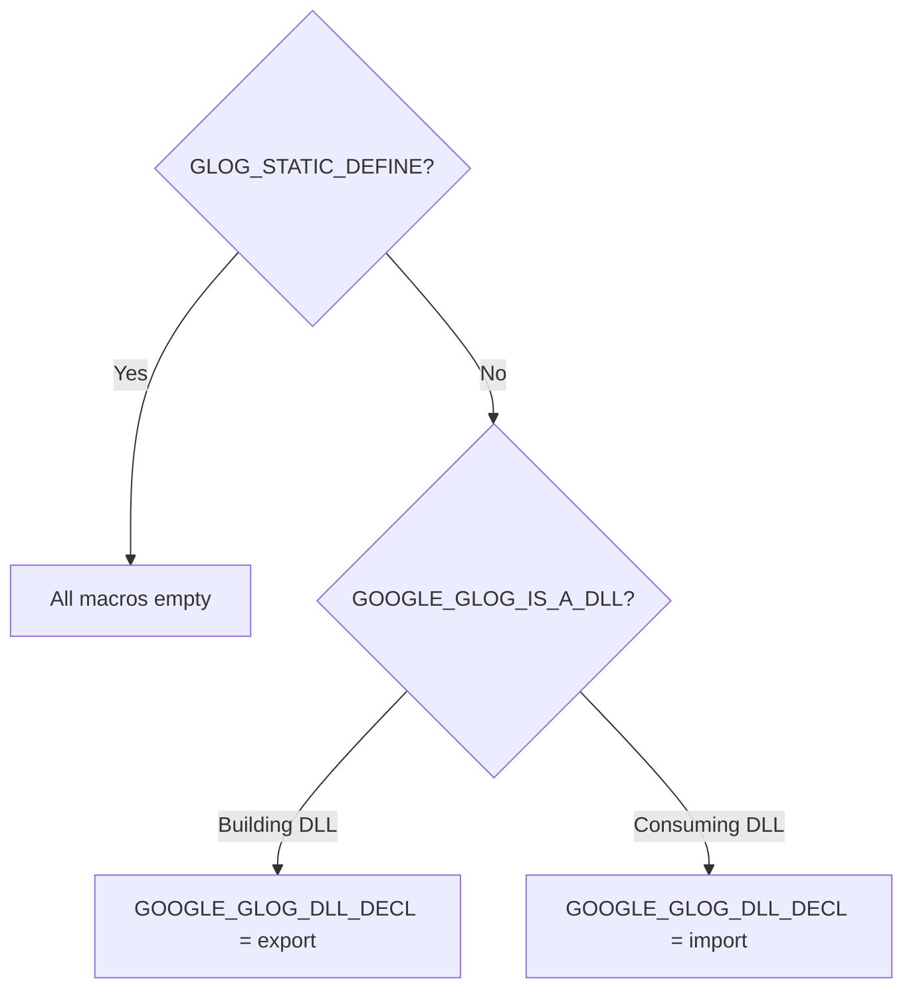

<!-- source-hash: c0de801216eb4d28806d7ecb1a5cc9bf -->
Visibility and export control macros for the Google glog logging library, managing symbol visibility across static and shared (DLL) build configurations on Windows.

## Key Components

| Macro | Purpose |
|---|---|
| `GOOGLE_GLOG_DLL_DECL` | Marks symbols for DLL export/import; empty on this platform (no `__declspec` needed) |
| `GLOG_NO_EXPORT` | Marks symbols that should not be exported from the library |
| `GLOG_DEPRECATED` | Tags symbols as deprecated using `__declspec(deprecated)` |
| `GLOG_DEPRECATED_EXPORT` | Combines export visibility with deprecation marking |
| `GLOG_DEPRECATED_NO_EXPORT` | Combines hidden visibility with deprecation marking |
| `GLOG_STATIC_DEFINE` | Define this to suppress all DLL decorators for static linking |

## Usage Example

```c
/* Static linking — suppress DLL decorators */
#define GLOG_STATIC_DEFINE
#include "export.h"

/* Annotate a public API function */
GOOGLE_GLOG_DLL_DECL void my_log_function(const char* msg);

/* Mark a function as deprecated but still exported */
GLOG_DEPRECATED_EXPORT void old_log_function(const char* msg);

/* Internal symbol — not exported */
GLOG_NO_EXPORT void internal_helper(void);
```

## Build Modes



> **Note:** On this particular build, both the export and import definitions of `GOOGLE_GLOG_DLL_DECL` resolve to empty strings, indicating the platform does not require explicit `__declspec` annotations (e.g., Linux/macOS GCC/Clang builds).