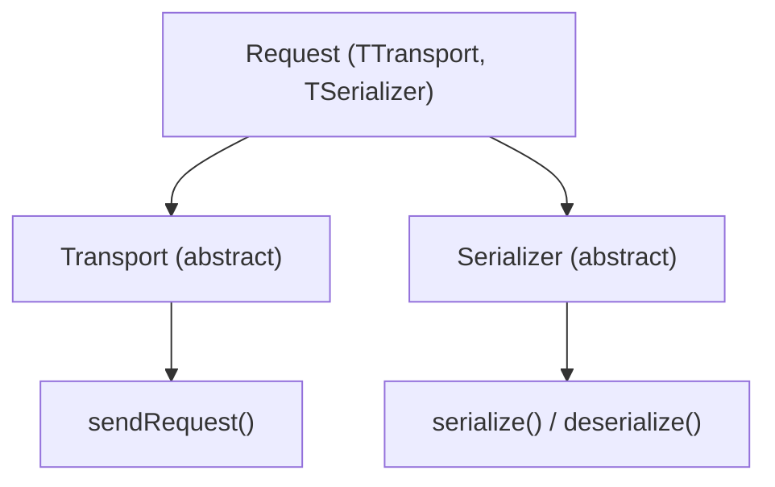

<!-- source-hash: ae5e181dbbf3582c2f83631762dba1c1 -->
Defines the core abstractions for osquery's remote communication layer, providing pluggable transport and serialization interfaces along with a templated `Request` class that composes them.

## Key Components

| Component | Type | Description |
|-----------|------|-------------|
| `compressString` | Function | GZip-compresses a string; applied post-serialization before transport |
| `Transport` | Abstract class | Base for network transport implementations (e.g. HTTP/TLS, WebSockets) |
| `Serializer` | Abstract class | Base for payload serialization implementations (e.g. JSON, XML) |
| `Request<TTransport, TSerializer>` | Template class | Composes a transport and serializer to execute remote calls |

## Key Relationships



## Usage Example

```cpp
#include <osquery/remote/requests.h>
#include <osquery/remote/transports/tls.h>
#include <osquery/remote/serializers/json.h>

using namespace osquery;

// Instantiate a Request with TLS transport and JSON serialization
Request<TLSTransport, JSONSerializer> req("https://enrollment.example.com/enroll");

// Optionally enable compression
req.setOption("compress", true);

// Build parameters and send
JSON params;
params.add("host_identifier", std::string("my-host-001"));
Status s = req.call(params);

if (s.ok()) {
    JSON response;
    s = req.getResponse(response);
    // process response...
} else {
    LOG(WARNING) << "Request failed: " << s.getMessage();
}
```

## Extension Points

- **Custom transports**: Subclass `Transport` and implement `sendRequest()` (with and without params).
- **Custom serializers**: Subclass `Serializer` and implement `getContentType()`, `serialize()`, and `deserialize()`.
- **Options**: Use `setOption(name, value)` on `Request` to pass transport-specific configuration (e.g. TLS peer verification, compression).

## Source

[`osquery/remote/requests.h`](https://github.com/flamingo-stack/osquery/blob/main/osquery/remote/requests.h)