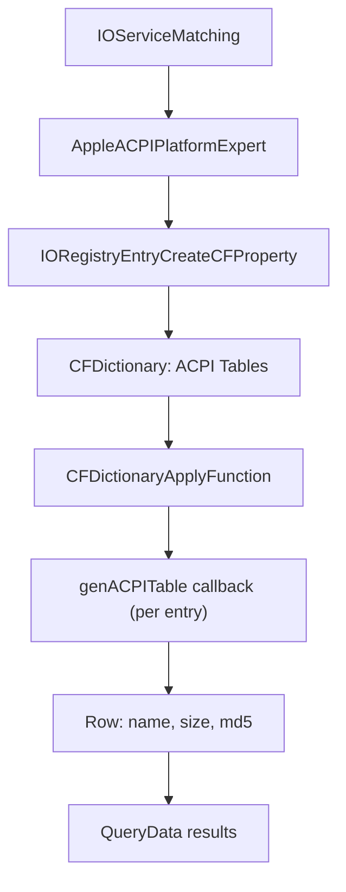

<!-- source-hash: 6703e26502b9d3be44c1db25c67baef8 -->
Implements the `acpi_tables` osquery table for macOS, querying the IOKit `AppleACPIPlatformExpert` service to enumerate and return ACPI table metadata.

## Key Components

- **`kIOACPIClassName_`** — IOKit service class name (`"AppleACPIPlatformExpert"`) used to locate the ACPI platform expert.
- **`kIOACPIPropertyName_`** — IOKit property key (`"ACPI Tables"`) identifying the ACPI table dictionary on the matched service.
- **`genACPITable(key, value, results)`** — CFDictionary callback that extracts a single ACPI table entry, populating `name`, `size` (bytes), and `md5` hash into a `Row` appended to the result set.
- **`genACPITables(context)`** — Primary table generator; matches the ACPI IOKit service, retrieves the `CFDictionary` of tables, and applies `genACPITable` over each entry.

## Usage Example

This file is consumed internally by the osquery table registration system. The equivalent SQL query exposed to users is:

```sql
SELECT name, size, md5
FROM acpi_tables;
```

Typical output:

```text
name   | size  | md5
-------|-------|----------------------------------
DSDT   | 98304 | d41d8cd98f00b204e9800998ecf8427e
FACP   | 116   | a87ff679a2f3e71d9181a67b7542122c
```

## Data Flow



> **Platform:** macOS only. Requires IOKit access; the table returns empty if no ACPI platform expert service is found or if the property is unavailable.