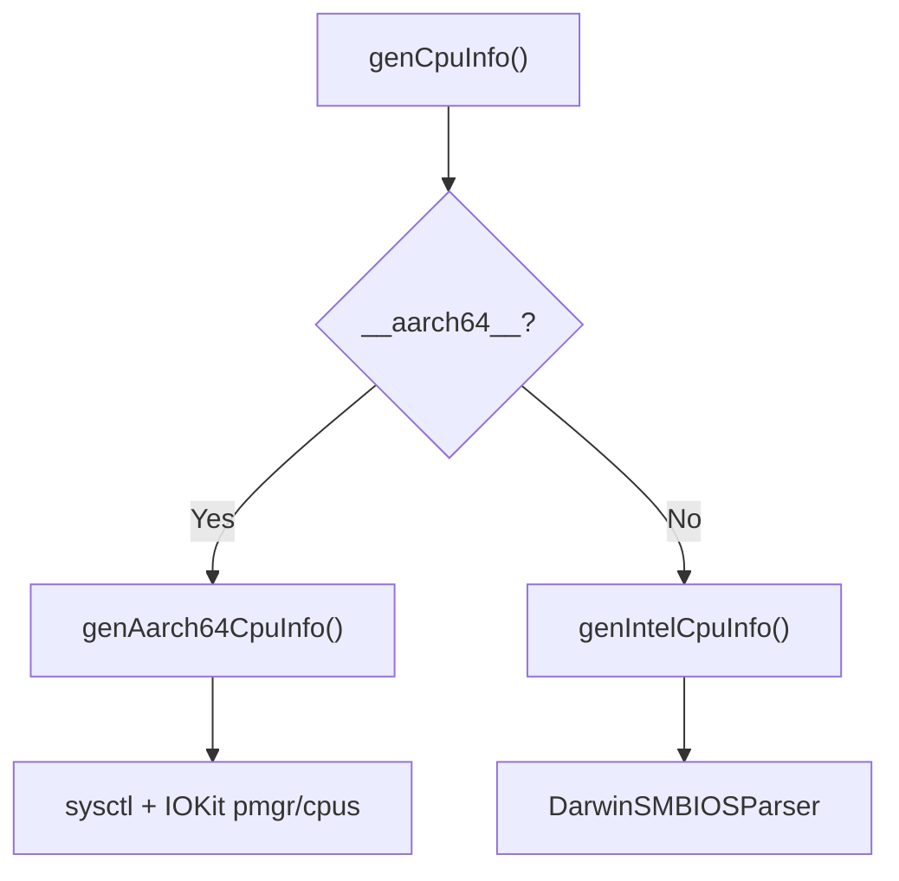

<!-- source-hash: 90db8eaeab8b46a6b1121c2c6342733d -->
Provides CPU information for macOS systems, supporting both Intel (via SMBIOS parsing) and Apple Silicon AArch64 architectures through a unified query interface.

## Key Components

| Function | Description |
|---|---|
| `genCpuInfo(context)` | Entry point; dispatches to architecture-specific implementation at compile time |
| `genIntelCpuInfo(context)` | Queries CPU data via `DarwinSMBIOSParser`, decorates rows with friendly `device_id` names |
| `genAarch64CpuInfo(context)` | Queries Apple Silicon CPU data via `sysctl` and IOKit, populates model, core counts, and clock speed |
| `getAarch64MaxCPUFreq()` | Reads `voltage-states5-sram` from the `pmgr` IOKit device to determine the P-core max frequency in Hz |
| `getHybridCoresNumber()` | Reads `p-core-count` and `e-core-count` from the `cpus` IOKit device, returning efficiency/performance core counts |

## Usage Example

```cpp
// Called internally by osquery's table infrastructure
QueryContext context;
QueryData results = osquery::tables::genCpuInfo(context);

for (const auto& row : results) {
    // Access fields populated per architecture
    // Intel: processor_type, device_id, manufacturer, model, ...
    // AArch64: device_id ("CPU0"), model, manufacturer ("Apple"),
    //          number_of_cores, logical_processors, max_clock_speed,
    //          number_of_efficiency_cores, number_of_performance_cores
}
```

## Architecture Dispatch



> **Note:** AArch64 max clock speed is derived from P-core voltage state entries (little-endian `uint32_t` Hz values), then converted to MHz for the `max_clock_speed` column.