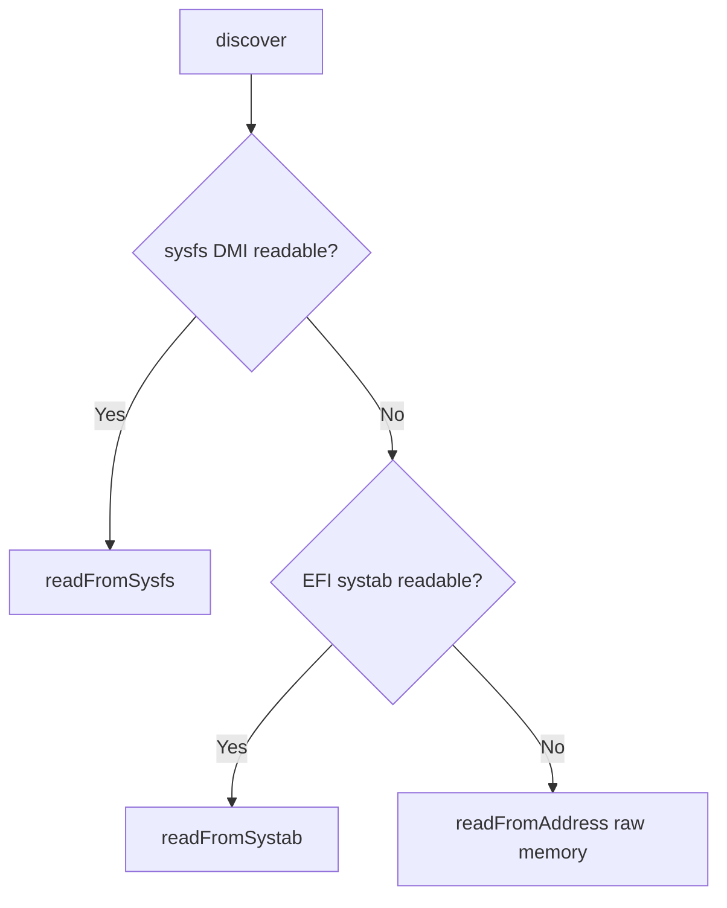

<!-- source-hash: 9f69b3ffa7064378485d8b9c94f0a072 -->
Linux SMBIOS/DMI table parser and osquery table generator for system firmware information on Linux platforms.

## Key Components

### `LinuxSMBIOSParser` Methods

| Method | Description |
|---|---|
| `discover()` | Entry point — detects and reads SMBIOS data via sysfs, EFI systab, or raw memory fallback |
| `readFromSysfs()` | Reads DMI tables directly from `/sys/firmware/dmi/tables/DMI` |
| `readFromSystab()` | Parses `/sys/firmware/efi/systab` to locate SMBIOS address, then reads from memory |
| `readFromAddress()` | Scans raw physical memory for the `_DMI_` magic header |
| `discoverTables()` | Reads raw DMI table data from a resolved physical address |

### Query Generator Functions

| Function | osquery Table |
|---|---|
| `genSMBIOSTables()` | `smbios_tables` — raw SMBIOS structure entries |
| `genMemoryDevices()` | `memory_devices` |
| `genMemoryArrays()` | `memory_arrays` |
| `genMemoryArrayMappedAddresses()` | `memory_array_mapped_addresses` |
| `genMemoryErrorInfo()` | `memory_error_info` |
| `genMemoryDeviceMappedAddresses()` | `memory_device_mapped_addresses` |
| `genOEMStrings()` | `oem_strings` |
| `genPlatformInfo()` | `platform_info` — BIOS vendor, version, date, address, size, revision, firmware type |

## Discovery Priority



## Usage Example

```cpp
// Typical pattern used by all gen* functions
LinuxSMBIOSParser parser;
if (!parser.discover()) {
    return {};
}

QueryData results;
parser.tables([&results](size_t index,
                         const SMBStructHeader* hdr,
                         uint8_t* address,
                         uint8_t* textAddrs,
                         size_t size) {
    genSMBIOSTable(index, hdr, address, size, results);
});
```

> **Note:** `readFromAddress()` respects the `/dev/mem` strict boundary at `0x100000`, clamping read sizes to avoid kernel log warnings on hardened systems.