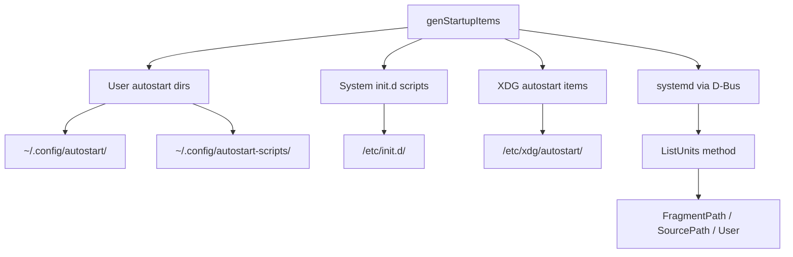

<!-- source-hash: 531dcb881be6c8b2b50cb47fd0c6bfc9 -->
Implements the `startup_items` osquery table for Linux, enumerating all startup entries from XDG autostart directories, init.d scripts, and systemd units via D-Bus.

## Key Components

### Constants
- **`kSystemItemPaths`** — System-wide XDG autostart directories (e.g., `/etc/xdg/autostart/`)
- **`kSystemScriptPaths`** — System-wide init script directories (e.g., `/etc/init.d/`)

### Functions

| Function | Description |
|---|---|
| `genAutoStartItems()` | Parses `.desktop`-style files in XDG autostart directories, extracting `Name=` and `Exec=` fields |
| `genAutoStartScripts()` | Enumerates plain script files in init.d-style directories, using filename as the item name |
| `genSystemdItems()` | Connects via D-Bus to enumerate all systemd units, fetching `FragmentPath`, `SourcePath`, and `User` properties |
| `genStartupItems()` | Entry point; aggregates results from all three sources for both user-level and system-level paths |

## Usage Example

```cpp
// Queried via osquery SQL interface:
// SELECT * FROM startup_items;

// Each result row contains:
// name     - human-readable name or unit ID
// path     - executable or unit file path
// type     - "Startup Item" or "systemd unit"
// status   - "enabled" (scripts/items) or active_state (systemd)
// source   - originating directory or source path
// username - owning user (if user-scoped path or systemd User= property)
```

## Data Sources



> **Note:** D-Bus connection failures for systemd enumeration are logged as errors but do not prevent XDG/init.d results from being returned.