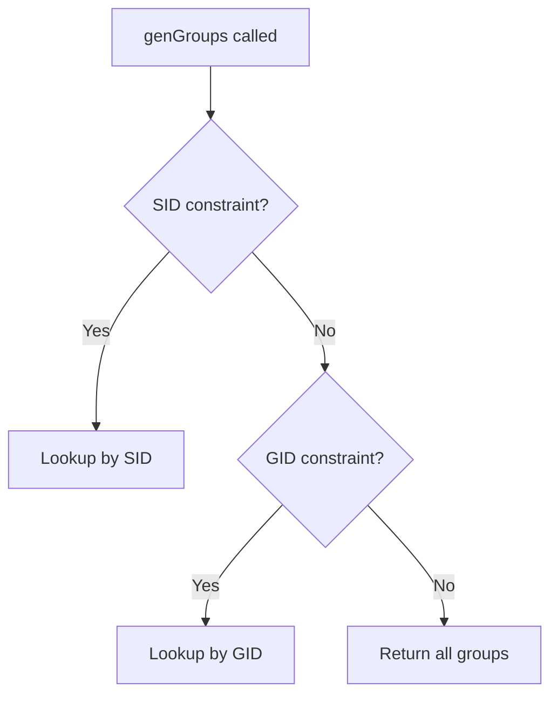

<!-- source-hash: fd5e72d72db6e85f1369001478666ec3 -->
Implements the Windows `groups` osquery virtual table, generating rows from the global groups cache with support for filtered lookups by SID or GID.

## Key Components

### `genGroup(const Group& group)`
Converts a `Group` struct into an osquery `Row` with the following columns:

| Column | Type | Description |
|--------|------|-------------|
| `gid` | BIGINT | Group numeric ID |
| `gid_signed` | INTEGER | Signed representation of GID |
| `group_sid` | STRING | Windows Security Identifier (SID) |
| `comment` | STRING | Group description/comment |
| `groupname` | STRING | Group display name |

### `genGroups(QueryContext& context)`
Main table generator that resolves query constraints and fetches groups from `GlobalUsersGroupsCache`. Supports three query paths:



## Usage Example

```cpp
// Querying via osquery SQL — filtered by SID
SELECT gid, groupname, group_sid, comment
FROM groups
WHERE group_sid = 'S-1-5-32-544';

// Filtered by GID
SELECT * FROM groups WHERE gid = 544;

// Full table scan
SELECT * FROM groups;
```

## Query Resolution Logic

- **SID filter** takes priority over GID filter
- **GID filter** applied only when no SID constraints exist; GID strings are parsed via `tryTo<uint32_t>()` and invalid values are silently skipped
- **No filter** triggers a full cache scan via `getAllGroups()`

All group data is sourced from `GlobalUsersGroupsCache`, avoiding repeated WinAPI calls across queries.