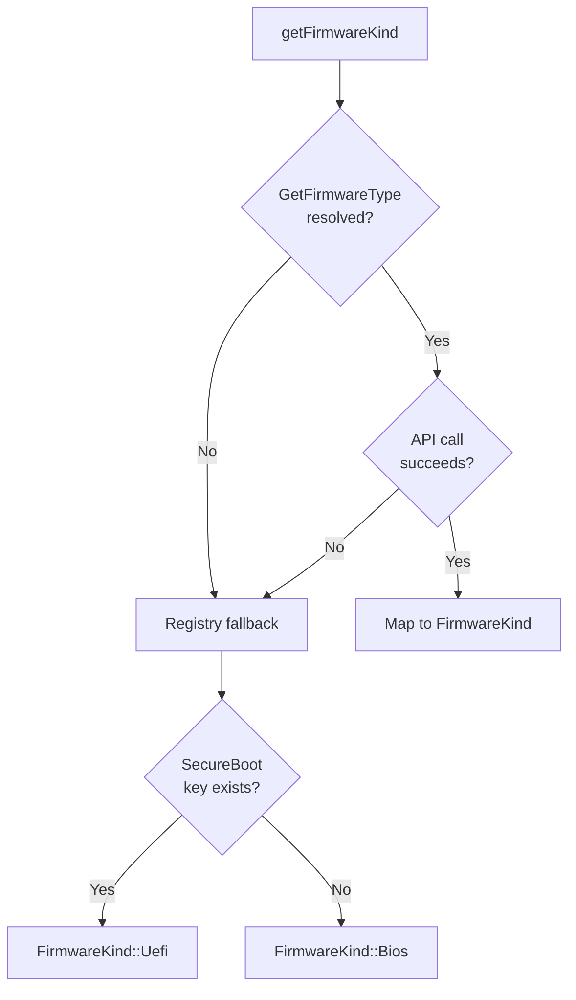

<!-- source-hash: 71af5b240a5a03e1bb1c428dd63413f7 -->
Windows-specific implementation of firmware type detection for the osquery `FirmwareKind` utility, using the Win32 `GetFirmwareType` API with a registry-based fallback.

## Key Components

| Symbol | Type | Description |
|---|---|---|
| `WindowsFirmwareType` | `enum class` | Typed wrapper for Win32 firmware type values (`Bios = 1`, `Uefi = 2`) |
| `locateGetFirmwareTypeProc()` | `static fn` | Dynamically resolves `GetFirmwareType` from `kernel32.dll` at runtime |
| `queryFirmwareKind()` | `static fn` | Calls the resolved Win32 proc and maps the result to `FirmwareKind` |
| `detectFirmwareTypeFromRegistry()` | `static fn` | Fallback: infers UEFI by checking existence of `HKLM\SYSTEM\CurrentControlSet\Control\SecureBoot\State` |
| `getFirmwareKind()` | **public** | Entry point — tries Win32 API first, falls back to registry detection |

## Detection Flow



## Usage Example

```cpp
#include <osquery/utils/info/firmware.h>

auto kind = osquery::getFirmwareKind();
if (kind.has_value()) {
    switch (kind.value()) {
    case FirmwareKind::Uefi:
        // System is UEFI
        break;
    case FirmwareKind::Bios:
        // System is legacy BIOS
        break;
    }
} else {
    // Detection failed entirely
}
```

## Notes

- `GetFirmwareType` is resolved **dynamically** via `GetProcAddress` to avoid hard linking against APIs absent on older Windows versions (pre-8/Server 2012).
- The registry fallback checks the presence of `SecureBoot\State` as a UEFI indicator — it does not validate the key's value.
- Errors are surfaced via osquery's `LOG(ERROR)` / `VLOG(1)` logging macros.