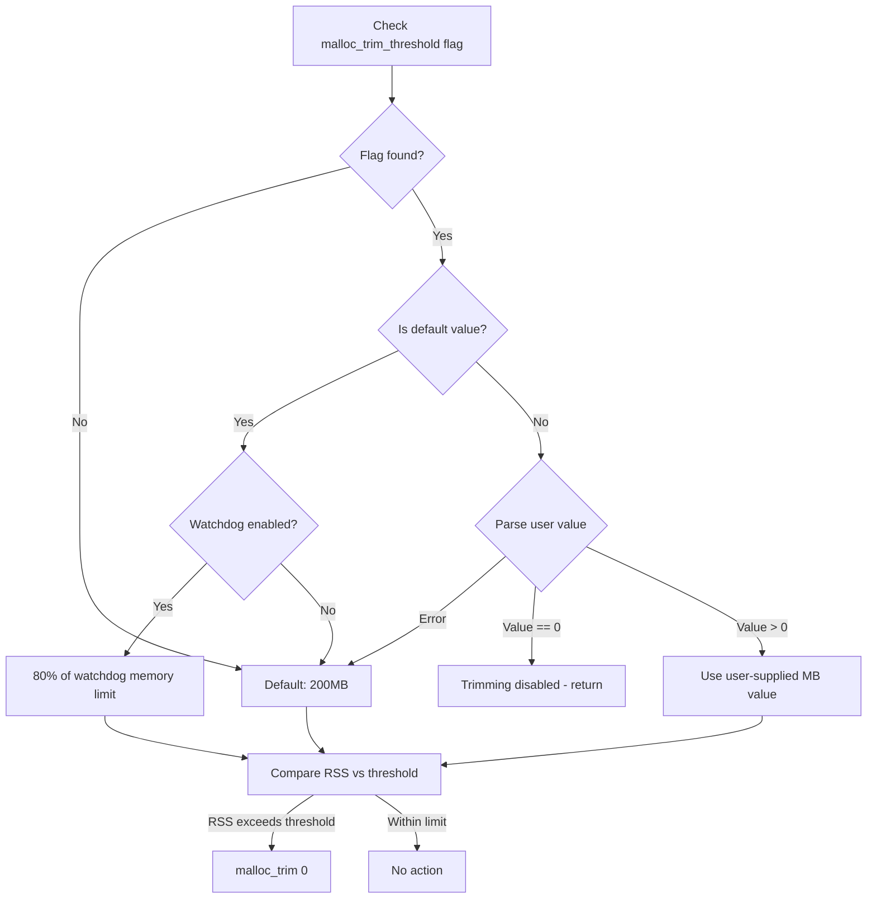

<!-- source-hash: d3d66dca694fced8c7fe91bdfe398c9c -->
Implements memory management for the osquery Linux daemon by monitoring and trimming heap memory retention when usage exceeds a configurable threshold.

## Key Components

### `releaseRetainedMemory()` *(Linux only)*
The sole exported function. Determines a memory threshold (in MB) and calls `malloc_trim(0)` if current RSS exceeds it.

**Threshold resolution logic:**



## Usage Example

```cpp
#include "memory.h"

// Called periodically by the osquery watchdog or scheduler
// to prevent unbounded heap growth on Linux hosts.
void periodicCleanup() {
#ifdef OSQUERY_LINUX
    osquery::releaseRetainedMemory();
#endif
}
```

**Flag control (at startup):**

```bash
# Disable trimming entirely
osqueryd --malloc_trim_threshold=0

# Set explicit 512MB threshold
osqueryd --malloc_trim_threshold=512

# Default: 80% of watchdog limit, or 200MB if watchdog is off
osqueryd
```

## Notes

- Linux-only (`#ifdef OSQUERY_LINUX`); no-op on other platforms.
- RSS is read from `/proc/self/status` via `getProcRSS("self")`.
- Threshold unit is **megabytes**; RSS is converted from bytes before comparison.
- Failures to read `/proc` or parse the flag are non-fatal and fall back to 200 MB.