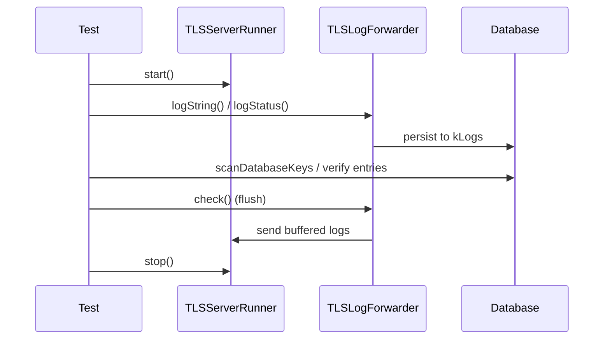

<!-- source-hash: c08d781bd0d816147d3de5aff6b488df -->
Unit tests for the `TLSLogForwarder` plugin, verifying that log entries (strings and status messages) are correctly persisted to the database and transmitted to a TLS-enabled remote server.

## Key Components

| Component | Description |
|---|---|
| `TLSLoggerTests` | GTest fixture that initializes the platform, registry, and test database before each test |
| `runCheck()` | Public helper that manually triggers `TLSLogForwarder::check()` to flush buffered logs |
| `test_database` | Verifies that logged strings and status lines are stored in the `kLogs` database with correct content |
| `test_send` | Verifies that bulk log entries (20 JSON strings) are successfully forwarded to a running TLS server |

## Usage Example

```cpp
// Instantiate the forwarder and log a JSON string
auto forwarder = std::make_shared<TLSLogForwarder>();
std::string expected = "{\"new_json\": true}";
forwarder->logString(expected);

// Log a status entry
StatusLogLine status{};
status.message = "{\"status\": \"bar\"}";
forwarder->logStatus({status});

// Verify entries were persisted to the kLogs database
std::vector<std::string> indexes;
scanDatabaseKeys(kLogs, indexes);
EXPECT_EQ(2U, indexes.size());

// Manually trigger forwarding/flush to the remote TLS server
runner->check();
```

## Test Flow

