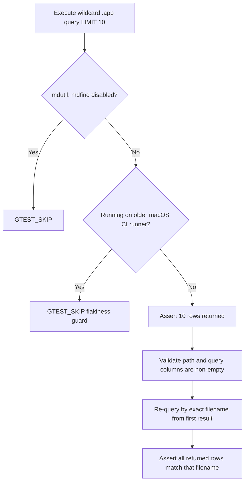

<!-- source-hash: f269e3bd27a587a4b1cdce711458c63b -->
Integration test for the `mdfind` osquery table on macOS, verifying that Spotlight metadata queries return valid results without crashing.

## Key Components

- **`Mdfind` (test fixture)** — GTest fixture class that initializes the osquery test environment via `setUpEnvironment()`.
- **`TEST_F(Mdfind, test_sanity)`** — Primary test case that validates the `mdfind` virtual table behavior end-to-end.

### Test Logic Flow



## Key Behaviors Tested

| Check | Detail |
|---|---|
| No crash on disabled `mdfind` | Query runs even when Spotlight is off |
| Row count | Exactly 10 rows returned with `LIMIT 10` |
| Schema validation | `path` and `query` columns are non-empty strings |
| Exact filename lookup | Secondary query by filename returns only matching paths |

## Usage Example

```cpp
// Run this specific test via osquery test runner:
// ./osquery_tests --gtest_filter=Mdfind.test_sanity

// The table under test accepts Spotlight query syntax:
execute_query(
    "SELECT * FROM mdfind "
    "WHERE query = 'kMDItemFSName = \"*.app\"' "
    "LIMIT 10;"
);
```

> **Note:** The test automatically skips if Spotlight indexing is disabled (`mdutil -s / | grep disabled`) or when running on older macOS CI runners due to known flakiness. It maps to the table spec at `specs/darwin/mdfind.table`.