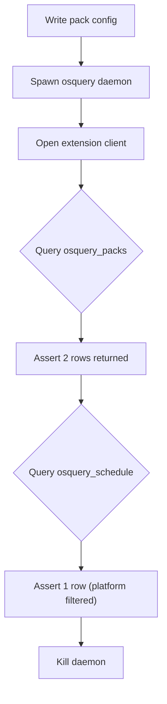

<!-- source-hash: 4608de89271aaeb41f76ad14ca855c70 -->
Tests additional osquery daemon features, specifically validating query pack loading, platform filtering, and schedule integration via the osquery extension interface.

## Key Components

- **`AdditionalFeatureTests`** — Test class inheriting from `test_base.ProcessGenerator` and `unittest.TestCase`, providing daemon lifecycle management alongside standard assertions.
- **`test_query_packs()`** — Decorated with `@test_base.flaky`; writes a temporary pack config with two queries (one with a non-existent platform), spawns a daemon with that pack loaded, then verifies:
  - Both queries appear in `osquery_packs`
  - Only the platform-compatible query is added to `osquery_schedule`

## Usage Example

```python
# Run standalone via test_base.Tester
python3 test_additional.py --build /path/to/osquery/build

# Run via unittest discovery
python3 -m unittest test_additional.AdditionalFeatureTests.test_query_packs
```

## Test Flow



## Notes

- Requires a compiled osquery build with Thrift bindings (`test_base.loadThriftFromBuild`).
- The `@test_base.flaky` decorator retries on intermittent failures caused by daemon startup lag.
- `test_base.expectTrue` is used as a polling helper to wait for async pack parsing before asserting.